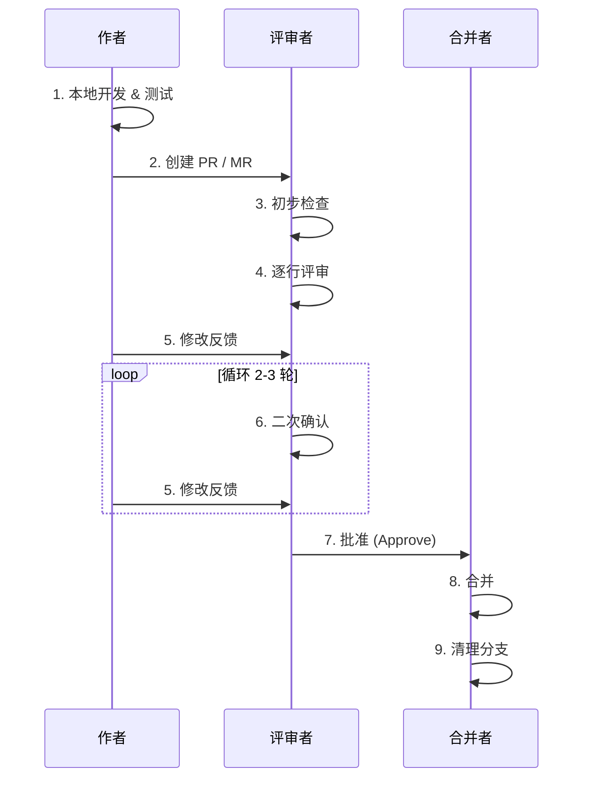

## Git

## Repository

### 仓库结构

#### README编写

### Commit规范

## 协作

### Issue

Issue用于跟踪问题、任务、需求、讨论（问题单/任务单）

- 作用：报告bug、提出需求、记录任务、组织讨论或进行设计决策
- 主要字段与功能
  - 标题、描述（支持md）、标签（label）、里程碑（milestone）、指派人(assignee)、评论、附件、引用（可以在issue/PR中引用其他编号）
  - Issue模板(.github/ISSUE_TEMPLATE)可以引导用户填写必要信息
- 生命周期与使用方式
  - 创建 -> triage（加标签/指派/分配里程碑）-> 分配给人或转成任务 -> 通过PR修复或直接关闭
  - 可以通过commit/PR信息自动关闭：在PR或commit描述中写"Fix #123"/"Close #123"会在合并后自动关闭对应issue
- 最佳实践
  - 用清晰可复现的步骤与最小可复现示例描述bug：对feature给出使用场景与验收标准
  - 用标签（bug/feature/priority等）和里程碑组织优先级
  - 把大任务拆成多个子issue（或使用GitHub Projects/Issue链接）

### PR/MR(Pull Request/Merge Request)

PR/MR 拉取或合并请求

在`feature`写好代码 -> 发起PR -> 让别人review -> 通过 -> 合并到`main`

PR/MR是一个东西，在不同平台的不同叫法，GitLab喜欢叫MR

PR三要素

1. 源分支：你的功能分支
2. 目标分支：main/develop
3. 评审人：Reviewer

#### 准备阶段（PR前)

这是最容易被忽略但最重要的阶段

- 自测先行
    1. 运行完整测试
    2. 检查代码风格
    3. 构建验证 
- 提交原子性检查
    1. 一个PR只做一件事（单一职责）
    2. 不要混合功能开发、重构、格式化修改
    3. 经验法则：PR改动行数建议 < 400行（超过容易漏审）
- Commit信息规范
- 自评(Self-Review)：在请求别人评审前，自己先读一遍自己的代码——能发现30%以上的低级错误

#### 创建PR/MR

##### PR标题

- 格式：`[类型] 简要描述`
- 示例：`[Feature] 用户中心页面改版`， `[Hotfix] 修复支付回调空指针`

##### PR描述

模板

```md
## 背景
为什么需要这个修改？（附 Jira/Issue 链接）

## 改动内容
- 增加了什么功能
- 修改了哪些核心逻辑
- 删除了哪些废弃代码

## 影响范围
会影响哪些模块？是否需要回归测试？

## 测试验证
- [x] 单元测试通过
- [x] 本地手动测试
- [x] 兼容性测试（如适用）

## 截图（UI 改动必填）
Before/After对比

## 需要关注的点
哪部分代码评审者需要特别留意
```

##### 指定评审者

- 至少1-2人，不要太多（“三个和尚没水喝”）
- 包括：领域负责人+模块熟悉者


### Code Review

Code Review（代码审查）是一种团队协作流程，用于提高代码质量、减少bug、保证代码风格一致\
在GitHub上，Code Review通常围绕Pull Request进行

- 开发者在本地完成新功能或修复后，将代码提交到一个分支
- 提交Pull Request请求合并到主分支
- 团队其他成员对PR进行审查，提出意见或修改建议
- PR被批准后才可以合并

目的：

- 捕捉bug和逻辑错误
- 保持代码风格一致
- 分享知识，让团队成员互相学习
- 提高代码可维护性

#### 流程图



#### 评审

评审者的核心职责：发现问题，而不是制造问题

##### 评审维度（优先级从高到低）

1. 正确性（必须）
    - 逻辑是否通顺？
    - 边界条件是否处理？
    - 异常路径是否有捕获？
2. 架构设计（强烈建议）
    - 是否符合团队规范？
    - 是否过度设计
    - 是否引入不必要的耦合？
3. 可维护性（必须）
    - 变量/函数命名是否自解释？
    - 是否有魔法数字？
    - 复杂逻辑是否有注释？
4. 测试覆盖（必须）
    - 新功能是否有单元测试？
    - Bug fix是否有对应的测试用例防止回归？
5. 性能/安全（视场景）
    - N+1查询问题？
    - 敏感数据是否暴露？
    - 用户输入是否校验？

##### 评审意见

差的反馈

```text
这里的代码写得不好
这个变量名看不懂
```

好的反馈
```text
建议：这里用Optional 处理可能为 null 的情况，避免空指针
问题：当用户未登录时，这行会抛异常，需要加判空
疑问：这个函数命名是getUserData,但它还调用了更新操作，是否符合单一职责？
```

评审者黄金法则

- 对事不对人，批评代码，不要批评作者
- 用建议/提问代替命令
- 解释“为什么”，而不只是“是什么”

#### 作者处理反馈

##### 心态准备

- 评审不是针对你个人，是让代码变得更好
- 团队里没有“我的代码”，只有“我们的代码”

##### 操作规范

1. 所有反馈都必须有回应（哪怕是“已修改”或“这里不修改的原因是...”）
2. 每轮修改后，重新请求Review
3. 不要Force Push到已开PR的分支（除非有明确约定）

##### 当遇到不同意见

- 当面沟通 > 文字辩论
- 如果无法达成一致，指定最终决策者（架构师/技术负责人）

#### 批准与合并

##### 批准条件

- 所有必须修改的问题都已解决
- 没有遗留的“阻塞性”意见
- 测试通过（CI绿）

##### 谁来合并

- 作者合并：适用于信任度高的团队
- 评审者合并：适用于严格管控的场景
- 机器人合并：要求所有Check通过后自动合并

##### 合并策略

| 策略 | 命令 | 场景 |
| - | - | - |
| Merge Commit | `git merge --no-ff` | 保留完整开发历史，适合多人协作 |
| Squash and Merge | 合并为一个Commit | 功能开发分支，保持主线整洁 |
| Rebase and Merge | `git rebase` | 追求线性历史，适合单人开发 |

推荐：普通功能分支用Squash and Merge, 多人协作分支用Merge Commit

#### 常见错误模式(Anti-Patterns)

##### 评审者的问题

1. LGTM主义：只看不评，或者秒Approve
2. 完美主义：要求每一行都完美，导致PR卡几周
3. 风格战争：争论空格/缩进（应该用Lint工具解决）
4. 跨职责评审：评审者不懂该领域代码，凭感觉发表意见

##### 作者的问题

1. 巨型PR：一次提交2000+行，没人愿意认真看
2. 沉默PR：描述只有标题，没有背景说明
3. 防御式回应：每条意见都辩解”为什么不能改“
4. 忽略式修改：私下改了代码，不回应评审意见


### Fork

### Star

### Watch

### Wiki

### Discussions

### Release

## Contribution Graph

## Project

## Package

## Actions

## gh
