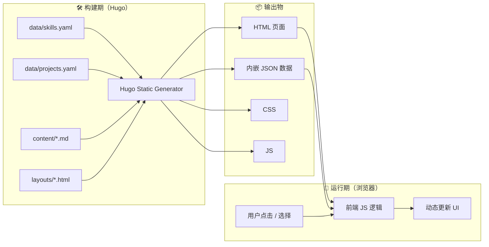

# root

```mermaid
flowchart LR
    subgraph Build["🛠 构建期（Hugo）"]
        D1[data/skills.yaml]
        D2[data/projects.yaml]
        M1[content/*.md]
        T1[layouts/*.html]

        D1 --> HUGO
        D2 --> HUGO
        M1 --> HUGO
        T1 --> HUGO
    end

    HUGO[Hugo Static Generator]

    subgraph Output["📦 输出物"]
        H1[HTML 页面]
        J1[内嵌 JSON 数据]
        C1[CSS]
        S1[JS]
    end

    HUGO --> H1
    HUGO --> J1
    HUGO --> C1
    HUGO --> S1

    subgraph Runtime["🧠 运行期（浏览器）"]
        U1[用户点击 / 选择]
        JS[前端 JS 逻辑]
        UI[动态更新 UI]
    end

    H1 --> JS
    J1 --> JS
    U1 --> JS
    JS --> UI
```

# 1
# 1
# 1
# 1
# 1
# 1
# 1
# 1
# 1
# 1
