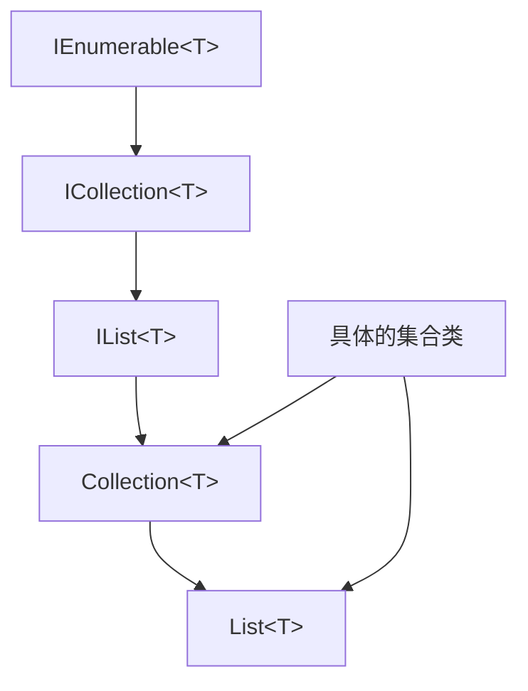

对于数据结构 .NET 提供了一套抽象：接口 + 抽象基类 + 泛型约定\
- 接口定义能力：`IEnumerable<T>`, `ICollection<T>`, `IList<T>`等定义了数据结构的契约
- 抽象基类提供共性：`Collection<T>`, `KeyedCollection<TKey, TItem>`等提供了通用实现
- 泛型确保类型安全：通过泛型约束和方差为编译时类型安全提供保障
- 扩展方法增强功能：在不修改原有类型的情况下扩展功能

抽象带来的能力有
1. 统一的访问方式（foreach, Count, 索引器，键值对）
2. 统一行为（增删改查）
3. 统一视角（只读视角、投影视图）
4. 统一算法接口（LINQ）
5. 统一比较规则（比较器）

这使得，对于不同的容器，能够以一致的方式被使用，你只需要知道它实现了哪些接口，提供了哪些通用行为，以及元素类型告诉容器哪些语义\

## Namespace
### `System.Collections`
非泛型集合（不建议新项目使用），包含定义各种对象集合的接口和类，例如列表、队列、位数组、哈希表和字典

#### Class

| Name | Description |
| - | - |
| `ArrayList` | 使用一个动态增长数组实现`IList`接口，元素类型位`object` |
| `BitArray` | 管理一个紧凑的位数组，用`bool`表示位状态（`true`为1， `false`为0）|
| `CaseInsensitiveComparer` | 比较两个对象是否相等，对字符串比较时忽略大小写 |
| `CaseInsensitiveHashCodeProvider` | 为对象提供哈希码，对字符串计算哈希时忽略大小 |
| `CollectionBase` | 强类型非泛型集合的抽象基类 |
| `Comparer` | 比较两个对象是否相等，对字符串比较时区分大小写 |
| `DictionaryBase` | 强类型非泛型键值对集合的抽象基类 |
| `Hashtable` | 基于哈希码组织的非泛型键值对集合 |
| `Queue` | 表示先进先出FIFO的非泛型对象集合 |
| `ReadOnlyCollectionBase` | 强类型非泛型只读集合的抽象基类 |
| `SortedList` | 按键排序的非泛型键值对集合，可按键或索引访问 |
| `Stack` | 表示LIFO的非泛型对象集合 |
| `StructuralComparisons` | 提供对于集合对象进行结构化比较的辅助对象 |

#### Struct

| Name | Descripriton |
| - | - |
| `DictionaryEntry` | 定义一个可设置或获取的字典键值对（非泛型）|

#### Interface

| 接口名                     | 中文说明                   |
| ----------------------- | ---------------------- |
| `ICollection`           | 定义非泛型集合的大小、枚举器和同步方法。   |
| `IComparer`             | 定义比较两个对象的方法。           |
| `IDictionary`           | 表示非泛型的键值对集合。           |
| `IDictionaryEnumerator` | 枚举非泛型字典中的元素。           |
| `IEnumerable`           | 提供枚举器，用于遍历非泛型集合。       |
| `IEnumerator`           | 支持对非泛型集合进行简单迭代。        |
| `IEqualityComparer`     | 定义用于判断对象相等性的比较方法。      |
| `IHashCodeProvider`     | 为对象提供哈希码的接口，使用自定义哈希算法。 |
| `IList`                 | 表示可通过索引访问的非泛型对象集合。     |
| `IStructuralComparable` | 支持对集合对象进行结构化比较。        |
| `IStructuralEquatable`  | 定义支持结构化相等性比较的方法。       |


### `System.Collections.Generic`
包含定义泛型集合的接口和类，允许用户创建强类型集合，与非泛型强类型集合相比，这些集合提供更好的类型安全性和性能

#### Class 

| Name | Description | Tag |
| - | - | - |
| `CollectionExtensions` | 给泛型集合提供扩展方法 |
| `Comparer<T>` | 提供`IComparer<T>`泛型接口的基类实现 |
| `Dictionary<TKey, TValue>.KeyCollection` | 表示`Dictionary<TKey, TValue>`中的键的集合，该类不可被继承 |
| `Dictionary<TKey, TValue>.ValueCollection` | 表示`Dictionary<TKey, TValue>`中的值的集合，该类不可被继承 |
| `Dictionary<TKey, TValue>` | 表示一个键值对集合 |
| `EqualityComparer<T>` | 提供`IEqualityComparer<T>`泛型接口实现的基类 |
| `HashSet<T>` | 表示一组值，不允许重复元素 |
| `KeyNotFoundException` | 当访问集合元素时指定的键不存在时，抛出此异常 |
| `KeyValuePair` | 创建`KeyValuePair<TKey, TValue>` |
| `LinkedList<T>` | 表示一个双向链表 |
| `LinkedListNode<T>` | 表示`LinkedList<T>`中的一个节点，不能被继承 |
| `List<T>` | 表示一个可按索引访问的强类型对象列表，提供搜索、排序和操作列表的方法 |
| `OrderedDictionary<TKey, TValue>.KeyCollection` | 表示`OrderedDictionary<TKey, TValue>`中键的集合 |
| `OrderedDictionary<TKey, TValue>.ValueCollection` | 表示`OrderedDictionary<TKey, TValue>`中值的集合 |
| `OrderedDictionary<TKey, TValue>` | 表示一个可以按键或索引访问的键值对集合 |
| `PriorityQueue<TElement, TPriority>.UnorderedItemsCollection` | 枚举`PriorityQueue<TElement, TPriority>`中的内容，未保证任何排序顺序 |
| `PriorityQueue<TElement, TPriority>` | 表示一组具有值和优先级的元素。出队时，优先级最低的元素会被移除 |
| `Queue<T>` | 表示先进先出的集合 |
| `ReferenceEqualityComparer` | 也给使用引用相等（`ReferenceEquals(Object, Object)`）而非值相等（`Equals(Object)`）比较对象实例的`IEqualityComparer<T>` |
| `SortedDictionary<TKey, TValue>.KeyCollection` | 表示`SortedDictionary<TKey, TValue>`中键的集合，不能被继承 |
| `SortedDictionary<TKey, TValue>.ValueCollection` | 表示`SortedDictionary<TKey, TValue>`中值的集合，不能被继承 |
| `SortedDictionary<TKey, TValue>` | 表示一组按键顺序的键值对集合 |
| `SortedList<TKey, TValue>` | 表示一组按键排序的键值对集合，基于实现的`IComparer<T>`进行排序 |
| `SortedSet<T>` | 表示按排序顺序排列的集合 |
| `Stack<T>` | 表示一个按LIFO顺序操作的集合 |

#### Struct

| 结构体名                                                                    | 描述                                                             |
| ----------------------------------------------------------------------- | -------------------------------------------------------------- |
| `Dictionary<TKey,TValue>.AlternateLookup<TAlternateKey>`                | 提供一个可以使用 `TAlternateKey` 作为键来操作 `Dictionary<TKey,TValue>` 的类型。 |
| `Dictionary<TKey,TValue>.Enumerator`                                    | 枚举 `Dictionary<TKey,TValue>` 中的元素。                             |
| `Dictionary<TKey,TValue>.KeyCollection.Enumerator`                      | 枚举 `Dictionary<TKey,TValue>.KeyCollection` 中的元素。               |
| `Dictionary<TKey,TValue>.ValueCollection.Enumerator`                    | 枚举 `Dictionary<TKey,TValue>.ValueCollection` 中的元素。             |
| `HashSet<T>.AlternateLookup<TAlternate>`                                | 提供一个可以使用 `TAlternate` 作为键来操作 `HashSet<T>` 的类型。                 |
| `HashSet<T>.Enumerator`                                                 | 枚举 `HashSet<T>` 中的元素。                                          |
| `KeyValuePair<TKey,TValue>`                                             | 定义一个可以设置或获取的键值对。                                               |
| `LinkedList<T>.Enumerator`                                              | 枚举 `LinkedList<T>` 中的元素。                                       |
| `List<T>.Enumerator`                                                    | 枚举 `List<T>` 中的元素。                                             |
| `OrderedDictionary<TKey,TValue>.Enumerator`                             | 枚举 `OrderedDictionary<TKey,TValue>` 中的元素。                      |
| `OrderedDictionary<TKey,TValue>.KeyCollection.Enumerator`               | 枚举 `OrderedDictionary<TKey,TValue>.KeyCollection` 中的元素。        |
| `OrderedDictionary<TKey,TValue>.ValueCollection.Enumerator`             | 枚举 `OrderedDictionary<TKey,TValue>.ValueCollection` 中的元素。      |
| `PriorityQueue<TElement,TPriority>.UnorderedItemsCollection.Enumerator` | 枚举 `PriorityQueue<TElement,TPriority>` 中的元素和优先级对，未保证任何排序顺序。    |
| `Queue<T>.Enumerator`                                                   | 枚举 `Queue<T>` 中的元素。                                            |
| `SortedDictionary<TKey,TValue>.Enumerator`                              | 枚举 `SortedDictionary<TKey,TValue>` 中的元素。                       |
| `SortedDictionary<TKey,TValue>.KeyCollection.Enumerator`                | 枚举 `SortedDictionary<TKey,TValue>.KeyCollection` 中的元素。         |
| `SortedDictionary<TKey,TValue>.ValueCollection.Enumerator`              | 枚举 `SortedDictionary<TKey,TValue>.ValueCollection` 中的元素。       |
| `SortedSet<T>.Enumerator`                                               | 枚举 `SortedSet<T>` 中的元素。                                        |
| `Stack<T>.Enumerator`                                                   | 枚举 `Stack<T>` 中的元素。                                            |

#### Interface

| 接口名                                        | 描述                                                            |
| ------------------------------------------ | ------------------------------------------------------------- |
| `IAlternateEqualityComparer<TAlternate,T>` | 通过实现 `IEqualityComparer<T>` 来支持将 `TAlternate` 实例与 `T` 实例进行比较。 |
| `IAsyncEnumerable<T>`                      | 提供支持异步迭代的枚举器，针对指定类型的值进行异步遍历。                                  |
| `IAsyncEnumerator<T>`                      | 支持对泛型集合进行简单的异步迭代。                                             |
| `ICollection<T>`                           | 定义操作泛型集合的方法。                                                  |
| `IComparer<T>`                             | 定义一个方法来比较两个对象。                                                |
| `IDictionary<TKey,TValue>`                 | 表示一组键值对的泛型集合。                                                 |
| `IEnumerable<T>`                           | 提供支持简单迭代的枚举器，适用于指定类型的集合。                                      |
| `IEnumerator<T>`                           | 支持对泛型集合进行简单的迭代。                                               |
| `IEqualityComparer<T>`                     | 定义支持比较对象是否相等的方法。                                              |
| `IList<T>`                                 | 表示一个可以按索引访问的对象集合。                                             |
| `IReadOnlyCollection<T>`                   | 表示一个只读的强类型集合。                                                 |
| `IReadOnlyDictionary<TKey,TValue>`         | 表示一个只读的泛型键值对集合。                                               |
| `IReadOnlyList<T>`                         | 表示一个只能按索引访问的只读集合。                                             |
| `IReadOnlySet<T>`                          | 提供集合的只读抽象。                                                    |
| `ISet<T>`                                  | 提供集合抽象的基本接口。                                                  |

### `System.Collections.Concurrent`
提供几个线程安全的集合类，当多个线程并发访问集合时，应使用这些类来代替`System.Collections`和`System.Collections.Generic`、
但是，通过扩展方法或显式接口实现访问集合对象的元素并不能保证线程安全，调用者可能需要进行同步

#### Class

| Name | Description |
| - | - |
| `BlockingCollection<T>` | 为实现了`IProducerConsumerColleciton<T>`的线程安全集合提供阻塞和容量限制能力，常用于生产者-消费者模型 |
| `ConcurrentBag<T>` | 表示一个线程安全、无序的对象集合，适合多线程频繁添加和移除的场景 |
| `ConcurrentDictionary<TKey, TValue>` | 表示一个可被多个线程并发访问的线程安全键值对集合 |
| `ConcurrentQueue<T>` | 表示一个线程安全的FIFO集合 |
| `ConcurrentStack<T>` | 表示一个线程安全的LIFO集合 |
| `OrderablePartitioner<TSource>` | 表示一种将可排序数据源拆分为多个分区的方式，并保留元素顺序信息 |
| `Partitioner` | 提供针对数组、列表和可枚举对象的通用分区策略 |
| `Partitioner<TSource>` | 表示一种将数据源拆分为多个分区的策略，用于并行处理 |

#### Struct

| Name | Description |
| - | - |
| `ConcurrentDictionary<TKey, TValue>.AlternateLookup<TAlternateKey>` | 提供一种使用`TAlternateKey`而非`TKey`来操作`ConcurrentDictionary<TKey, TValue>`的方式，用于避免构造真实键对象 |

#### Interface

| Name | Description |
| - | - |
| `IProducerConsumerCollection<T>` | 定义用于生产者/消费者模型的线程安全集合操作接口，使`BlockingCollection<T>`能将其作为底层存储使用 |

#### Enums

| Name | Description |
| - | - |
| `EnumerablePartitionerOptions` | 指定用于控制分区器缓冲行为的选项 |

### `System.Collections.Immutable`
包含不可变集合的接口和类\
使用不可变集合，可以
- 共享集合而无需担心内容被修改
- 在多线程环境中获得隐式线程安全（读取无需加锁）
- 遵循函数式编程风格
- 在枚举集合的同时“修改”集合，而原集合保持不变

不可变集合是.NET核心库的一部分，但在.NET Framework中并非默认包含。对于.NET Framework 4.6.2及以后版本，需要通过NuGet`System.Collections.Immutable`安装

#### Class

| Name | Description |
| - | - |
| `ImmutableArray` | 提供用于创建不可变数组的方法，一旦创建后内容不可更改 |
| `ImmutableArray<T>.Builder` | 可写的数组构建器，可在不产生额外内存分配的情况下转换为`ImmutableArray<T>` |
| `ImmutableDictionary` | 提供用于初始化`ImmutableDictionary<TKey, TValue>`实例的方法 |
| `ImmutableDictionary<TKey, TValue>.Builder` | 可变的哈希映射构建器，能高效地产生或基于不可变字典继续构建 |
| `ImmutableDictionary<TKey, TValue>` | 表示一个不可变、无序的键值对集合 |
| `ImmutableHashSet` | 提供用于初始化`ImmutableHashSet<T>`实例的方法 |
| `ImmutableHashSet<T>.Builder` | 可变的哈希集合构建器，能高效生成或扩展不可变哈希集合 |
| `ImmutableHashSet<T>` | 表示一个不可变、无序的哈希集合 |
| `ImmutableInterlocked` | 包含针对不可变集合的源自交换（Interlocked）机制 |
| `ImmutableList` | 提供用于初始化`ImmutableList<T>`实例的方法 |
| `ImmutableList<T>.Builder` | 可变的列表构建器，能高效生成或扩展不可变列表 |
| `ImmutableList<T>` | 表示一个不可变列表，可通过索引访问元素 |
| `ImmutableQueue` | 提供用于初始化`ImmutableQueue<T>`实例的方法 |
| `ImmutableQueue<T>` | 表示一个不可变队列 |
| `ImmutableSortedDictionary` | 提供用于初始化`ImmutableSortedDictionary<TKey, TValue>`实例的方法 |
| `ImmutableSortedDictionary<TKey, TValue>.Builder` | 可变的排序字典构建器，能高效生成或扩展不可变排序字典 |
| `ImmutableSortedDictionary<TKey, TValue>` | 表示一个不可变的有序字典 |
| `ImmutableSortedSet` | 提供用于初始化`ImmutableSortedSet<T>`实例的方法 |
| `ImmutableSortedSet<T>` | 表示一个不可变的排序集合 |
| `ImmutableStack` | 提供用于初始化`ImmutableStack<T>`实例的方法 |
| `ImmutableStack<T>` | 表示一个不可变栈 |

##### Struct

| 结构体名                                                 | 中文说明                   |
| ---------------------------------------------------- | ---------------------- |
| `ImmutableArray<T>.Enumerator`                       | 不可变数组的枚举器。             |
| `ImmutableArray<T>`                                  | 表示一个不可变数组，一旦创建不可修改。    |
| `ImmutableDictionary<TKey, TValue>.Enumerator`       | 无需额外内存分配即可枚举不可变字典内容。   |
| `ImmutableHashSet<T>.Enumerator`                     | 无需额外内存分配即可枚举不可变哈希集合内容。 |
| `ImmutableList<T>.Enumerator`                        | 枚举基于二叉树结构的不可变列表内容。     |
| `ImmutableQueue<T>.Enumerator`                       | 无需额外内存分配即可枚举不可变队列内容。   |
| `ImmutableSortedDictionary<TKey, TValue>.Enumerator` | 枚举基于二叉树结构的不可变排序字典内容。   |
| `ImmutableSortedSet<T>.Enumerator`                   | 枚举基于二叉树结构的不可变排序集合内容。   |
| `ImmutableStack<T>.Enumerator`                       | 无需额外内存分配即可枚举不可变栈内容。    |

##### Interface

| 接口名                                  | 中文说明                    |
| ------------------------------------ | ----------------------- |
| `IImmutableDictionary<TKey, TValue>` | 表示一个不可变的键值对集合接口。        |
| `IImmutableList<T>`                  | 表示一个不可修改的列表接口。          |
| `IImmutableQueue<T>`                 | 表示一个不可变的先进先出（FIFO）集合接口。 |
| `IImmutableSet<T>`                   | 表示一个只能通过创建新实例来修改的集合接口。  |
| `IImmutableStack<T>`                 | 表示一个不可变的后进先出（LIFO）集合接口。 |

### `System.Collections.Specialized`
包含特殊用途（用途非常明确）、强类型的集合；它们的存在是为某种明确使用场景，直接提供的现成工具\
当场景足够明确时，泛型不是最优解

#### Class

| Name | Description |
| - | - |
| `CollectionsUtil` | 创建忽略字符串大小写的集合 |
| `HybridDictionary` | 小规模时用`ListDictionary`，变大后自动切换为`Hashtable` |
| `ListDictionary` | 使用单向链表实现的`IDictionary`，适合 <10 个元素 |
| `NameObjectCollectionBase` | 以 string -> object 形式存储的抽象基类，可按key或index访问 |
| `NameObjectCollectionBase.KeysCollection` | 表示上述集合中的所有键（string）|
| `NameValueCollection` | string -> string，允许一个key 对应多个 value |
| `NotifyCollectionChangedEventArgs` | `CollectionChanged`事件的数据载体 |
| `OrderedDictionary` | 既能按key，又能按index访问的字典 |
| `StringCollection` | 只包含string的集合 |
| `StringDictionary` | string -> string的哈希表 |
| `StringEnumerator` | 用于遍历`StringCollection`的枚举器 |

#### Struct 

| Name | Description |
| - | - |
| `BitVector32` | 用32位整数存多个布尔值/小整数（极致省内存）|
| `BitVector32.Section` | 表示BitVector32中的一段整数区域 |

#### Interface

| Name | Description |
| - | - |
| `INotifyCollectionChanged` | 通知监听者集合发生变化（增/删/清空）|
| `IOrderedDictionary` | 有顺序的字典接口（key + index）|

#### Enums

| Name | Description |
| - | - |
| `NotifyCollectionChangedAction` | 描述集合发生变化的行为类型 |

#### Delegates

| Name | Description |
| - | - |
| `NotifyCollectionChangedEventHandler` | 处理集合变化事件的方法签名 |

### `System.Linq`
包含LINQ扩展方法，用于集合查询

### `System.Runtime.CompilerServices`
包含一些编译器服务类
- `ConditionalWeakTable<TKey, TValue>`

### `System`

#### Class

| Name | Description |
| - | - |
| `Array`/`T[]` | CLR内建数组类型，表示一段连续内存并携带长度信息，是`System`中唯一的通用集合型数据结构 |
| `String` | 不可变的UTF-16字符序列，本质是只读的`char[]`数组，具有运行时级别的特殊支持 |
| `Tuple<T1,...>` | 引用类型的定长异构数据结构，用于将多个不同类型的值组合在一起，主要用于兼容和反射场景 |
| `ValueTuple<T1,...>` | 值类型的定长异构数据结构，内存连续、无额外分配，是现代C#推荐的元组实现 |
| `Nullable<T>` | 表示“可能不存在”的值类型数据结构，本质是带状态标记的值(`hasValue + value`) |
| `Span<T>` | 表示一段连续内存的可写视图，基于栈生命周期的轻量级数据结构，用于高性能内存访问 |
| `ReadOnlySpan<T>` | 表示一段连续内存的只读视图，是安全指针的替代方案，避免堆分配 |
| `Memory<T>` | 表示托管内存的可写引用，可跨越异步边界接受GC管理 |
| `ReadOnlyMemory<T>` | 表示托管内存的只读引用，用于在异步和托管环境中安全传递内存视图 |

#### Struct

| Name | Description |
| - | - |
| `Boolean` | 表示二值状态的最小数据结构 |
| `Char` | 表示UTF-16编码的单个字符，是`String`的基本单元 |
| `Int16`/`Int32`/`Int64` | 表示有符号整数的值类型结构 |
| `UInt16`/`UInt32`/`UInt64` | 表示无符号整数的值类型结构 |
| `Single` / `Double` | 表示 IEEE 754 浮点数的数据结构 |
| `Decimal` | 高精度十进制定点数结构，内部由多个整数组成 |
| `DataTime` | 表示时间点的结构，内部以ticks表示 |
| `TimeSpan` | 表示时间间隔的结构 |
| `Guid` | 128位全局唯一标识的数据结构 |
| `RuntimeTypeHandle` | 运行时类型句柄结构，用于指向CLR中的类型元数据 |
| `RuntimeMethodHandle` | 运行时方法句柄结构 |
| `RuntimeFieldHandle` | 运行时字段句柄结构 |

#### Interface

| Name | Description |
| - | - |
| `IEquatable<T>` | 定义值相等性的比较语义，直接影响集合与去重行为 | 
| `IComparable` | 定义非泛型排序比较规则 |
| `IComparable<T>` | 定义泛型排序比较规则 |
| `IFormattable` | 定义数据如何被格式化输出（字符串视角的数据投影）|
| `ISpanFormattable` | 为`Span<char>`提供格式化支持，避免字符串分配 |
| `IConvertible` | 定义基础类型之间的转换语义 | 
| `ICloneable` | 定义数据结构的复制语义（浅拷贝/深拷贝未强制）|
| `IAsyncDisposable` | 定义资源型数据结构的异步释放语义（生命周期相关）|

#### Miscellaneous

| Name | Description |
| - | - |
| `Index` | 表示索引位置（从头/从尾），用于数组、Span、字符串 |
| `Range` | 表示索引区间，常用于切片操作 |

### `System.Buffers`
包含高性能内存池和数组池、用于创建和管理内存缓冲区的类型\
如何在.NET里，像写系统代码一样，控制内存、避免分配、压榨性能

#### Class

| Name | Description |
| - | - |
| `ArrayBufferWriter<T>` | 基于堆数组的可增长输出缓冲区，用于连续写入T |
| `ArrayPool<T>` | 数组对象池，复用`T[]`，减少GC压力 |
| `BuffersExtensions` | 为`ReadOnlySequence<T>`提供的扩展方法 |
| `MemoryManager<T>` | 用于自定义`Memory<T>`实现的抽象基类 |
| `MemoryPool<T>` | 内存块池，管理可复用的内存 |
| `ReadOnlySequenceSegment<T>` | `ReadOnlySequence<T>`的链表节点（每段一块内存）|
| `SearchValues` | 创建`SearchValues<T>`的工厂类 |
| `SearchValues<T>` | 不可变、只读、搜索优化的值集合（面向Span）|
| `SequenceReaderExtensions` | 为`SequenceReader<T>`提供字节序相关的读取扩展 |

#### Structs

| Name | Description |
| - | - |
| `MemoryHandle` | 表示一块内存的句柄（常用于pin）|
| `ReadOnlySequence<T>.Enumerator` | `ReadOnlySequence<T>`的枚举器 |
| `ReadOnlySequence<T>` | 表示由多段不连续内存组成的只读序列 |
| `SequenceReader<T>` | 从`ReadOnlySequence<T>`中高性能读取二进制/文本数据 |
| `StandardFormat` | 无字符串分配的标准格式描述（替代format string）|

#### Interface

| Name | Description |
| - | - |
| `IBufferWriter<T>` | 写入标准接口（Span/Pipelines的核心）|
| `IMemoryOwner<T>` | 表示一块内存的所有者，负责释放 |
| `IPinnable` | 提供pin/unpin机制，防止GC移动对象 |

#### Enums

| Names | Description |
| - | - |
| `OperationStatus` | 表示Span操作的执行状态（成功/需要更多数据/错误）|

#### Delegates

| Name | Description |
| - | - |
| `ReadOnlySpanAction<T.TArg>` | 接收`ReadOnlySpan<T>`的回调 |
| `SpanAction<T.TArg>` | 接收`Span<T>`的回调 |


## 接口
定义契约，数据结构的抽象规范，定义“能做什么”，不考虑具体实现

| Name | Description |
| - | - |
| **核心迭代接口** |
| `IEnumerable<T>`/`IEnumerator<T>` | 提供迭代能力 |
| `IAsyncEnumerable<T>` | 支持异步迭代 |
| **集合功能接口** |
| `ICollection<T>` | 基础集合操作 |
| `IList<T>` | 顺序访问集合 |
| `IDictionary<TKey, TValue>` | 键值映射 |
| `ISet<T>` | 数学集合操作 |
| `IReadOnlyCollection<T>` | 只读契约 |
| **特殊功能接口** |
| `IComparable<T>`/`IComparaer<T>` | 比较排序 |
| `IEquatable<T>`/`IEqualityComparer<T>` | 相等比较 |
| **并发集合接口** |
| `IProducerConsumerCollection<T>` | 支持多线程 |

### `IEnumerator<T>` & `IEnumerable<T>`
`IEnumerator<T>`和`IEnumerable<T>`是C#迭代模式和`foreach`循环的基石
- `IEnumerable<T>`：代表一个数据的集合，它本身不负责遍历，只负责提供一个能遍历它的工具
- `IEnumerator<T>`：代表一个遍历过程中的游标或状态，它真正负责逐个访问集合中的元素

#### `IEnumerable<T>`- 可枚举集合
`IEnumerable<T>`接口非常简洁，它只定义了一个方法。如果一个类实现了这个接口，就表示它可以被遍历

```cs
public interface IEnumerable
{
    IEnumerator GetEnumerator();
}

// 泛型版本
public interface IEnumerable<T> : IEnumerable
{
    new IEnumerator<T> GetEnumerator();
}
```
- `IEnumerator<T> GetEnumerator()`：返回一个循环访问集合的枚举器

它的唯一职责就是产生枚举器。每次调用`GetEnumerator()`方法，都应该返回一个新的、独立的枚举器，这样多个遍历操作直接就不会互相干扰\
`List<T>`, `Array`, `Dictionary`全都实现它，就是为了配合`foreach`

#### `IEnumerator<T>` - 枚举器（遍历器）
`IEnumerator<T>`接口定义了遍历集合所需的基本功能。它是一个状态机，记录了当前遍历到了哪个位置
```cs
public interface IEnumerator
{
    bool MoveNext();
    object Current { get; }
    void Reset();
}

// 泛型版本
public interface IEnumerator<T> : IDisposable, IEnumerator
{
    new T Current { get; }
}
```
- `T Current { get; }`：获取集合中位于枚举器当前位置的元素，这是一个只读属性
- `bool MoveNext()`：将枚举器推进到集合的下一个元素。如果成功推进到下一个元素，返回`true`；如果已经位于集合的末尾，返回`false`
- `void Reset()`：将枚举器设置回其初始位置，即集合中第一个元素之前。（此方法没人使用，也不应该被使用，它是老接口的遗产，并且在泛型版本中通常是显式执行的，甚至可能抛出`NotSupportedException`）
- `IDisposable`：`foreach`结束后清理资源

##### 工作流程
一个典型的`foreach`循环在底层是这样使用`IEnumerator<T>`的
```cs
// 假设有一个集合 myCollection
IEnumerator<string> enumerator = myCollection.GetEnumerator();

// 这等价于 foreach (var item in myCollection) { ... }
while (enumerator.MoveNext()) // 1. 移动到下一个元素
{
    string item = enumerator.Current; // 2. 获取当前元素
    Console.WriteLine(item); // 3. 使用当前元素
}
// 4. 循环结束后，枚举器会被释放（Dispose）
```

#### 两者的关系与协作
`IEnumerable<T>`是`IEnumerator<T>`的工厂；这种设计遵循了“单一职责原则”
- 集合（`IEnumerable<T>`）
  - 负责存储数据
  - 负责按需创建遍历工具
- 遍历器（`IEnumerator<T>`）
  - 负责维护遍历状态（当前位置）
  - 负责按顺序提供数据

#### 示例
1. 手动使用枚举器
```cs
List<string> fruits = new List<string> { "Apple", "Banana", "Orange" };

// 获取枚举器
IEnumerator<string> enumerator = fruits.GetEnumerator();

// 手动遍历
try
{
    while (enumerator.MoveNext())
    {
        string fruit = enumerator.Current;
        Console.WriteLine(fruit);
    }
}
finally
{
    // 重要：IEnumerator<T> 继承了 IDisposable，需要释放资源
    enumerator.Dispose();
}

// 输出
// Apple
// Banana
// Orange
```

2. 实现一个简单的自定义集合
```cs
// 一个简单的自定义集合，存储一个范围内的数字
public class NumberRange : IEnumerable<int>
{
    private int _start;
    private int _count;

    public NumberRange(int start, int count)
    {
        _start = start;
        _count = count;
    }

    // 实现 IEnumerable<T>.GetEnumerator()
    public IEnumerator<int> GetEnumerator()
    {
        // 这里使用了 yield return 语法糖（见下文）
        for (int i = _start; i < _start + _count; i++)
        {
            yield return i;
        }
    }

    // 实现非泛型 IEnumerable.GetEnumerator()（必须显式实现，泛型版本继承自非泛型版本）
    System.Collections.IEnumerator System.Collections.IEnumerable.GetEnumerator()
    {
        return GetEnumerator(); // 只需返回泛型版本
    }
}

// 使用
class Program
{
    static void Main()
    {
        NumberRange range = new NumberRange(5, 3); // 数字 5, 6, 7

        // 使用 foreach 遍历（编译器会自动调用 GetEnumerator 和 Dispose）
        foreach (int number in range)
        {
            Console.WriteLine(number);
        }
        // 输出：
        // 5
        // 6
        // 7
    }
}
```

#### `yield return`
手动实现`IEnumerator<T>`很繁琐。C#引入了`yield return`这个语法糖，编译器会自动生成实现`IEnumerator<T>`和`IEnumerable<T>`的状态机类\
`yield return`的作用：
- 告诉编译器，这个方法是一个迭代器方法
- 编译器会自动生成一个实现了`IEnumerator<T>`和`IEnumerable<T>`的类
- 每次执行到`yield return`语句时，方法会返回一个值，并暂停执行，保存当前的所有状态（局部变量等）
- 当`MoveNext()`再次被调用时，方法会从上次暂停的地方继续执行

这使得实现迭代器变得极其简单和清晰

#### 总结
1. `IEnumerable<T>`是“可遍历的东西”，不是“遍历行为”
每次调用`GetEnumerator()`，都在创建一个新的`IEnumerator<T>`实例，从头开始遍历，每个枚举器互不影响

2. `IEnumerator<T>`是“状态机”，不是“迭代器函数”
它本质是个FSM
- MoveNext()切状态
- Current读状态
- Dispose清理状态

C#的`foreach`干的就是这三个动作，没有其他多余行为\
`Current`永远读取的是“当前位置指向的值”，不是“下一个值”\
初始状态甚至不在元素上，是在“第一个元素之前”

3. `Reset()`不要使用，迭代器通常是不可逆的，比如`yield return`生成的就是不能Reset的
4. `yield return`不是语法糖，而是编译器自动生成状态机
当写`yield return`的方法时，编译器会自动生成两个类
- 一个实现`IEnumerable<T>`
- 一个实现`IEnumerator<T>`

它保存的不是简单变量，而是方法当前的整个执行上下文。包括局部变量、循环遍历啊你给、分支的执行点位置等

5. `foreach`是语法协议，不是集合专用
只要一个类型
- 有`GetEnumerator()`方法
- 返回的类型有`MoveNext()`和`Current`

无论是不是实现`IEnumerable`接口，甚至无论是不是集合，它都能用`foreach`
```cs
public class Counter
{
    public CounterEnumerator GetEnumerator() => new CounterEnumerator();
}

public class CounterEnumerator
{
    int _value = 0;

    public bool MoveNext()
    {
        _value++;
        return _value <= 3;
    }

    public int Current => _value;
}

// foreach
foreach (var x in new Counter())
    Console.WriteLine(x);
```
输出
```
1
2
3
```
这就是C#的鸭子类型式协议靠编译器推断的例子

### `IAsyncEnumerable<T>`
`IAsyncEnumerable<T>`是C# 8.0引入的一个重要特性，它为异步流处理提供了原生支持

#### 存在意义
##### 传统`IEnumerable<T>`的问题
在`IAsyncEnumerable<T>`之前，处理异步数据流很麻烦
```cs
// 传统的异步方法返回 Task<IEnumerable<T>>的问题
public static async Task<IEnumerable<int>> GetDataAsync()
{
    var results = new List<int>();
    for (int i = 0; i < 10; i++)
    {
        // 模拟异步操作（如从数据库、API读取
        await Task.Delay(100);
        results.Add(i);
    }
    return results; // 必须等待所有数据就绪后才能返回
}

class Program
{
    static void Main()
    {
        var results = GetDataAsync();
        foreach (var result in results) // 拿到的是完整的results List
        {
            Console.WriteLine(result);
        }
    }
}
```
问题：必须等待所有数据都获取完成后才能返回整个集合，无法实现“边生产边消费”

##### `IAsyncEnumerable<T>`解决方案
`IAsyncEnumerable<T>`允许异步地逐个生成元素
```cs
public async IAsyncEnumerable<int> GetDataAsync()
{
    for (int i = 0; i < 10; i++)
    {
        // 模拟异步操作
        await Task.Delay(100);
        yield return i; // 生产一个元素就能立即返回
    }
}

class Program
{
    static async Task Main() // 异步Main(C# 7.1+ 支持)
    {
        // await foreach会异步等待每一个元素
        await foreach(var item in GetDataAsync()) // 生成一个用一个
        {
            Console.WriteLine(item);
        }
    }
}
```

#### 核心接口定义
- `IAsyncEnumerable<T>`
```cs
public interface IAsyncEnumerable<out T>
{
    IAsyncEnumerator<T> GetAsyncEnumerator(CancellationToken cancellationToken = default);
}
```
- `IAsyncEnumerator<T>`
```cs
public interface IAsyncEnumerator<out T> : IAsyncDisposable
{
    T Current { get; }
    Value Task<bool> MoveNextAsync();
}
```
- `IAsyncDisposable`
```cs
public interface IAsyncDisposable
{
    ValueTask DisposeAsync();
}
```

#### 使用方式
1. 使用`await foreach`消费异步流
```cs
// 消费异步流
await foreach (var item in GetDataAsync())
{
    Console.WriteLine($"Received: {item} at {DateTime.Now:HH:mm:ss.fff}");
}

// 输出示例：
// Received: 0 at 14:30:01.123
// Received: 1 at 14:30:01.234  (大约100ms后)
// Received: 2 at 14:30:01.345  (再100ms后)
// ...
```

2. 带取消令牌的版本
```cs
public static async IAsyncEnumerable<int> GetDataWithCancellationAsync(
    [EnumeratorCancellation] CancellationToken cancellationToken = default)
{
    for (int i = 0; i < 100; i++)
    {
        // 检查取消请求
        cancellationToken.ThrowIfCancellationRequested();
        
        await Task.Delay(100, cancellationToken);
        yield return i;
    }
}

// 使用
var cts = new CancellationTokenSource();
cts.CancelAfter(TimeSpan.FromSeconds(3)); // 3秒后取消

await foreach (var item in GetDataWithCancellationAsync(cts.Token))
{
    Console.WriteLine(item);
}
```
这段代码会异步产出一个数字流，每100ms输出一个数字；但整个流可以被CancellationToken中断
- `async IAsyncEnumerable<int>`：异步迭代器方法，里面可以`await`，又可以`yield return`
- `[EnumeratorCancellation]`：作用：确保在await foreach外部传入的Token能够正确传递到enumerator
没有这个attribute，`CancellationToken`参数只能作用于调用方法内部的await，但`await foreach`本身触发的等待（比如拉取下一个元素）不会响应它
- `ThrowIfCancellationRequested`确保可以在迭代开始前立即退出
- `Task.Delay(100, token)`是另一个自然的取消点
- 如果没取消，就`yield return i`输出当前元素
- `await foreach`是消费`IAsyncEnumerable<T>`的唯一正确方式
- `CancelAfter(3秒)`会在三秒后触发取消，当`CancellationToken`被触发时
  - `Task.Delay`会抛出`TaskCanceledException`
  - 或`ThrowIfCancellationRequested`抛`OperationCanceledException`

这两个异常都会被视为正常取消流程，循环退出，程序结束，不会产生未处理异常

#### 性能考量
1. `ValueTask`的优势
`IAsyncEnumerator<T>`使用`ValueTask<bool>`而不是`Task<bool>`，这避免了不必要的堆分配，对于高频调用的`MoveNextAsync()`方法来说性能更好
2. 内存效率
异步流在处理大型数据集时非常内存高效，因为不需要再内存中保存整个集合

### `ICollection<T>`
`ICollection<T>`是.NET泛型集合体系中的一个核心接口。它位于`System.Collection.Generic`命名空间下

简单来说，它代表了一个具有特定类型的对象的集合。这个“集合”比简单的列表`IList<T>`更基础，但比纯粹的枚举`IEnumerable<T>`功能更丰富。它定义了对一组对象进行计数、添加、删除、清空和检查存在性等基本操作的标准方式

`ICollection<T>`是所有“能放元素的容器”的统一基础接口。可以理解为：任何能装东西的容器，只要实现了这个接口，就保证具备一套通用能力

#### 它在继承体系中的具体位置
- `IEnumerablt<T>`（最基础）
  - `ICollection<T>`（增加了修改功能）
    - `IList<T>`（增加了按索引访问和插入的功能）
    - `ISet<T>`（定义了数学集合操作，如交集、并集）

所以，`ICollection<T>`是`IEnumerable<T>`的直接扩展，同时也是`List<T>`, `Queue<T>`, `Stack<T>`, `HashSet<T>`等众多具体集合类的基接口\
`ICollection<T>`处于“只能遍历”与“按索引访问”之间的位置，起到“可修改集合”的共性定义的桥接作用\
它是所有集合类的最低标准：只要是集合，就需要能统计数量，能增删，能复制

#### 核心成员
`ICollection<T>`接口包含了`IEnumerable<T>`的所有成员，并新增了以下关键成员
```cs
public interface ICollection<T> : IEnumerable<T>
{
    int Count { get; }
    bool IsReadOnly { get; }

    void Add(T item);
    void Clear();
    bool Contains(T item);
    void CopyTo(T[] array, int arrayIndex);
    bool Remove(T item);
}
```
##### 属性
- `int Count { get; }`
  - 获取集合中实际包含的元素数量
- `bool IsReadOnly { get; }`
  - 获取一个值，指示该集合是否为只读。如果为`true`，则`Add`, `Clear`, `Remove`等方法将抛出`NotSupportedException`

##### 方法
- `void Add(T item)`
  - 向集合添加一个元素
- `bool Remove(T item)`
  - 从集合中移除特定对象的第一个匹配项
  - 返回值很重要：如果成功移除该项，返回`true`；否则（例如项不存在），返回`false`
- `void Clear()`
  - 移除集合中的所有项
- `bool Contains(T item)`
  - 确定集合中是否包含特定值
  - 返回`true`如果找到该项；否则返回`false`
- ` void CopyTo(T[] array, int arrayIndex)`
  - 这是.NET早期遗产，从指定的数组索引开始，将整个集合复制到兼容的一维数组中。这个方法在需要旧的、基于数组的API交互时很有用

`ICollection<T>`继承自`IEnumerable<T>`，所以可用`foreach`遍历

#### 示例
```cs
using System;
using System.Collections.Generic;

class Program
{
    static void Main()
    {
        // 使用 List<T> 类，它实现了 ICollection<T>
        ICollection<string> collection = new List<string>();

        // 1. 添加元素
        collection.Add("Apple");
        collection.Add("Banana");
        collection.Add("Cherry");
        Console.WriteLine($"初始集合: {string.Join(", ", collection)}"); // 输出: Apple, Banana, Cherry
        Console.WriteLine($"Count: {collection.Count}"); // 输出: 3

        // 2. 检查元素是否存在
        bool hasBanana = collection.Contains("Banana");
        Console.WriteLine($"包含 ‘Banana‘: {hasBanana}"); // 输出: True

        // 3. 移除元素
        bool removed = collection.Remove("Banana");
        Console.WriteLine($"移除了 ‘Banana‘: {removed}"); // 输出: True
        Console.WriteLine($"移除后: {string.Join(", ", collection)}"); // 输出: Apple, Cherry

        // 4. 尝试移除不存在的元素
        removed = collection.Remove("Fig");
        Console.WriteLine($"移除了 ‘Fig‘: {removed}"); // 输出: False

        // 5. 复制到数组
        string[] array = new string[collection.Count];
        collection.CopyTo(array, 0);
        Console.WriteLine($"复制到数组: {string.Join(", ", array)}"); // 输出: Apple, Cherry

        // 6. 清空集合
        collection.Clear();
        Console.WriteLine($"清空后 Count: {collection.Count}"); // 输出: 0

        // 7. 只读检查
        Console.WriteLine($"集合是只读的吗？ {collection.IsReadOnly}"); // 输出: False (对于 List<T>)
    }
}
```

#### 主要特点和注意事项
1. 不保证顺序
    - `ICollection<T>`本身不保证其元素的任何特定顺序。顺序取决于具体的实现类
    - 例如，`List<T>`会保持插入顺序，而`HashSet<T>`则不保证顺序
2. 允许重复元素（取决于实现）
    - 它本身不禁止重复元素。是否允许重复也由实现类决定
    - `List<T>`允许重复，而`HashSet<T>`则自动去重
3. `IsReadOnly`属性
    - 这个属性不是指集合本身是常量，而是指这个集合示例的大小是否可变
    - 即使一个集合是只读的，如果它包含的对象是引用类型，仍然可能修改这些对象的内部状态
4. `Remove`方法的返回值
    - 这是一个非常实用的设计。它让你知道操作是否真的发生了，而不需要你在调用`Remove`之前先调用`Contains`，避免了竞争条件，并且代码更简洁高效

#### 设计意义与定义
`ICollection<T>`的核心作用不是提供大量功能，而是提供一致的行为层，让上层容器都可以被统一对待

它提供的不是算法，而是语义
- 一个集合必须能告诉我它有多大
- 它应对允许我判断元素是否存在
- 如果不是只读的，它应当允许添加、移除
- 它一定是可遍历（继承IEnumerable）

这是.NET所有集合的共同语法面向

前面说的“统一访问方式、统一行为、统一视角”等，这`ICollection<T>`这里具体体现为
1. 统一的增删查能力（Add/Remove/Contains）
不管底层是动态数组、链表、哈希表、平衡树，都必须实现这三件事
2. 统一的大小语义（Count）
这在算法中非常重要，对用户来说也非常中啊哟
3. 统一的只读语义（IsReadOnly）
很多框架代码依赖于只读语义提供安全的“视图”
4. 统一的遍历方式（继承IEnumerable）
`foreach`保证
5. 统一的“按值操作”
因为Add/Remove/Contains依赖`Equals`，这构建起一致的比较规则（配合`IEqualityComparer<T>`）

这也是.NET这套抽象真正强大的地方：写算法时不用关心容器的具体形式，直接面向`ICollection<T>`设计

#### 适用场景
- 作为方法参数或返回类型：当编写一个方法，它只需要对集合进行基本的遍历、添加、删除等操作，而不关心集合是否支持按索引访问时，使用`ICollection<T>`是非常好的选择。这比使用具体的`List<T>`更灵活，因为调用者可以传入`HashSet<T>`, `LinkedList<T>`等任何实现了该接口的集合
```cs
public void ProcessItems(ICollection<string> items)
{
    if (items.Contains("target"))
    {
        items.Remove("target");
    }
    // ... 其他操作
}
```
- 面向接口编程：遵循“依赖于抽象而非具体实现”的原则，使用`ICollection<T>`可以使代码更通用、更易于测试和维护

### `IList<T>`
`IList<T>`是.NET中一个泛型接口，位于`System.Collections.Generic`它代表了一个可以通过索引单独访问的对象的强类型集合

简单来说，它是一个“功能增强”的集合接口，在继承了`ICollection<T>`（基本的集合操作）和`IEnumerable<T>`（遍历能力）的基础上，增加了按索引访问和在指定位置插入/删除的能力

#### 核心成员
```cs
public interface IList<T> : ICollection<T>, IEnumerable<T>, IEnumerable
{
    T this[int index] { get; set; }
    
    int IndexOf(T item);
    void Insert(int index, T item);
    void RemoveAt(int index);
}
```

`IList<T>`包含了父接口`ICollection<T>`和`IEnumerator<T>`的所有成员，并新增了以下关键字

| 成员 | 类型 | 描述 |
| - | - | - |
| `T this[int index] { get; set; }` | 索引器 | 核心特性。获取或设置指定索引处的元素 |
| `int IndexOf(T item)` | 方法 | 返回特定项在列表中的第一个匹配项的从零开始的索引。如果没找到则返回 -1 |
| `void Insert(int index, T item)` | 方法 | 将一项插入到列表的指定索引处 |
| `void RemoveAt(int index)` | 方法 | 移除列表指定索引处的项 |

#### 抽象层级
`IList<T>`处在“最可用、最具体”的区间\
`IList<T>`首次明确：我是“线性表”，而且“有索引序”

它给框架一个承诺：任何实现这个接口的东西，都可以像数组一样被操作，但不用被限制为数组的低级细节

这对框架意义巨大：
- UI绑定
- 泛型算法
- 数据结构包装
- 内部统一处理序列型对象

都因为这个接口而通用化

```cs
// 使用接口作为参数/返回类型
public void ProcessItems(IList<int> items)
{
    // ... 处理逻辑
}
```
而不是这样
```cs
// 依赖具体实现
public void ProcessItem(List<int> items)
{
    // ... 处理逻辑
}
```
这样做的好处
- 灵活性和可测试性：你的方法可以接受`List<int>`, `int[]`，或者任何其他实现了`IList<int>`的自定义集合。在单元测试中，可以轻松地传入一个模拟的集合
- 降低耦合：你的方法只依赖于一个抽象的契约（接口），而不是一个具体的实现（类）。这使得未来更换集合实现变得更容易

但使用接口并不是最佳实践，而是一种权衡；在性能敏感环境（游戏循环、物理计算、图形更新）千万不要这样写\
抽象能减少耦合，但切换抽象成本会转移到运行时。在性能关键代码里尽量使用具体类型

所有通过接口的方法调用，本质都是接口虚调用（interface dispatch）\
这意味着
```cs
IList<int> a = new List<int>();
a[0] = 10;
```
运行时不会直接跳到`List<T>.set_Item`，而是
1. CLR查接口映射表（interface map）
2. 找到List<T>对应IList<T>的实现槽位
3. 跳到目标地址
4. 执行方法

多了一层跳转，意味着性能和可预测性下降\
接口的动态性 与 框架的灵活性 成正比，与 系统的性能成本 成反比

#### 实现了`IList<T>`的类
- `List<T>`：一个基于动态数组的实现，提供了`IList<T>`接口的完整功能，性能优异，适用于大多数场景
- `T[]`：C#中的数组也实现了`IList<T>`。但要注意，大小固定的数组的`Add`, `Insert`, `Remove`等方法会抛出`NotSupportedException`，算是半残实现
```md
数组的本质是
- 大小固定
- 连续内存
- 极端高性能
- 协变

CLR为了让数组也能参与“泛化体系”，给它挂上了接口
- `IEnumerable`
- `ICollection<T>`
- `IList<T>`

但数组根本不是设计成“可修改结构”的，所以它只能做到
- 索引器可用（本身就有）
- `IndexOf`可以模拟（遍历）
- `Insert/Remove`直接抛异常

CLR只是让数组“看起来像”IList，而不完全“是”IList

所以，数组实现接口并不是OO，更多是在填框架的坑
```
- `ObservableCollection<T>`：常用于WPF等数据绑定场景，当集合变化时会发出通知
- `Collection<T>`：一个可被继承的、更易于自定义的集合基类
- `ReadOnlyCollection<T>`：一个只读的包装器，它实现了`IList<T>`，但所有修改方法都会抛出异常，`IsReadOnly`返回`true`

#### 使用示例
```cs
using System;
using System.Collections.Generic;

class Program
{
    static void Main()
    {
        // 创建一个 IList<T>。通常我们使用 List<T> 这个实现类。
        IList<string> fruits = new List<string>();

        // 1. 使用 Add 方法添加元素
        fruits.Add("Apple");
        fruits.Add("Banana");
        fruits.Add("Orange");

        // 2. 使用索引器访问元素
        Console.WriteLine($"The first fruit is: {fruits[0]}"); // 输出: Apple

        // 3. 使用 Insert 方法在指定位置插入
        fruits.Insert(1, "Mango"); // 在索引1（Banana之前）插入
        // 现在顺序是: Apple, Mango, Banana, Orange

        // 4. 使用 IndexOf 查找元素位置
        int index = fruits.IndexOf("Banana");
        Console.WriteLine($"Banana is at index: {index}"); // 输出: 2

        // 5. 使用 RemoveAt 根据索引删除
        fruits.RemoveAt(index); // 删除 "Banana"

        // 6. 使用 Remove 根据值删除
        fruits.Remove("Apple"); // 删除 "Apple"

        // 7. 遍历集合 (来自 IEnumerable<T>)
        Console.WriteLine("\nRemaining fruits:");
        foreach (string fruit in fruits)
        {
            Console.WriteLine(fruit);
        }
        // 输出:
        // Mango
        // Orange

        // 8. 检查是否只读和元素数量
        Console.WriteLine($"\nIs the list read-only? {fruits.IsReadOnly}"); // 输出: False
        Console.WriteLine($"Number of fruits: {fruits.Count}"); // 输出: 2
    }
}
```

### `IDictionary<TKey, TValue>`
`IDictionary<TKey, TValue>`定义了一组键值对的集合
- 键：用于在字典中查找值得唯一标识符。就像现实字典中的“单词”
- 值：与键关联的数据。就像现实字典中对应单词的“解释”

它的核心思想是：通过一个唯一的键，可以快速地获取、设置或删除与之关联的值

#### 核心特性
1. 键的唯一性：字典中每个键都必须是唯一的。尝试添加重复的键会抛出`ArgumentException`
2. 键不能为null：对于引用类型的键，通常不允许为`null`（尝试会抛出`ArgumentNullException`）。值类型的键自然不能为`null`
3. 值可以为null：与键关联的值可以是`null`（如果值类型是可为空的，如`string`）
4. 快速查找：基于哈希表实现的字典（如`Dictionary<TKey, TValue>`）具有接近O(1)的查找、插入和删除性能，非常高效

#### 常用实现类
最常用、最标准的实现是`Dictionary<TKey, TValue>`。它位于`System.Collection.Generic`命名空间下，基于哈希表实现，提供了最佳的综合性能
```cs
// 最常见的用法：使用 Dictionary类
IDictionary<string, int> personAge = new Dictionary<string, int>();
// 或者更简单地
var personAge = new Dictionary<string, int>()
```
其他一些实现包括
- `SortedDictionary<TKey, TValue>`：基于二叉搜索树实现，按键的顺序遍历元素
- `ConcurrentDictionary<TKey, TValue>`：线程安全的字典，适用于多线程并发场景
- `ReadOnlyDictionary<TKey, TValue>`：只读字典包装器

#### 主要成员
`IDictionary<TKey, TValue>`继承父类`ICollection<T>`, `IEnumerable<T>`的全部方法，此外`IDictionary<TKey, TValue>`实现额外的功能
```cs
public interface IDictionary<TKey, TValue> : ICollection<KeyValuePair<TKey, TValue>>, IEnumerable<KeyValuePair<TKey, TValue>>, IEnumerable<KeyValuePair<TKey, TValue>>, IEnumerable
{
    TValue this[TKey key] { get; set; }

    ICollection<TKey> Keys { get; }
    ICollection<TValue> Values { get; }

    void Add(TKey key, TValue value);
    bool ContainsKey(TKey key);
    bool Remove(TKey key);
    bool TryGetValue(TKey key, out TValue value);
}
```
- 索引器
```cs
TValue this[TKey key] { get; set; }
```
提供key，可查value；提供key和value可进行修改，这是字典类的核心

- Key Collection
```cs
ICollection<TKey> Keys { get; }
```
把所有key取出来，只读视图

- Value Collection
```cs
ICollection<TValue> Values { get; }
```
把所有value取出来，只读视图

- 添加元素
```cs
void Add(TKey key, TValue value);
```
强制要求能插入新键值对；如果key已存在，必须抛异常（Dictionary标准行为）

- 移除元素
```cs
bool Remove(TKey key);
```
按key删除，返回是否成功

- 检查key是否存在
```cs
bool ContainsKey(TKey key);
```

- 尝试安全取值
```cs
bool TryGetValue(TKey key, out TValue value);
```
不抛异常，返回是否成功，并取出value

#### 示例
```cs
// 初始化一个字典
IDictionary<string, string> capitals = new Dictionary<string, string>();

// --- 添加元素 ---
capitals.Add("China", "Beijing");
capitals.Add("USA", "Washington D.C.");
capitals.Add("Japan", "Tokyo");

// 另一种添加方式：使用索引器
// 如果键不存在，会添加；如果存在，会修改其值
capitals["France"] = "Paris";
capitals["USA"] = "New York"; // 修改了 USA 的首都

// --- 访问元素 ---
// 使用索引器访问（键必须存在，否则抛出 KeyNotFoundException）
string chinaCapital = capitals["China"]; // "Beijing"

// 安全地访问：TryGetValue 方法（推荐）
if (capitals.TryGetValue("Germany", out string germanCapital))
{
    Console.WriteLine($"Germany's capital is {germanCapital}");
}
else
{
    Console.WriteLine("Germany is not in the dictionary.");
}

// --- 检查元素 ---
// 检查键是否存在
bool hasJapan = capitals.ContainsKey("Japan"); // true
// 检查值是否存在（注意：此操作较慢，是 O(n)）
bool hasBeijing = capitals.ContainsValue("Beijing"); // true

// --- 删除元素 ---
// 删除指定键的键值对
capitals.Remove("Japan");

// --- 常用属性 ---
int count = capitals.Count; // 获取键值对的数量
var keys = capitals.Keys;   // 获取所有键的集合
var values = capitals.Values; // 获取所有值的集合

// --- 遍历字典 ---
// 方式1：遍历 KeyValuePair<TKey, TValue>
foreach (KeyValuePair<string, string> kvp in capitals)
{
    Console.WriteLine($"Country: {kvp.Key}, Capital: {kvp.Value}");
}

// 方式2：单独遍历所有键
foreach (string country in capitals.Keys)
{
    Console.WriteLine($"Country: {country}");
}

// 方式3：单独遍历所有值
foreach (string capital in capitals.Values)
{
    Console.WriteLine($"Capital: {capital}");
}
```

#### `[]`与`TryGetValue`
- `var value = dict[key]`
  - 优点：语法简洁
  - 缺点：如果`key`不存在，会抛出`KeyNotFoundException`。必须确保键存在时才能使用
- `dict.TryGetValue(key, out value)`
  - 优点：安全。如果键存在返回`true`并将值赋给`out`参数；如果不存在返回`false`，`out`参数为默认值。不会抛出异常
  - 缺点：语法稍长

最佳实践：在不确定键是否存在的情况下，优先使用`TryGetValue`

### `ISet<T>`
`ISet<T>`是.NET Framework 4.0引入的一个泛型接口，位于`System.Collections.Generic`命名空间中。它定义了一组专门用于处理集合操作的方法

核心思想：它代表一个不包含重复元素的集合。这正是数学中“集合”的定义

任何实现`ISet<T>`的集合，都必须像“数学里的集合”一样行动

#### `ISet<T>`存在的意义
在`ISet<T>`出现之前，通常用`List<T>`或`Dictinary<TKey, TValue>`来模拟集合的行为，但这存在一些问题

| 特性 | `List<T>` | `Dictionary<TKey, TValue>` | `ISet<T>` |
| - | - | - | - |
| 唯一性 | 不保证。需要手动检查`Contains` | 键是唯一的 | 核心特性，自动保证 |
| 性能 | 在大型集合上很慢，`Add`和`Contains`操作是$O(n)$ | 很快，`Add`和`Contains`平均操作是$O(1)$ | 很快，`Add`和`Contains`平均操作是$O(1)$ | 
| 语义化 | 代表一个有序的序列 | 代表键值对映射 | 代表一个数学集合 |
| 集合操作 | 需要手动实现 | 不适合进行集合操作 | 内置强大方法，如交集，并集，差集 |

- `List<T>`可以有重复项，顺序很重要
- `Dictionary<TKey, TValue>`通过键快速找到值，名字不能重复
- `ISet<T>`元素唯一，顺序无关

#### 行为契约
`ISet<T>`继承自`ICollection<T>`, `IEnumerable<T>`, `IEnumerable`
```cs
public interface ISet<T> : ICollection<T>, IEnumerable<T>, IEnumerable
{
    bool Add (T item);
    void ExceptWith(IEnumerable<T> other);
    void IntersectWith(IEnumerable<T> other);
    bool IsProperSubsetOf(IEnumerable<T> other);
    bool IsProperSupersetOf(IEnumerable<T> other);
    bool IsSubsetOf(IEnumerable<T> other);
    bool IsSupersetOf(IEnumerable<T> other);
    bool Overlaps(IEnumerable<T> other);
    bool SetEquals(IEnumerable<T> other);
    void SymmetricExceptWith(IEnumerable<T> other);
    void UnionWith(IEnumerable<T> other);
}
```
- `bool Add (T item)`
  - 契约
    - 元素不得重复
    - 添加成功返回true；已存在返回false
    - 不保证顺序，不保证位置概念
  - 隐含不变量
  集合中的元素唯一：`Equals()`与`GetHashCode()`参与判定

- `ExceptWith(IEnumerable<T> other)`
  - 契约
    - 从当前集合移除所有在other中出现的元素；差集
    - 操作必须是in-place的
    - 操作后集合仍保持唯一性
  - 隐含约束
  other为null必须抛ArgumentNullException

- `IntersectWith(IEnumerable<T> other)`
  - 契约
    - 当前集合必须被修改为交集（`this` ∩ `other`）
    - 非双方共有的元素必须全部删除 

这意味着任何`ISet<T>`实现都必须能高效（或至少正确）遍历自身

- `UnionWith(IEnumerable<T> other)`
  - 契约
    - 修改当前集合为并集
    - 必须加入other中的所有新元素，但不得出现重复

- `SymmetricExceptWith(IEnumerable<T> other)`
  - 契约
    - 当前集合必须变成“只存在一边的元素”；对称差集
    - 语义必须完全等价于XOR
    - 不能留下共同元素，也不能丢掉双方独有的

- `IsSubsetOf(IEnumerable<T> other)`
  - 契约
    - 如果当前集合所有元素都包含在other中，返回true，否则返回false
    - 不修改集合

- `IsSupersetOf(IEnumerable<T> other)`
  - 契约
    - 是否包含other的所有元素
    - 不修改集合

- `IsProperSubsetOf(IEnumerable<T> other)`
  - 契约
    - other的真子集

需要考虑处理other不是`ISet<T>`的情况

- `IsProperSupersetOf(IEnumerable<T> other)`
  - 契约
    - 是超集，并且不相等

- `Overlaps(IEnumerable<T> other)`
  - 契约
    - 交集不为空则返回true
    - 不修改集合

- `SetEquals(IEnumerable<T> other)`
  - 契约
    - 集合内容必须完全相同
    - 顺序无关
    - 重复性无关（对集合来说不合法）
  - 隐含约束
  必须考虑other不是`ISet<T>`的情况，因此不能依赖Count

#### `ISet<T>`的主要实现类
1. `HashSet<T>`
    - 底层结构：哈希表
    - 特点
      - 不保证元素的顺序。每次比哪里顺序可能不同
      - `Add`, `Remove`, `Contains`操作非常快，接近$O(1)$
      - 是性能最高的集合实现之一
    - 适用场景：当你只需要确保元素唯一性，并且需要快速查找时，绝大多数情况都用它
2. `SortedSet<T>`
    - 底层结构：红黑树
    - 特点：
      - 元素始终是排序的。遍历时会按照顺序（默认是升序，可通过构造函数自定义）输出
      - 操作（如`Add`, `Remove`）稍慢于`HashSet<T>`，为$O(log n)$，但仍然非常高效
    - 适用场景：当你既需要元素唯一，又需要它们按顺序排列时


#### 示例
```cs
using System;
using System.Collections.Generic;

class Program
{
    static void Main()
    {
        // 1. 创建 HashSet
        HashSet<int> set1 = new HashSet<int> { 1, 2, 3, 4, 5 };
        HashSet<int> set2 = new HashSet<int> { 4, 5, 6, 7, 8 };

        Console.WriteLine("Set1: " + string.Join(", ", set1)); // 输出顺序可能不定
        Console.WriteLine("Set2: " + string.Join(", ", set2));

        // 2. 基本操作 - 添加重复元素无效
        bool added = set1.Add(3); // 返回 false，因为 3 已存在
        Console.WriteLine($"Added 3? {added}");

        // 3. 集合操作 - 这些操作会修改 set1
        // 并集
        set1.UnionWith(set2);
        Console.WriteLine("Union: " + string.Join(", ", set1)); // 1, 2, 3, 4, 5, 6, 7, 8

        // 重置 set1
        set1 = new HashSet<int> { 1, 2, 3, 4, 5 };

        // 交集
        set1.IntersectWith(set2);
        Console.WriteLine("Intersection: " + string.Join(", ", set1)); // 4, 5

        // 重置 set1
        set1 = new HashSet<int> { 1, 2, 3, 4, 5 };

        // 差集
        set1.ExceptWith(set2);
        Console.WriteLine("Difference (set1 - set2): " + string.Join(", ", set1)); // 1, 2, 3

        // 重置 set1
        set1 = new HashSet<int> { 1, 2, 3, 4, 5 };

        // 对称差集
        set1.SymmetricExceptWith(set2);
        Console.WriteLine("Symmetric Difference: " + string.Join(", ", set1)); // 1, 2, 3, 6, 7, 8

        // 4. 关系判断
        HashSet<int> smallSet = new HashSet<int> { 2, 3 };
        Console.WriteLine($"{{2, 3}} is subset of {{1,2,3,4,5}}? {smallSet.IsSubsetOf(new[] {1, 2, 3, 4, 5})}"); // True

        // 5. 使用 SortedSet（自动排序）
        SortedSet<string> sortedNames = new SortedSet<string> { "Charlie", "Alice", "Bob" };
        Console.WriteLine("SortedSet: " + string.Join(", ", sortedNames)); // Alice, Bob, Charlie
    }
}
```

### IReadOnly_ Series
C#中的IReadOnly系列接口，看着像“限制能力”，其实是在设计层面给出承诺：这个对象不会被你破坏\
核心成员主要有四个：
- `IReadOnlyCollection<T>`
- `IReadOnlyList<T>`
- `IReadOnlyDictionary<TKey, TValue>`
- `IReadOnlySet<T>`

它们本质上是把可读接口从可写接口里“提纯”出来，让调用方法只拿到安全、稳定的一组能力

#### IReadOnly存在意义
当一个系统把内部容器暴露出来，但不希望你把它改坏，最干净的办法就是——暴露只读接口

这是接口设计里最务实的想法：调用方越少能力，耦合越低；实现方越自由，未来越可演化

#### `IReadOnlyCollection<T>`
这是最基础的“只读集合视图”
```cs
public interface IReadOnlyCollection<out T> : IEnumerable<T>, IEnumerable
{
    int Count { get; }
}
```
它提供的能力很少
- `int Count { get; }`：查看数量
- `IEnumerator<T> GetEnumerator()`：提供遍历能力

适用场景：当你想暴露“这确实是一组元素”，但不希望外部随便动

示例
```cs
IReadOnlyCollection<string> cities = new List<string> { "Beijing", "Shanghai", "Guangzhou" };

Console.WriteLine($"Count: {cities.Count}"); // 输出: Count: 3

foreach (var city in cities)
{
    Console.WriteLine(city);
}
// 不能执行 cities.Add("Shenzhen") - 编译错误
```

#### `IReadOnlyList<T>`
进一步强化了只读语义
```cs
[DefaultMember("Item")]
public interface IReadOnlyList<out T> : IEnumerable<T>, IEnumerable, IReadOnlyCollection<T>
{
    T this[int index] { get; }
}
```
- `[DefaultMember("Item")]`：告诉编译器：这个类型的“默认成员”叫Item
- `T this[int index] { get; }`：提供索引访问能力

应用场景：一个类返回一个顺序稳定的列表，比如材质列表、关卡节点列表、点阵坐标等

示例
```cs
IReadOnlyList<int> numbers = new List<int> { 1, 2, 3, 4, 5 };

Console.WriteLine($"Count: {numbers.Count}"); // Count: 5
Console.WriteLine($"First element: {numbers[0]}"); // First element: 1
Console.WriteLine($"Last element: {numbers[numbers.Count - 1]}"); // Last element: 5

// 支持索引访问，但不能修改
// numbers[0] = 10; // 编译错误
```

#### `IReadOnlyDictionary<TKey, TValue>`
只读字典
```cs
public interface IReadOnlyDictionary<TKey, TValue> : IEnumerable<KeyValuePair<TKey, TValue>>, IEnumerable, IReadOnlyCollection<KeyValuePair<TKey, TValue>>
{
    TValue this[TKey key] { get; }
    IEnumerable<TKey> Keys { get; }
    IEnumerable<TValue> Values { get; }

    bool ContainsKey(TKey key);
    bool TryGetValue(TKey key, [MaybeNullWhen(false)] out TValue value)
}
```
- `[MaybeNullWhen(false)]`：可空性注解，用来告诉编译器：当某个方法返回值满足特定条件时，这个out参数可能会是null；当为false时，out参数可能为null

适用场景：一种常用在配置、映射表、资源索引等地方的“外部只读字典”

示例
```cs
var dict = new Dictionary<string, int>
{
    ["Alice"] = 25,
    ["Bob"] = 30,
    ["Charlie"] = 35
};

IReadOnlyDictionary<string, int> readOnlyDict = dict;

Console.WriteLine($"Alice's age: {readOnlyDict["Alice"]}"); // Alice's age: 25

// 检查键是否存在
if (readOnlyDict.ContainsKey("Bob"))
{
    Console.WriteLine("Bob exists in dictionary");
}

// 遍历所有键值对
foreach (var kvp in readOnlyDict)
{
    Console.WriteLine($"{kvp.Key}: {kvp.Value}");
}

// 获取所有键
foreach (var key in readOnlyDict.Keys)
{
    Console.WriteLine($"Key: {key}");
}
```

#### `IReadOnlySet<T>`
`IReadOnlySet<T>`是.NET 6左右加入的BCL接口（底层在`System.Collectios.Generic`里）\
是一个只能读，不能改的Set视图\
读写分离的接口中，本来就该有它，但早期BCL设计落下了这块；等待.NET 5/6(C# 9.0)新时代的时候，官方意识到越来越多语言、库已经在依赖这类契约，于是把缺漏补上

```cs
public interface IReadOnlySet<T> : IEnumerable<T>, IEnumerable, IReadOnlyCollection<T>
{
    bool Contains(T item);
    bool IsProperSubsetOf(IEnumerable<T> other);
    bool IsProperSuperOf(IEnumerable<T> other);
    bool IsSubsetOf(IEnumerable<T> other);
    bool IsSupersetOf(IEnumerable<T> other);
    bool Overlaps(IEnumerable<T> other);
    bool SetEquals(IEnumerable<T> other);
}
```

示例
```cs
var setA = new HashSet<int> { 1, 2, 3, 4, 5 };
var setB = new HashSet<int> { 3, 4, 5, 6, 7 };
var setC = new HashSet<int> { 1, 2 };
var setD = new HashSet<int> { 1, 2, 3, 4, 5 };

IReadOnlySet<int> readOnlyA = setA;
IReadOnlySet<int> readOnlyB = setB;
IReadOnlySet<int> readOnlyC = setC;
IReadOnlySet<int> readOnlyD = setD;

// 子集检查
Console.WriteLine($"C is subset of A: {readOnlyC.IsSubsetOf(readOnlyA)}"); // True
Console.WriteLine($"C is proper subset of A: {readOnlyC.IsProperSubsetOf(readOnlyA)}"); // True

// 超集检查
Console.WriteLine($"A is superset of C: {readOnlyA.IsSupersetOf(readOnlyC)}"); // True
Console.WriteLine($"A is proper superset of C: {readOnlyA.IsProperSupersetOf(readOnlyC)}"); // True

// 重叠检查
Console.WriteLine($"A overlaps with B: {readOnlyA.Overlaps(readOnlyB)}"); // True

// 集合相等检查
Console.WriteLine($"A equals D: {readOnlyA.SetEquals(readOnlyD)}"); // True
Console.WriteLine($"A equals B: {readOnlyA.SetEquals(readOnlyB)}"); // False
```

#### IReadOnly 应用场景
1. 作为方法参数
```cs
public class DataProcessor
{
    // 使用只读接口作为参数，明确表示方法不会修改集合
    public void ProcessData(IReadOnlyList<int> data)
    {
        Console.WriteLine($"Processing {data.Count} items");
        
        for (int i = 0; i < data.Count; i++)
        {
            Console.WriteLine($"Item {i}: {data[i]}");
        }
        
        // data.Add(100); // 编译错误 - 无法修改
    }
    
    // 返回只读视图
    public IReadOnlyList<string> GetReadOnlyData()
    {
        List<string> internalList = new List<string> { "A", "B", "C" };
        return internalList.AsReadOnly();
    }
}
```
2. 封装内部集合
```cs
public class Repository
{
    private List<string> _internalData = new List<string>();
    
    // 对外暴露只读视图
    public IReadOnlyList<string> Data => _internalData.AsReadOnly();
    
    public void AddItem(string item)
    {
        _internalData.Add(item);
    }
    
    // 内部可以修改，外部只能读取
    public void Clear()
    {
        _internalData.Clear();
    }
}

// 使用
var repo = new Repository();
repo.AddItem("Item1");
repo.AddItem("Item2");

IReadOnlyList<string> data = repo.Data;
Console.WriteLine($"Items count: {data.Count}"); // Items count: 2

// data.Clear(); // 编译错误 - 无法通过只读接口修改
```

#### 创建只读集合的方法
1. 使用`AsReadOnly()`方法
```cs
List<int> mutableList = new List<int> { 1, 2, 3 };
IReadOnlyList<int> readOnlyList = mutableList.AsReadOnly();
```

2. 使用`ReadOnlyCollection<T>`包装器
```cs
List<string> originalList = new List<string> { "a", "b", "c" };
var readOnlyCollection = new ReadOnlyCollection<string>(originalList);
```

3. 数组隐式支持
```cs
int[] array = { 1, 2, 3 };
IReadOnlyList<int> readOnlyArray = array;
```

### `IComparable<T>` / `IComparer<T>`
它们是实现对象比较和排序的基石\
简单来说，它们的区别在于“谁”和“如何”比较
- `IComparable<T>`：让对象自己拥有比较的能力（表示自身可比较）
  - 一个类实现了这个接口，就意味着它的实例可以和另一个同类型实例进行比较。它定义了对象的“自然顺序”
  - 例如：`String`类定义了`IComparable<string>`，所以任何两个字符串都知道如何按字母顺序比较彼此
- `IComparer<T>`：定义一个外部的、独立的比较器。（表示自身是一个比较器）
  - 它是一个独立的类，专门用来比较两个其他类型的对象。它定义了“自定义顺序”或“替代顺序”
  - 例如：可以为`Product`类创建一个按价格排序的比较器`ProductPriceComparer`，再创建一个按名称排序的比较器`ProductNameComparer`

#### `IComparable<T>`
自我排序协议，告诉别人自己的排序方式\
定义一个通用的比较方法，值类型或类实现该方法，以创建特定于类型的比较方法，用于对其实例进行排序或分级
```cs
public interface IComparable<in T>
{
    int CompareTo(T? other);
}
```
- `CompareTo`方法的返回值约定
  - `< 0`：比other小
  - `= 0`：与other相等
  - `> 0`：比other大

示例
```cs
class Player : IComparable<Player>
{
    public int Score { get; set; }
    public string Name { get; set; }

    public Player(int score, string name)
    {
        Score = score;
        Name = name;
    }

    public int CompareTo(Player other)
    {
        return Score.CompareTo(other.Score);
    }
}

class Program
{
    static void Main()
    {
        var playerlist = new List<Player>();

        var player1 = new Player(12, "Player1");
        var player2 = new Player(22, "Player2");
        var player3 = new Player(13, "Player3");

        playerlist.Add(player1);
        playerlist.Add(player2);
        playerlist.Add(player3);

        playerlist.Sort();

        foreach (var player in playerlist) 
            Console.WriteLine(player.Score + " " + player.Name);
    }
}
```
`Array.Sort`, `List.Sort`会默认使用`IComparable<T>.CompareTo`方法

#### `IComparer<T>`
当需要为某个类提供多种排序方式，或者这个类本身没有实现`IComparable<T>`但仍想对它排序时，就使用`IComparer<T>`
```cs
public interface IComparer<in T>
{
    int Compare(T? x, T? y);
}
```
`Compare`方法的返回值规则
- `< 0 `：`x < y`（`x`应该排在`y`前面）
- `= 0`：`x == y`
- `> 0`：`x > y`（`x`应该排在`y`后面）

```cs
// 按姓名排序的比较器
public class NameComparer : IComparer<Player>
{
    public int Compare(Player? x, Player? y)
    {
        // 处理 null 值
        if (x is null && y is null) return 0;
        if (x is null) return -1; // null 排在前面
        if (y is null) return 1;  // null 排在后面

        // 使用 String.Compare 进行字符串比较
        return string.Compare(x.Name, y.Name, StringComparison.OrdinalIgnoreCase);
    }
}

// 按年龄降序排序的比较器
public class AgeDescendingComparer : IComparer<Player>
{
    public int Compare(Player? x, Player? y)
    {
        if (x is null && y is null) return 0;
        if (x is null) return -1;
        if (y is null) return 1;

        // 注意：为了降序，我们反转了 x 和 y 的位置
        return y.Score.CompareTo(x.Score);
    }
}
```
使用
```cs
class Program
{
    static void Main()
    {
        var playerlist = new List<Player>
        {
            new Player(98, "Alice"),
            new Player(60, "Amanda"),
            new Player(98, "Eric"),
            new Player(77, "Jeff"),
            new Player(60, "Evi"),
            new Player(100, "Jeffrey")

        };

        playerlist.Sort();
        foreach (var player in playerlist)
            Console.WriteLine(player.Score + " " + player.Name);
        // 60 Amanda
        // 60 Evi
        // 77 Jeff
        // 98 Alice
        // 98 Eric
        // 100 Jeffrey

        playerlist.Sort(new NameComparer());
        foreach (var player in playerlist)
            Console.WriteLine(player.Score + " " + player.Name);
        // 98 Alice
        // 60 Amanda
        // 98 Eric
        // 60 Evi
        // 77 Jeff
        // 100 Jeffrey

        playerlist.Sort(new ScoreDescendingComparer());
        foreach (var player in playerlist)
            Console.WriteLine(player.Score + " " + player.Name);
        // 100 Jeffrey
        // 98 Alice
        // 98 Eric
        // 77 Jeff
        // 60 Amanda
        // 60 Evi
    }
}
```

如果`IComparable<T>`与`IComparer<T>`都存在，Sort使用的是传进去的`Comparer<T>`（优先级更高）

#### 总结
1. `IComparable<T>`是对象的默认立场，`IComparer<T>`是外部世界对你的评价标准\
对象自带排序适合默认情况，但一个对象永远不可能知道所有可能的排序方式；因此比较器适合业务需求千变万化
2. `IComparable<T>`是一个“自然顺序”概念，`IComparer<T>`是一种”策略模式“实现
把算法的可变部分抽出去，用不同类注入不同策略；排序器本质上就是一种策略（Strategy）；业务逻辑越复杂，这种分离越有必要，否则对象类会膨胀成灾难
3. 官方强烈建议值类型必须实现`IComparable<T>`
    这不是风格问题，是性能问题；排序算法内部经常要比较元素，值类型如果没有实现`IComparable<T>`，且没有传入`IComparer<T>`，它会：
    1. boxing成object
    2. 调用 object.CompareTo
    3. 如果CompareTo不存在，再抛异常

    所以像`int`, `float`, `string`都实现了`IComparable<T>`

4. 当同一个类存在多个排序逻辑时，应当绝不让类内部同时承担所有排序责任
    如果一个类实现了多个字段排序，这就是垃圾；
    
    正确的做法：
    - Player定义默认CompareTo
    - 其他顺序通过单独的Comparer实现
    - 当需求变化时替换策略，不动Player本身

5. `IComparer<T>`可以组合
```cs
var comparer = 
    Comparer<Player>.Create((a, b) => b.Score.CompareTo(a.Score))
    .ThenBy(p => p.Name)
    .ThenBy(p => p.JoinDate);
```

实际开发中的选择
- 如果对象本身有天然顺序，用`IComparable<T>`
- 排序逻辑取决于业务，用`IComparer<T>`
- 多种排序方式，只用`Icomparer<T>`
- 公共值类型，必须使用`IComparable<T>`（性能）

### `IEquatable<T>` / `IEqualityComparer<T>`
类似于`IComparable<T>`和`IComparer<T>`
- `IEquatable<T>`：回答“我和另一个同类对象是否相等”（参与者自身的默认比较逻辑）
- `IEqualityComparer<T>`：回答“任意两个同类对象在我这里是否相等”（第三方的自定义比较逻辑）

#### `IEquatable<T>`
这个接口让类型自己来实现与另一个同类型对象的比较逻辑。它通常用于值类型或简单的密封类，以避免装箱操作并提供更好的性能
```cs
public interface IEquatable<T>
{
    bool Equals(T? other);
}
```

##### 为什么使用它
1. 性能：对于值类型（`struct`），如果不实现`IEquatable<T>`，当调用`object.Equals`方法时会发生装箱。实现`IEquatable<T>`的`Equals`方法可以避免这个问题
2. 类型安全：`Equals(T other)`方法是类型安全的，不需要进行类型检查
3. 语义清晰：表明这个类型拥有一个内在的、默认的相等性定义

##### 实现
实现`IEquatable<T>`时，通常需要同时
- 重写`object.Equals`方法
- 重写`object.GetHashCode`方法

```cs
public class Person : IEquatable<Person>
{
    public string FirstName { get; set; }
    public string LastName { get; set; }
    public int Age { get; set; }

    // 实现 IEquatable<Person>.Equals
    public bool Equals(Person? other)
    {
        // 使用模式匹配进行 null 检查（C# 9.0+）
        if (other is null)
            return false;

        // 如果是引用类型，检查是否是同一个实例
        if (ReferenceEquals(this, other))
            return true;

        // 定义“相等”的逻辑：这里认为姓名和年龄都相同就是同一个人
        return FirstName == other.FirstName &&
               LastName == other.LastName &&
               Age == other.Age;
    }

    // 重写 object.Equals
    public override bool Equals(object? obj) => Equals(obj as Person);

    // 重写 GetHashCode - 必须与 Equals 逻辑一致！
    public override int GetHashCode()
    {
        // 使用 HashCode.Combine 来方便地生成组合哈希码（.NET Core 2.1+）
        return HashCode.Combine(FirstName, LastName, Age);
        
        // 旧版本 .NET 的替代方案：
        // unchecked
        // {
        //     int hash = 17;
        //     hash = hash * 23 + (FirstName?.GetHashCode() ?? 0);
        //     hash = hash * 23 + (LastName?.GetHashCode() ?? 0);
        //     hash = hash * 23 + Age.GetHashCode();
        //     return hash;
        // }
    }

    // 可选：重写 == 和 != 操作符
    public static bool operator ==(Person? left, Person? right) => Equals(left, right);
    public static bool operator !=(Person? left, Person? right) => !Equals(left, right);
}

// 使用
var person1 = new Person { FirstName = "John", LastName = "Doe", Age = 30 };
var person2 = new Person { FirstName = "John", LastName = "Doe", Age = 30 };

Console.WriteLine(person1.Equals(person2)); // True (调用了 IEquatable<Person>.Equals)
Console.WriteLine(person1 == person2);      // True (如果重载了操作符)
```

#### `IEqualityComparer<T>`
这个接口定义了一个独立的、外部的“比较器”类，它专门负责比较两个对象的相等性。当你想为一个类型提供多种不同的相等性定义，或者无法修改类型的源代码，就需要使用它
```cs
public interface IEqualityComparer<T>
{
    bool Equals(T? x, T? y);
    int GetHashCode(T obj);
}
```

##### 为什么使用它
1. 多种比较策略：例如，对于`Person`类，可能需要一个按“姓名”比较的比较器，另一个按“年龄”比较的比较器
2. 控制第三方类型的比较：对于如`string`, `int`或无法修改的类，可以自定义比较逻辑
3. 用于集合：像`Dictionary<TKey, TValue>`, `HashSet<T>`, `Distinct()`, `Contains()`等方法都接受`IEqualityComparer<T>`作为参数

##### 实现
假设有一个`Product`类，想为它创建不同的比较器
```cs
public class Product
{
    public int Id { get; set; }
    public string Name { get; set; }
    public string Category { get; set; }
}

// 比较器1：按ID比较
public class ProductByIdComparer : IEqualityComparer<Product>
{
    public bool Equals(Product? x, Product? y)
    {
        if (ReferenceEquals(x, y)) return true;
        if (x is null) return false;
        if (y is null) return false;

        return x.Id == y.Id;
    }

    public int GetHashCode(Product obj) => obj.Id.GetHashCode();
}

// 比较器2：按名称（不区分大小写）比较
public class ProductByNameIgnoreCaseComparer : IEqualityComparer<Product>
{
    public bool Equals(Product? x, Product? y)
    {
        if (ReferenceEquals(x, y)) return true;
        if (x is null) return false;
        if (y is null) return false;

        return string.Equals(x.Name, y.Name, StringComparison.OrdinalIgnoreCase);
    }

    public int GetHashCode(Product obj) => obj.Name?.ToLowerInvariant().GetHashCode() ?? 0;
}

// 使用
var product1 = new Product { Id = 1, Name = "Laptop", Category = "Electronics" };
var product2 = new Product { Id = 2, Name = "laptop", Category = "Computers" };

var idComparer = new ProductByIdComparer();
var nameComparer = new ProductByNameIgnoreCaseComparer();

Console.WriteLine(idComparer.Equals(product1, product2));    // False (ID不同)
Console.WriteLine(nameComparer.Equals(product1, product2));  // True (名称忽略大小写后相同)

// 在集合中使用
var productSetById = new HashSet<Product>(new ProductByIdComparer());
productSetById.Add(product1);
productSetById.Add(product2); // 可以添加，因为ID不同

var productSetByName = new HashSet<Product>(new ProductByNameIgnoreCaseComparer());
productSetByName.Add(product1);
productSetByName.Add(product2); // 不会被添加，因为名称被视为相同
```

#### 为什么实现`IEquatable<T>`需要重写`object.Equals`和`object.GetHashCode`
这个问题背后牵扯到的时C#相等性的“整套契约”如果只实现了其中一部分，集合、比较器、语言特性都会出现诡异行为；它是整个.NET相等性系统保持一致的基础\
简单来说：实现`IEquatable<T>`而不重写`object.Equals`和`GetHashCode`，会导致类型出现“多重相等规则冲突”，引发各种不可预测行为

##### C#有两套Equals —— `object.Equals` 和 `IEquatable.Equals`
当实现
```cs
bool Equals(T other)
```
这是一个类型专用的判断相当方法

但.NET的很多API（Dictionary, HshSet, Linq, 排序算法，ValueTask, Boxing机制...）调用的不是它，而是`object.Equals(object)`

如果不重写
```cs
public override bool Equals(object obj)
```
那外部在判断你两个对象是否相等时，会走`object.Equals`的默认实现，也就是
- 对class：默认比较引用
- 对struct：默认按字段逐个比较（反射方式，性能差）

这样就直接出现相等逻辑不一致
```cs
p1.Equals(p2); // 用 IEquatable<T>的逻辑
((object)p1).Equals(p2); // 用的是object.Equals的默认逻辑
```
两个结果可能完全相反，程序就乱套；这就是为什么必须同时重写object.Equals

##### 哈希集合依赖GetHashCode
假设你写了一个类，自认为“按Id判断相等”
```cs
class Person : IEquatable<Person>
{
    public int Id;

    public bool Equals(Person other) => other != null && Id == other.Id;

    // 未重写GetHashCode
}
```
```cs
var set = new HashSet<Person>();

var p1 = new Person { Id = 1 };
var p2 = new Person { Id = 1 };

set.Add(p1);
bool contains = set.Contains(p2);

Console.WriteLine(contains);
```
预期输出`True`，因为p1.Id == p2.Id\
但 C# 会输出 `False`\

哈希集合查找流程
1. 计算对象的hashCode
2. 找到对应的桶位
3. 在桶内用Equals判断是否相同

这意味着：两个对象如果认为相等（Equals返回true），就必须保证GetHashCode返回同一个值\
如果没重写`GetHashCode`，那么
- `p1.GetHashCode()`用的是`object.GetHashCode()` -> 基于对象引用地址
- `p2.GetHashCode()`也是基于地址，但不同对象，哈希不同

结果是：
- p1被放进桶123
- p2去桶456里找

桶456中根本没有p2，所以`Contains`返回`flase`\
Equals方法完全没有机会被调用

#### 总结
只要定义了对象相等逻辑，就必须
1. 实现`bool Equals(T other)`
2. 重写`bool Equals(object obj)`
3. 重写`int GetHashCode()`
4. 保证Equals和hashCode的逻辑一致
5. 让对象在哈希集合中的行为完全可预测

### `IProducerConsumerCollection<T>`
`IProducerConsumerCollection<T>`位于`System.Collections.Concurrent`命名空间下。专门为生产者-消费者场景设计的线程安全集合

简单来说，它是一个“管道”，生产者在一端放入数据，消费者在另一端取出数据，整个过程是线程安全的，多个生产者和消费者可以同时操作而不会导致数据损坏或竞争条件

#### 核心设计理念：生产者-消费者模式
- 生产者：负责生成或发布数据的线程
- 消费者：负责处理或接收数据的线程
- 缓冲区/管道：连接生产者和消费者的数据结构。当生产者过快时，缓冲区可以堆积任务；当消费者过快时，缓冲区可以让消费者等待新任务。它解耦了生产者和消费者，让它们可以以不同的速度独立工作

`IProducerConsumerCollection<T>`就是为充当这个“缓冲区”而设计的

#### 接口定义
```cs
public interface IProducerConsumerCollection<T> : IEnumerable<T>, IEnumerable, ICollection
{
    void CopyTo(T[] array, int index);
    T[] ToArray();
    bool TryAdd(T item);
    bool TryTake([MaybeNullWhen(false)] out T item);
}
```
- `bool TryAdd(T item)`：尝试添加一个元素。如果由于集合已满（对于有解集合）或其他并发原因导致添加失败，它会返回`false`，而不是抛出异常。这是一种非阻塞的、优雅的失败处理方式
- `bool TryTake(out T item)`：尝试取出并移除一个元素。如果集合为空，它会立即返回`false`，并将`item`设置为`default(T)`。这避免了消费者在空集合上无限期等待
- `CopyTo`：将当前集合中的元素复制到指定数组中
- `ToArray`：将集合中的元素复制到一个新数组中

这种“尝试-失败”的模式非常适合并发编程，因为它将控制权交还给调用者，让调用者决定下一步该做什么（例如，重试、记录日志或执行其他任务）

#### 接口实现
.NET提供了多个内置的、线程安全的集合，它们都实现了`IProducerConsumerCollection<T>`
1. `ConcurrentQueue<T>`
    - 行为：FIFO
    - `TryAdd` -> `Enqueue`（实际上`Enqueue`内部使用了`TryAdd`的逻辑，但通常直接使用`Enqueue`）
    - `TryTake` -> `TryDequeue`
    - 这是最常用的生产者-消费者队列

2. `ConcurrentStack<T>`
    - 行为：LIFO
    - `TryAdd` -> `Push`
    - `TryTake` -> `TryPop`
    - 适用于某些需要最近优先处理的场景

3. `ConcurrentBag<T>`
    - 行为：无序集合。它会针对每个线程维护一个本地队列，因此当同一个线程同时生产和消费时，效率非常高。它不保证任何顺序
    - 直接使用`Add`和`TryTake`

4. `BlockingCollection<T>`
    - `BlockingCollection<T>`本身不直接实现`IProducerConsumerCollection<T>`，但它包装了一个实现了该接口的集合
    - 它提供了阻塞和有界能力
      - 阻塞：当集合为空时，`Take`方法会阻塞消费者线程，直到有数据可用。当集合已满（如果设置了边界）时，`Add`方法会阻塞生产者线程，直到有空间可用
      - 有界：可以设置集合的最大容量
    - 默认情况下，它包装一个`ConcurrentQueue<T>`

#### 使用示例
1. 直接使用`ConcurrentQueue<T>`(`IProducerCOnsumerCollection<T>`)
```cs
using System;
using System.Collections.Concurrent;
using System.Threading;
using System.Threading.Tasks;

class Program
{
    static void Main()
    {
        // ConcurrentQueue 实现了 IProducerConsumerCollection<int>
        IProducerConsumerCollection<int> queue = new ConcurrentQueue<int>();

        // 生产者任务
        var producer = Task.Run(() => {
            for (int i = 0; i < 10; i++) {
                // 使用 TryAdd 添加元素
                while (!queue.TryAdd(i)) {
                    // 如果添加失败（对于ConcurrentQueue几乎不会发生），稍等再试
                    Thread.Sleep(10);
                }
                Console.WriteLine($"Produced: {i}");
                Thread.Sleep(100); // 模拟生产耗时
            }
        });

        // 消费者任务
        var consumer = Task.Run(() => {
            int item;
            for (int i = 0; i < 10; i++) {
                // 使用 TryTake 取出元素
                while (!queue.TryTake(out item)) {
                    // 如果取出失败（队列为空），稍等再试
                    Thread.Sleep(10);
                }
                Console.WriteLine($"Consumed: {item}");
                Thread.Sleep(150); // 模拟消费耗时
            }
        });

        Task.WaitAll(producer, consumer);
        Console.WriteLine("Done!");
    }
}
```

2. 使用`BlockingCollection<T>`
`BlockingCollection<T>`简化上面的“重试循环”，因为它会自动处理等待
```cs
using System;
using System.Collections.Concurrent;
using System.Threading.Tasks;

class Program
{
    static void Main()
    {
        // 创建一个有界（容量为5）的阻塞集合，底层使用ConcurrentQueue
        using (BlockingCollection<int> collection = new BlockingCollection<int>(boundedCapacity: 5))
        {
            // 生产者任务
            var producer = Task.Run(() => {
                for (int i = 0; i < 10; i++) {
                    // Add 方法在集合满时会阻塞，直到有空间
                    collection.Add(i);
                    Console.WriteLine($"Produced: {i}");
                }
                // 通知消费者不再生产了
                collection.CompleteAdding();
            });

            // 消费者任务
            var consumer = Task.Run(() => {
                // GetConsumingEnumerable() 会阻塞直到有元素可取或CompleteAdding被调用
                foreach (var item in collection.GetConsumingEnumerable()) {
                    Console.WriteLine($"Consumed: {item}");
                }
            });

            Task.WaitAll(producer, consumer);
        }
        Console.WriteLine("Done!");
    }
}
```

#### 总结
`IProducerConsumerCollection<T>`的意义是：\
给所有线程安全的“生产者-消费者集合”规定一个最小能力接口，让BlockingCollection等高级并发结构可以自由组合底层逻辑\
它是.NET并发集合设计中的拼接层\
是灵活性的来源\
是高性能并发队列/栈/Bag的统一抽象


## 抽象基类
抽象基类是“半成品集合”，它的目的是：减少重复代码，实现共性逻辑\
比如想要建造一个新的集合类型，如果从0开始需要实现：`Add`, `Remove`, `Clear`, `Count`, `Enumerator`, 索引器，版本管理（修改集合时Enumerator要失效），同步锁，错误检查，ThrowHelper的使用，`ToArray`, `CopyTo`，...\
这些是基础且共性的，且往往不是你创造新集合的目的\
因此，.NET的抽象基类把这些“公共逻辑”都封装好了，你只要实现你的独特部分

抽象基类规定继承继承子类是什么
- 身份定义：派生类是该基类的一种具体类型
- 代码复用：提供通用的实现代码
- 状态管理：可以包含字段和属性
- 部分实现：可以同时包含抽象放啊和具体实现
- 构造逻辑：可以有构造函数

但是，.NET BCL里的核心容器根本没有继承抽象集合基类，它们是自己独立实现接口的\
这并非缺失，而是设计如此，有以下考量
1. 性能优先，避免不必要的抽象层
    早期CLR从设计第一天起，就把性能和预测性放在最前面\
    继承抽象基类意味着
    - 额外的虚函数调用开销
    - 方法结构固定，不够贴近底层

    例如`List<T>`是高度优化的一维数组动态扩容结构，它的操作路径必须纯粹。框架组不想让抽象基类插手它的逻辑

2. 历史原因
    `CollectionBase`来自.NET 1.x （没有泛型），`Collection<T>`来自2.0，引入泛型之后才出现

    而核心容器（List, Dictionary）最早就是独立设计的，不可能硬塞进新的基类里

3. 抽象基类只服务“自定义集合扩展”，不用于“核心容器”
    `Collection<T>`的定位是：给用户一个“方便制作自己集合”的框架模板

    但是`List<T>`和`Dictionary<T>`是BCL内部的核心设施，本身就不是用户扩展的对象\
    它们的设计目标是最小API + 最大性能，不需要继承链\
    从工程哲学来说，这就像：\
    写引擎核心时，是裸写ECS，调度器，渲染管线\
    写工具时，才需要那些用来“给别人扩展的基础类”\
    `Collection<T>`属于后者

4. 接口比抽象基类轻量、灵活
    当想提供“统一行为约束”，接口比基类更合适（尤其在泛型时代）

    接口是纯约束\
    抽象类是约束 + 结构

    List的强项就是“我要我的结构长什么样由我决定”\
    这让它内部可以做到疯狂优化，比如：
    - 内部`_item`指向一个数组
    - 自动扩容策略
    - RemoveAt版本号控制（防止迭代时修改）
    - 无锁操作
    - 内联方法（JIT优化）

    这些都依赖“结构自由”

C#集合体系实际上是两套并行结构：
1. 内核级：性能至上，接口为主，结构自由
    - `List<T>`
    - `Dictionary<T, TValue>`
    - `Queue<T>`
    - `LinkedList<T>`
    - `Stack<T>`

这些必须极简、暴力、快速甚至激进

2. 扩展级：给开发者定制用的抽象集合
    - `Collection<T>`
    - `ReadOnlyCollection<T>`
    - `KeyedCollection<T>`
    - `ObservableCollection<T>`

这些是“框架友好API”

### `CollectionBase`（不推荐使用）
`CollectionBase`是一个位于`System.Collections`命名空间下的抽象基类。它的主要目的是为开发人员提供一个简单的框架，用于创建强类型的自定义集合

.NET 1.x时代的产物。那时候还没有泛型，所有集合都只能用`object`存东西\
它的核心思想就是：“你要自定义一个集合类？从我继承。内部有个ArrayList，帮你管理增删查，再提供集合钩子让你override”

关键点：
- 内部基于ArrayList（全是object）
- 要自己处理类型安全，比如要创建一个`MyIntCollection`，需要在`OnInsert`里检查值是不是int
- 性能不够好，因为要频繁装箱/拆箱（boxing/unboxing）
- 写法笨重，扩展性一般

官方现在也基本视为“别再用它了”，除非维护15年前的遗留代码，否则`CollectionBase`一辈子不会用到\
但是它对于理解集合的工作原理和维护遗留代码仍然非常重要

#### 源代码分析
结合`CollectionBase`源代码实现进行分析
1. 整体定义与核心字段
    - `CollectionBase`是.NET早期（非泛型时代）的“可继承集合基类”。它封装了一个`ArrayList`（字段`_list`），并把常见集合操作（Add/Remove/Insert/Clear/索引访问等）都委托给这个内部`ArrayList`
    - 设计目的是：给用户一个简答的模板，让你只需要覆盖钩子（hook）就能实现自定义集合行为（比如类型检查、事件、约束等）

    关键字段/属性
    - `private readonly ArraList _list;`：实际的数据存储
    - `protected ArrayList InnerList { get { return _list; } }`：派生类访问底层`ArrayList`（可以直接操作原始集合）
    - `protected IList List { get { return (IList)this; } }`：把当前对象（实现了`IList`）以`IList`形式暴露，便于在派生类中使用`List.Add(...)`等并触发`CollectionBase`的钩子和检查（因为`IList`的实现是显式实现的）
    > 设计哲学：把“实现细节”放在`InnerList`，把“行为/接口”放在`IList`显式实现上；派生类若想直接操作底层而跳过钩子可以用`InnerList`，想用带钩子的标准操作用`List`

2. 显式接口实现（IList/ICollection）
    类里很多成员都是显式实现（如`IList.Add`, `IList.Remove`, `IList.this[int]`, `ICollection.CopyTo`等）\
    含义与影响：
    - 显式实现不会出现在派生类的共有API中（除非通过接口引用访问）。这使得`CollectionBase`的公有表面更“干净”——除非把对象当作`IList`，否则看不到这些方法
    - 也意味着派生类可以自己定义更强类型的公有方法（例如`public void Add(MyTypeitem)`, `public MyType this[int index]`而不与接口签名冲突

3. 钩子方法（`On*`方法）与调用顺序
    `CollectionBase`提供了一系列受保护的`virtual`方法（通常称为`On*`方法），可以在派生类中重写它们，以便在集合发生变化时执行自定义逻辑
    - `protected virtual void OnInsert(int index, object value)`：在通过`Add`或`Insert`添加新项之前调用
    - `protected virtual void OnInsertComplete(int index, object value)`：在添加新项之后调用
    - `protected virtual void OnRemove(int index, object value)`：在移除项之前调用
    - `protected virtual void OnRemoveComplete(int index, object value)`：在移除项之后调用
    - `protected virtual void OnSet(int index, object oldValue, object newValue)`：在通过索引器设置值之前调用
    - `protected virtual void OnValidate(object value)`：在任何操作中，当需要验证传入的对象时调用（在`OnInsert`, `OnSet`等之前调用）
    - `protected virtual void OnClear()`：在调用`Clear`方法之前调用
    - `protected virtual void OnClearComplete()`：在调用`Clear`方法之后调用

    调用与事务性保证
    - 在`IList.Add`的流程里，先`OnValidate(value)`，再`OnInsert(...)`，然后`InnerList.Add(value)`实际插入，再调用`OnInsertComplete(...)`
    - `OnInsertComplete`, `OnRemoveComplete`, `OnSetComplete`等在调用时被包在`try{...} catch { rollback; throw; }`里————也就是说如果`OnXComplete`抛异常，集合会回滚到操作前的状态（例如：在`Add`失败后把项删掉；在`Remove`失败后把项插回原位）。这是为了保证集合状态的一致性
    - `OnValidate`在操作前就做检查（防止非法值进入内部集合）

    这个“先validate -> pre-hook -> do operation -> post-hook（可回滚）”的模式保证了扩展逻辑既能介入，也不会因为后续钩子异常把集合搞崩

4. 常用成员与行为细节
    - `Capacity` / `Count`：直接代理给`InnerList`
    - `Clear()`：调用`OnClear()` -> `InnerList.Clear()` -> `OnClearComplete()`
    - 索引器`IList.this[int]`：get 返回`InnerList[index]`；set做`OnValidate`, `OnSet`, `InnerList[index] = value`, `OnSetComplete`；并在`OnSetComplete`抛异常时回滚旧值
    - `RemoveAt`：先检查index，再取临时`temp = InnerList[index]`，`OnValidate(temp)`（有点多余但保证一致），`OnRemove(index, temp)`， `InnerList.RemoveAt(index)`， `OnRemoveComplete`，若后者抛异常则把`temp`插回原位 


示例：在添加项时进行验证
```cs
public class ValidatedProductCollection : CollectionBase
{
    public void Add(Product product)
    {
        List.Add(product);
    }

    public Product this[int index]
    {
        get { return (Product)List[index]; }
        set { List[index] = value; }
    }

    // 重写 OnValidate 来确保添加的不是 null
    protected override void OnValidate(object value)
    {
        base.OnValidate(value); // 良好实践：调用基类方法
        if (value == null)
        {
            throw new ArgumentNullException(nameof(value), "Product cannot be null.");
        }
        if (!(value is Product))
        {
            throw new ArgumentException("Value must be of type Product.", nameof(value));
        }
    }

    // 重写 OnInsertComplete 来记录或触发事件
    protected override void OnInsertComplete(int index, object value)
    {
        base.OnInsertComplete(index, value);
        Console.WriteLine($"Product '{(value as Product).Name}' was added to the collection.");
        // 这里也可以触发一个自定义的 'ItemAdded' 事件
    }
}
```

5. 错误检查与约束
    - `OnValidate`默认只检查`null`（`ArgumentNullException.ThrowIfNull`）。因为旧时设计任务集合项不能为`null`（或至少要显式处理）。派生类通常override`OnValidate`做强类型检查（例如`if(!(value is MyType)) throw new ArgumentException(...)`）
    - 大量`ArgumentOutOfRangeException`检查，保证索引使用安全
    - `IList.Remove(object value)`如果找不到会`throw new ArgumentException(SR.Arg_RemoveArgNotFound)`

6. 线程安全
    - `ICollection.IsSynchronized`/`SyncRoot`都委托给`InnerList`。默认不线程安全（`ArrayList`也不是线程安全的）；如果需要线程安全，用户需自行使用`SyncRoot`并在外部枷锁

7. 性能与类型安全
    - 使用`ArrayList`（非泛型）意味着装箱/拆箱 对值类型会产生开销；引用类型则仍是`object`存储且失去编译期类型检查
    - 在现代代码里，这是劣势：容易出错、性能差。正因如此有了`Collection<T>`（泛型版本）后，一般不要再新代码中使用`CollectionBase`

### `Collection<T>`
- `Collection<T>`位于`System.Collections.ObjectModel`命名空间下
- 本质上是对`IList<T>`的一个包装
- 提供了比简单列表更丰富的功能
- 具有数据绑定支持和变更通知能力



`Collection<T>` = 带钩子的`List`包装器，用于框架内部或业务场景需要“可观察但可控制”的集合

可以把它看成：
- 一个可替换底层`IList<T>`的wrapper
- 一个允许继承者劫持Insert/Remove/Set/Clear行为的基类
- 一个保证调用者无法绕过钩子的“统一入口”

这不是给普通开发者写业务逻辑用的，它更多是为框架曾设计的（例如WPF, XAML绑定体系，EF，序列化系统等）

#### 源码分析
核心代码
```cs
public class Collection<T> : IList<T>, IList, IReadOnlyList<T>
{
    private IList<T> items;

    public Collection()
    {
        items = new List<T>();
    }

    protected virtual void InsertItem(int index, T item) { ... }
    protected virtual void SetItem(int index, T item) { ... }
    protected virtual void RemoveItem(int index) { ... }
    protected virtual void ClearItems() { ... }
}
```
这些`protected virtual`方法，允许开发者重写插入、修改、删除、清空行为\
换句话说，`Collection<T>` 是为了实现带钩子的 List

`Collection<T>`的内部是一个`IList<T>`，这使得可以传入自定义的`IList<T>`实现\
`Collection<T>`只做行为管理

#### 示例
1. 实现一个可观察列表
```cs
public class LoggingCollection<T> : Collection<T>
{
    protected override void InsertItem(int index, T item)
    {
        Console.WriteLine($"Add: {item}");
        base.InsertItem(index, item);
    }

    protected override void RemoveItem(int index)
    {
        Console.WriteLine($"Remove at {index}");
        base.RemoveItem(index);
    }
}
```
2. 禁止外部删除元素的集合
```cs
protected override void RemoveItem(int index)
{
    throw new InvalidOperationException("This collection does not allow removing items.");
}
```

#### `Collection<T>` vs `List<T>`

| 项目 | `Collection<T>` | `List<T>` |
| - | - | - |
| 底层存储结构 | 任意`IList<T>`（可自定义）| 固定数组后端 |
| 行为可拦截/可扩展 | 强（4个virtual钩子）| 无法拦截 |
| 适合框架层使用 | 是（WPF, EF, XAML, 序列化）| 否 |
| 性能 | 略低（多一层包装）| 更快 |
| API丰富度 | 基于IList，功能少 | 最全面的通用列表 |
| 可观察性 | 可自定义 | 不支持 |
| 使用场景 | 自定义集合、可控行为、通知 | 普通业务列表、性能敏感场景 |
| 是否常用于应用层业务 | 不常用 | 几乎所有情况都用 |

- `List<T>` -> 性能 + 常规列表
- `Collection<T>` -> 可控，可观察，可扩展

### `DictionaryBase`（不推荐使用）
`DictionaryBase`是.NET（非泛型）集合的一份抽象基类，位于`System.Collections`。它为实现基于键/值得自定义集合提供骨架：把内部存储包装好、并暴露一组受保护得钩子（`OnInsert`/`OnRemove`等），让派生类专注于类型安全、校验或额外逻辑，而不用从头实现`IDictionary`的所有方法。适用于向后兼容.NET 1.x风格或在非泛型场景下快速做强类型包装的情形

但在现代代码中通常不推荐新开发使用（优先选`Dictionary<TKey, TValue>`/`IDictionary<TKey, TValue>`等泛型实现）

#### 源码分析
```cs
public abstract class DictionaryBase : ICollection, IEnumerable, IDictionary
{
    protected DictionaryBase();

    public int Count { get; }
    protected IDictionary Dictionary { get; }
    protected Hashtable InnerHashtable { get; }

    public void Clear();
    public void CopyTo(Array array, int index);
    public IDictionaryEnumerator GetEnumerator();
    protected virtual void OnClear();
    protected virtual void OnClearComplete();
    protected virtual object? OnGet(object key, object? currentValue);
    protected virtual void OnInsert(object key, object? value);
    protected virtual void OnInsertComplete(object key, object? value);
    protected virtual void OnRemove(object key, object? value);
    protected virtual void OnRemoveComplete(object key, object? value);
    protected virtual void OnSet(object key, object? oldValue, object? newValue);
    protected virtual void OnSetComplete(object key, object? oldValue, object? newValue);
    protected virtual void OnValidate(object key, object? value);
}
```
- `protected IDictionary Dictionary { get; }`：派生类通过这个属性访问实际的键/值容器并实现增删改查（例如`Dictionary.Add(key, value)`）。这是实现外部API的“入口”
- `protected Hashtable InnerHashtable { get; }`：返回内部底层的`Hashtable`（可用于需要访问底层实现细节的场景）。`On*`钩子只在通过`Dictionary`属性调用时触发，而不是直接操作`InnerHashtable`时触发
- `On*`钩子函数：可覆盖的受保护的虚方法（可用于插入/设置/移除前后做自定义逻辑）。这些方法在执行相应操作的关键节点被调用，适合做参数校验、事件触发、事务性检查或拒绝非法操作

#### 示例
派生自`DictionaryBase`，显式暴露类型安全的索引器、`Add`、`Remove`、`Contains`等，然后再`OnValidate`/`OnInsert`中做类型/业务校验
```cs
using System;
using System.Collections;

public class ShortStringDictionary : DictionaryBase
{
    // 强类型索引器
    public string this[string key]
    {
        get => (string)Dictionary[key];
        set => Dictionary[key] = value;
    }

    // 强类型 Add/Remove/Contains
    public void Add(string key, string value) => Dictionary.Add(key, value);
    public bool Contains(string key) => Dictionary.Contains(key);
    public void Remove(string key) => Dictionary.Remove(key);

    // 在插入/设置前校验 —— 限制 value 长度不超过 5
    protected override void OnValidate(object key, object value)
    {
        if (key == null) throw new ArgumentNullException(nameof(key));
        if (!(key is string)) throw new ArgumentException("key must be string", nameof(key));
        if (!(value is string)) throw new ArgumentException("value must be string", nameof(value));
        if (((string)value).Length > 5) throw new ArgumentException("value length > 5");
    }
}
```
所有对外操作都通过`Dictionary`属性（即`IDictionary`接口）去做，这样会触发`On*`钩子。若直接操作`InnerHashtble`，钩子不会触发（除非手动调用）

#### 行为/特性与限制
- 非泛型：接受`object`键/值，需要在派生类中做类型转换和校验（因此在现代代码中易出错）
- 内部实现：基于`Hashtable`，因此行为/复杂度与`Hashtable`相似（平均O(1)查找——但碰撞、扩容等同样存在）。如果关心性能细节，优先使用泛型`Dictionary<TKey, TValue>`
- 序列化 & 可用性：像`Hashtable`/非泛型结合那样，可能对`XmlSerializer`等序列化支持器支持有限（常见技巧时暴露可序列化形式的列表/数组）
- 线程安全：默认与`Hashtable`行为相同——不是线程安全的（`Hashtable.Synchronized`可包装同步访问），对并发场景应选`ConcurrentDictionary<TKey, TValue>`

### `KeyedCollecion<TKey, TItem>`
`KeyedCollection<Tkey, Item>`是一个抽象类，同时具备了列表和字典的特性
- 像列表一样：它内部按顺序存储元素，可以通过整数索引来访问、迭代它们
- 像字典一样：可以通过一个唯一的键来快速查找和访问元素

简单来说，它是一个自带索引的、有序的字典

核心关系：它继承自`Collection<TItem>`，而`Collection<TItem>`又实现了`IList<TItem>`。这意味着它在列表功能的基础上，增加了通过键访问的能力

#### 存在意义
假设有一个`Product`类，每个产品都有一个唯一的`Id`（string）和其他属性
```cs
public class Product
{
    public string Id { get; set; }
    public string Name { get; set; }
    public decimal Price { get; set; }
}
```
使用`Dictionary<TKey, TValue>`
- 优点：通过`Id`查找产品非常快（O(1)）
- 缺点：
  - 没有顺序保证
  - 不能通过整数索引访问
  - 如果即想按键访问又想按索引访问，需要维护一个`Dictionary<string, Product>`和一个`List<Prodect>`，并确保它们同步

使用`List<T>`
- 优点：有序，可以通过索引访问
- 缺点：通过`Id`查找产品需要遍历整个列表(O(n))，效率低下

使用`KeyedCollection<TKey, TItem>`
- 它解决了上述所有问题
  - 按键访问快：内部使用字典进行查找，接近O(1)的时间复杂度
  - 支持索引访问：内部使用列表维护顺序
  - 数据一致性：键和项是同一个集合的一部分，无需手动同步

#### 源码分析

##### 核心实现机制分析
1. 智能的字典创建策略
这是`KeyedCollection`最精妙的设计之一
```cs
private void AddKey(TKey key, TItem item)
{
    if (dict != null)
    {
        dict.Add(key, item);
    }
    else if (keyCount == threshold) // 达到阈值时创建字典
    {
        CreateDictionary();
        dict!.Add(key, item);
    }
    else
    {
        if (Contains(key)) // 小集合时使用线性搜索检查重复键
        {
            throw new ArgumentException(SR.Format(SR.Argument_AddingDuplicate, key), nameof(key));
        }
        keyCount++;
    }
}
```
优化策略：
- 小集合时（元素数量 < threshold），只维护`keyCount`，使用线性搜索
- 达到阈值时，一次性创建字典并将所有现有项加入
- 默认`threshold=0`，意味着默认立即创建字典

2. 内部数据结构
```cs
private readonly IEqualityComparer<TKey> comparer;
private Dictionary<TKey, TItem>? dict; // 可空的字典
private int keyCount; // 小集合时的键计数
private readonly int threshold; // 字典创建阈值
```
双重存储策略
- `List<TItem> Items`：继承自`Collection<TItem>`，维护顺序和索引访问
- `Dictionary<Tkey, TItem>? dict`：可空的字典，用于快速键查找

3. 键的管理和验证
```cs
private void AddKey(TKey key, TItem item)
{
    // 在添加键时的重复检查
    if (Contains(key))
    {
        throw new ArgumentException(SR.Format(SR.Argument_AddingDuplicate, key), nameof(key));
    }
}
```
重要约束：键必须在整个集合中唯一，这与字典的行为一致

4. 性能优化的访问方法
```cs
public bool TryGetValue(TKey key, [MaybeNullWhen(false)] out TItem item)
{
    ArgumentNullException.ThrowIfNull(key);

    if (dict != null)  // 有字典：O(1) 查找
    {
        return dict.TryGetValue(key, out item!);
    }

    // 无字典：O(n) 线性搜索
    foreach (TItem itemInItems in Items)
    {
        TKey keyInItems = GetKeyForItem(itemInItems);
        if (keyInItems != null && comparer.Equals(key, keyInItems))
        {
            item = itemInItems;
            return true;
        }
    }

    item = default;
    return false;
}
```

5. 项生命周期管理
每个集合操作都正确维护键的同步
```cs
protected override void InsertItem(int index, TItem item)
{
    TKey key = GetKeyForItem(item);
    if (key != null)
    {
        AddKey(key, item); // 先添加键
    }
    base.InsertItem(index, item); // 再添加项
}

protected override void RemoveItem(int index)
{
    Tkey key = GetKeyForItem(Items[index]);
    if (key != null)
    {
        RemoveKey(key); // 先移除键
    }
    base.RemoveItem(index); // 再移除项
}
```

##### 关键设计亮点
1. 空值处理
从代码中可以看出，`GetKeyForItem()`可以返回`null`，这种情况下该项不会被加入键查找机制，但仍在列表中

2. 键变更支持
`ChangeItemKey`方法允许安全地更改项的键
```cs
protected void ChangeItemKey(TItem item, TKey newKey)
{
    if (!ContainsItem(item))
    {
        throw new ArgumentException(SR.Argument_ItemNotExist, nameof(item));
    }

    TKey oldKey = GetKeyForItem(item);
    if (!comparer.Equals(oldKey, newKey))
    {
        if (newKey != null)
        {
            AddKey(newKey, item);
        }
        if (oldKey != null)
        {
            RemoveKey(oldKey);
        }
    }
}
```

3. 性能与内存平衡
```cs
public KeyedCollection(IEqualityComparer<TKey>? comparer, int dictionaryCreationThreshold)
{
    if (dictionaryCreationThreshold < -1)
    {
        throw new ArgumentOutOfRangeException(nameof(dictionaryCreationThreshold), 
            SR.ArgumentOutOfRange_InvalidThreshold);
    }
    
    this.comparer = comparer ?? EqualityComparer<TKey>.Default;
    threshold = dictionaryCreationThreshold == -1 ? int.MaxValue : dictionaryCreationThreshold;
}
```
阈值选项
- `-1`：永远不创建字典，节省内存但查找性能差
- `0`：默认，立即创建字典
- `N > 0`：元素超过N时创建字典

##### 具体成员分析
###### 字段和构造函数
- `comparer`：一个用于比较键的`IEqualityComparer<TKey>`实例，用来确保键的比较方式可定制。默认使用的是`EqualityComparer<TKey>.Default`
- `dict`：一个可选的字典（`Dictionary<TKey, TItem>`，用于在达到一定阈值时加速元素查找
- `keyCount`：跟踪已经存储的键的数量
- `threshold`：当前元素超过这个阈值时，集合将会使用`Dictionary`来存储元素，从而提高查找效率

###### `KeyedCollection<TKey, TItem>`有多个构造函数
- 无参数的构造函数：使用默认的比较器和阈值
- 带有比较器的构造函数：允许传入自定义的`IEqualityComparer<TKey>`来比较键
- 带有比较器和阈值的构造函数：允许传入自定义的阈值，这个阈值控制何时使用字典来存储数据

###### `Items`属性
这个属性时对基类`Collection<TItem>`中`Items`的重写。通过它，集合内部会使用一个`List<TItem>`来存储元素。这是为了避免每次遍历时都分配新的枚举器，从而减少内存分配

###### `Comparer`属性
`Comparer`属性返回用于比较键的比较器（`IEqualityComparer<TKey>`）

###### 索引器（`this[TKey key]`）
索引器允许通过键来访问集合中的元素。如果集合中没有该键对应的元素，将抛出`KeyNotFoundException`异常

###### `Contains`和`TryGetValue`方法
- `Contains(TKey key)`：检查集合中是否存在指定键的元素。若存在则返回`true`，否则返回`false`
- `TryGetValue(TKey key, out TItem item)`：尝试根据指定的键获取对应的元素。如果键存在，返回`true`和该元素；如果键不存在，返回`false`和`default`

###### `Remove`方法
该方法通过键删除对应的元素。它首先检查是否已经使用了字典存储元素。如果没有使用字典，则遍历`Items`列表，找到对应的元素并删除

###### `ChangeItemKey`方法
该方法允许修改某个元素的键。如果元素已经存在，并且新旧键不同，就会先删除旧的键，并添加新的键。需要注意的是，如果新键已经存在，方法会抛出异常

###### `ClearItems`方法
该方法清空集合中的所有项，并清空字典（如果存在）。同时，将`keyCount`设为0

###### `GetKeyForItem`方法
这是一个抽象方法，子类必须实现它，用于为集合中的元素生成唯一的键

###### 重写集合操作
- `InsertItem(int index, TItem item)`：在插入新元素时，首先通过`GetKeyForItem(item)`获取元素的键，并将该键添加到字典（如果已经启用字典）
- `RemoveItem(int index)`：在删除元素时，通过`GetKeyForItem`获取元素的键，并将该键从字典中移除
- `SetItem(int index, TItem item)`：在更新元素时，会检查新的键和旧的键是否相同。如果不同，则会更新字典中的键

###### 内部字典创建和删除
- `AddKey(TKey key TItem item)`：将键值对添加到字典。如果字典尚未创建，且元素超过阈值，则会触发字典的创建
- `CreateDictionary()`：当元素数量超过阈值时，将现有元素全部移入字典中，从而提高查询效率
- `RemoveKey(TKey key)`：从字典中删除一个键值对。如果字典尚未创建，则直接减少`keyCount`

#### 使用示例
1. 产品库存系统
```cs
public class Product
{
    public string Sku { get; set; }
    public string Name { get; set; }
    public decimal Price { get; set; }
    public int Stock { get; set; }

    public Product(string sku, string name, decimal price, int stock)
    {
        Sku = sku; Name = name; Price = price; Stock = stock;
    }

    public override string ToString() => $"{Sku}: {Name} - ${Price} (Stock: {Stock})";
}

public class ProductCollection : KeyedCollection<string, Product>
{
    protected override string GetKeyForItem(Product item)
    {
        return item.Sku;
    }
}

class Program
{
    static void Main()
    {
        var products = new ProductCollection();

        products.Add(new Product("NB-001", "Notebook", 2.50m, 100));
        products.Add(new Product("PN-002", "Pen", 1.20m, 200));
        products.Add(new Product("ER-003", "Eraser", 0.80m, 150));

        for (int i = 0; i < products.Count; i++)
        {
            Console.WriteLine($"[{i}] {products[i]}");
        }

        Console.WriteLine($"SKU 'PN-002': {products["PN-002"]}");

        foreach (var product in products)
            Console.WriteLine(product);

        Console.WriteLine($"Contains 'NB-001': {products.Contains("NB-001")}");
        Console.WriteLine($"Contains 'XX-999': {products.Contains("XX-999")}");

        if (products.TryGetValue("ER-003", out var eraser))
        {
            Console.WriteLine($"Found: {eraser}");
        }

        products.Remove("PN-002");
        Console.WriteLine($"After removal, Count: {products.Count}");
    }
}
```

2. 学生成绩管理
```cs
using System;
using System.Collections.ObjectModel;

public class Student
{
    public int StudentId { get; }  // 学号作为键
    public string Name { get; set; }
    public Dictionary<string, double> Grades { get; } = new();

    public Student(int studentId, string name)
    {
        StudentId = studentId;
        Name = name;
    }

    public void AddGrade(string subject, double grade)
    {
        Grades[subject] = grade;
    }

    public double GetAverageGrade()
    {
        return Grades.Values.Any() ? Grades.Values.Average() : 0;
    }

    public override string ToString()
    {
        return $"ID: {StudentId}, Name: {Name}, Avg: {GetAverageGrade():F2}";
    }
}

public class StudentCollection : KeyedCollection<int, Student>
{
    // 使用自定义比较器（例如按学号模10分组）
    public StudentCollection() : base(new StudentIdComparer()) { }

    protected override int GetKeyForItem(Student student)
    {
        return student.StudentId;
    }

    // 自定义比较器：学号最后一位相同的视为相等（示例用途）
    private class StudentIdComparer : IEqualityComparer<int>
    {
        public bool Equals(int x, int y) => (x % 10) == (y % 10);
        public int GetHashCode(int obj) => (obj % 10).GetHashCode();
    }
}

class AdvancedExample
{
    static void Main()
    {
        var students = new StudentCollection();

        // 添加学生
        students.Add(new Student(1001, "Alice") { Grades = { ["Math"] = 85, ["Science"] = 92 } });
        students.Add(new Student(1002, "Bob") { Grades = { ["Math"] = 78, ["Science"] = 88 } });
        students.Add(new Student(1011, "Charlie") { Grades = { ["Math"] = 95, ["Science"] = 90 } });

        Console.WriteLine("=== 所有学生 ===");
        foreach (var student in students)
        {
            Console.WriteLine(student);
        }

        Console.WriteLine("\n=== 键访问和比较器测试 ===");
        // 由于比较器，1001 和 1011 被视为相同键
        Console.WriteLine($"Contains 1001: {students.Contains(1001)}");
        Console.WriteLine($"Contains 1011: {students.Contains(1011)}"); // 返回 true！

        // 尝试访问会抛出异常，因为键冲突
        try
        {
            var student = students[1011];
        }
        catch (ArgumentException ex)
        {
            Console.WriteLine($"错误: {ex.Message}");
        }

        Console.WriteLine("\n=== 性能阈值测试 ===");
        TestPerformanceThreshold();
    }

    static void TestPerformanceThreshold()
    {
        // 创建延迟字典创建的集合（阈值=5）
        var smallCollection = new KeyedCollection<string, string>(null, 5)
        {
            "A", "B", "C", "D"  // 前4个元素不会创建字典
        };

        // 此时内部应该还没有字典
        Console.WriteLine($"Count: {smallCollection.Count}");
        
        smallCollection.Add("E");  // 第5个元素，达到阈值，创建字典
        Console.WriteLine("Added 5th item - dictionary created internally");
    }
}
```

### `ReadOnlyCollectionBase`
`ReadOnlyCollectionBase`是一个抽象基类，位于`System.Collections`命名空间中。它的主要目的是为希望实现强类型、只读集合的开发人员提供一个简单的起点

这个类在.NET Core或.NET 5+ 中已经不再推荐使用，并且在现代应用程序开发中很少被直接使用。现代更多的开发者倾向于使用`ReadOnlyCollection<T>`或`IReadOnlyList<T>`等更现代的实现

核心思想：它已经帮你实现了基本的集合接口（主要是`IEnumerable`），并封装了一个内部的`ArrayList`来存储数据。只需要继承这个类，并添加必要的、强类型的方法（如索引器、`Contains`方法等），同时确保这些方法不会修改集合内容

#### 设计初衷和使用场景
在.NET Framework 1.x 时期，泛型还没有出现。如果想要创建一个不是万能的`ArrayList`（它存储`object`），而是专门存储`Customer`或`Product`对象的集合，并且希望它是只读的，手动实现所有接口（`ICollection`, `IEnumerable`）会比较繁琐

`ReadOnlyCollectionBase`应运而生，它解决了两个问题
1. 强类型：让你的集合不再需要装箱/拆箱，并且编译时安全
2. 只读：提供一种机制来阻止集合内容被修改

在.NET 2.0及以后版本，由于泛型的出现，直接使用这个类的情况已经很少见了。但是，理解它仍然有助于理解集合的演变历史和设计思想

#### 主要特点
- 抽象类：`ReadOnlyCollectionBase`是一个抽象类，意味着它不能直接被实例化。开发者通常需要继承它并实现一些特定的方法来创建自定义的只读集合
- 不允许修改：正如类名所示，`ReadOnlyCollectionBase`提供一个基础框架，使得集合本身是只读的。通过继承该类并重写必要的方法，可以控制集合的访问方式，防止外部修改数据
- 较为过时：`ReadOnlyCollectionBase`在现代开发中不再推荐使用，通常建议使用更强类型的集合类，如`ReadOnlyCollection<T>`或`IMmutableList<T>`

#### 源码分析
签名
```cs
public abstract class ReadOnlyCollectionBase : ICollection, IEunmerable
{
    protected ReadOnlyCollectionBase();

    public virtual int Count { get; }
    protected ArrayList InnerList { get; }

    public virtual IEnumerator GetEnumerator();
}
```
完整源码
```cs
public abstract class ReadOnlyCollectionBase : ICollection
{
    private ArrayList? _list;

    protected ArrayList InnerList => _list ??= new ArrayList();

    public virtual int Count
    {
        get { return InnerList.Count; }
    }

    bool ICollection.IsSynchronized
    {
        get { return InnerList.IsSynchronized; }
    }

    object ICollection.SyncRoot
    {
        get { return InnerList.SyncRoot; }
    }

    void ICollection.CopyTo(Array array, int index)
    {
        InnerList.CopyTo(array, index);
    }

    public virtual IEnumerator GetEnumerator()
    {
        return InnerList.GetEnumerator();
    }
}
```
- `IsSynchronized`：返回`true`表示集合本身是线程安全的；如果返回`false`，表示集合不是线程安全的
- `SyncRoot`：返回一个对象，该对象可以用于同步对集合的访问。通常，`SyncRoot`是`InnerList.SyncRoot`，即`ArrayList`自身的同步对象

#### 使用示例
```cs
using System;
using System.Collections;

public class MyReadOnlyCollection : ReadOnlyCollectionBase
{
    // 使用内部的 InnerList 来构建只读集合
    public MyReadOnlyCollection(ArrayList list)
    {
        InnerList.AddRange(list);
    }

    // 添加方法 (只是为了展示，这不会改变集合的只读性)
    public void DisplayItems()
    {
        foreach (var item in InnerList)
        {
            Console.WriteLine(item);
        }
    }
}

class Program
{
    static void Main()
    {
        ArrayList list = new ArrayList { "Apple", "Banana", "Cherry" };

        MyReadOnlyCollection readOnlyCollection = new MyReadOnlyCollection(list);

        // 打印所有元素
        readOnlyCollection.DisplayItems();

        // 尝试修改 InnerList（不推荐，演示目的）// 根本访问不到 protected
        // readOnlyCollection.InnerList[0] = "Orange"; // 这样会修改原始数据，但不影响 ReadOnlyCollection
    }
}
```

### `ReadOnlyCollection<T>`
`ReadOnlyCollection<T>`是一个泛型类，位于`System.Collections.ObjectModel`命名空间中。它的核心作用是提供一个只读的包装器，将一个可变的集合（如`List<T>`）包装起来，使其对外呈现出只读的特性

关键点：
1. 它本身不存储数据：而是包装一个已有的`IList<T>`
2. 对外是只读的：客户端代码无法通过这个包装器来修改集合
3. 对内是可变的：如果你仍然持有对原始底层集合的引用，通过这个原始引用依然可以修改集合。`ReadOnlyCollection<T>`会“看到”这些更改

#### 主要特性和设计目的
设计目的：提供一种轻量级、类型安全的方式来向外部代码暴露一个集合，同时保证该集合不会被外部代码意外修改。这遵循了良好的API设计原则，即“尽可能严格地限制访问权限”

主要特性：
1. 只读契约：它实现了`IList<T>`接口，但所有会修改集合的方法（如`Add`, `Remove`, `Clear`）都会抛出`NotSupportedException`。设置元素的索引器`set`也同样被禁用
2. 实时视图：它是对原始集合的一个“实时视图”或“窗口”。如果底层集合被修改，`ReadOnlyCollection<T>`中的所有相关项也会立即反映这个变化（例如`Count`和索引访问）
3. 性能：因为只是一个包装器，创建`ReadOnlyCollection<T>`的成本非常低，不涉及数据的复制
4. 不支持协变：在C# 4.0之前，泛型是不协变的。虽然`IEnumerable<out T>`是协变的，但`IList<T>`不是，因此`ReadOnlyCollection<T>`也不能协变。这意味着你不能将`ReadOnlyCollection<Dog>`赋值给`ReadOnlyCollection<Animal>`，即使`Dog`继承自`Animal`

#### 使用场景
- 保护数据：当你希望传递一个集合，并且确保它不会在外部代码中被修改时，可以使用`ReadOnlyCollection<T>`
- 返回只读集合：在方法中返回集合时，使用`ReadOnlyCollection<T>`可以防止外部代码修改原始集合

#### 源码分析
类成员签名
```cs
public class ReadOnlyCollection<T> : ICollection<T>, IEnumerable<T>, IEnumerable, IList<T>, IReadOnlyCollection<T>, IReadOnlyList<T>, ICollection, IList
{
    public ReadOnyCollection(IList<T> list);

    public T this[int index] { get; }
    public static ReadOnlyCollection<T> Empty { get; }
    public int Count { get; }
    protected IList<T> Items { get; }

    public bool Contains(T value);
    public void CopyTo(T[] array, int index);
    public IEnumerator<T> GetEnumerator();
    public int IndexOf(T value);
}
```

#### 使用示例
```cs
using System;
using System.Collections.Generic;
using System.Collections.ObjectModel;

class Program
{
    static void Main()
    {
        // 1. 创建一个可变的原始列表
        List<string> mutableList = new List<string> { "Apple", "Banana", "Cherry" };

        // 2. 创建只读包装器
        ReadOnlyCollection<string> readOnlyFruits = mutableList.AsReadOnly();
        // 或者： ReadOnlyCollection<string> readOnlyFruits = new ReadOnlyCollection<string>(mutableList);

        // 3. 通过只读集合访问数据
        Console.WriteLine($"Count: {readOnlyFruits.Count}");
        Console.WriteLine($"First fruit: {readOnlyFruits[0]}");
        
        // 遍历是完全支持的
        foreach (var fruit in readOnlyFruits)
        {
            Console.WriteLine(fruit);
        }

        // 4. 尝试修改只读集合 --> 根本无法访问
        // try
        // {
        //     readOnlyFruits.Add("Date"); // NotSupportedException
        // }
        // catch (NotSupportedException ex)
        // {
        //     Console.WriteLine($"Error: {ex.Message}");
        // }

        // 5. 但是，通过修改原始列表，只读集合的内容会改变！
        Console.WriteLine("\n--- Modifying the original list ---");
        mutableList.Add("Date"); // 成功添加
        mutableList[0] = "Apricot"; // 成功修改

        // 只读集合“实时”反映了更改
        Console.WriteLine($"Count now: {readOnlyFruits.Count}");
        Console.WriteLine($"First fruit now: {readOnlyFruits[0]}"); // 输出 "Apricot"
        foreach (var fruit in readOnlyFruits)
        {
            Console.WriteLine(fruit); // 输出 Apricot, Banana, Cherry, Date
        }
    }
}
```

### `ObservableCollection<T>`（UI框架下使用）
`ObservableCollection<T>`是一个位于`System.Collections.ObjectModel`命名空间下的泛型集合类。它本质上是一个动态数据集合，提供了添加、删除、移动项或刷新整个列表时自动发出通知的能力

#### 核心特性
它的核心价值在于实现了`INotifyCollectionChanged`接口。这个接口包含一个非常重要的事件：
- `CollectionChanged`：当集合中的元素发生任何变化时，这个事件就会被触发

这个特性使得它成为数据绑定，尤其是在WPF，Xamarin，UWP等XAML-base UI框架中的完美搭档

#### 工作原理
在没有`ObservableCollection<T>`的时代，如果你使用普通的`List<T>`进行数据绑定，当`List<T>`中的数据发生变化时（比如新增或删除一项），UI界面是不会自动更新的。你必须手动通知界面（例如，重新设置`ItemSource`或调用`OnPropertyChanged`）

而`ObservableCollection<T>`解决了这个问题：\
UI控件（如`ListBox`, `DataGrid`, `ListView`）被绑定到`ObservableCollection<T>`；当你在代码后台向`ObservableCollection<T>`添加、删除、移动项目，或者清空整个集合时，`ObservableCollection<T>`会立即自动引发`CollectionChanged`事件，UI控件会监听这个事件，并根据事件中包含的变更信息（例如，新增了哪一项，删除了哪一项），自动更新其显示的内容

这个过程对开发者来说是透明的，你只需要操作集合，UI就会自动同步，极大地简化了开发

#### 注意事项
1. 线程安全：`ObservableCollection<T>`不是线程安全的。它只能在创建它的线程（通常是UI线程）上被修改。如果从后台线程修改它，会导致UI绑定出现异常。解决方案包括使用`Dispatcher.BeginInvoke`或将修改操作marshal回UI线程
2. 批量操作性能：如果需要一次性添加或删除大量数据（成百上千条），频繁的`CollectionChanged`事件会导致UI严重卡顿
    - 解决方案：
      - 可以先创建一个临时的`List<T>`，进行所有操作
      - 然后清空`ObservableCollection<T>`（`Clear()`）
      - 最后使用`AddRange`方法（注意：标准库中的`ObservableCollection<T>`没有`AddRange`，需要自己扩展或使用社区实现的版本）或者循环及那个`List<T>`中的数据添加到`ObservableCollection<T>`。这样只会触发一次`Reset`通知，而不是成千上万次的`Add`通知
3. 项本身属性的变化：`ObservableCollection<T>`只关心集合的结构变化（增、删、移）。如果集合中的某个对象的属性发生了变化（例如，一个`Person`对象的`Name`属性被修改），UI不会自动更新，除非该对象自身实现了`INotifyProtertyChanged`接口

### `Comparer<T>`
`Comparer<T>`是.NET种用于比较对象的一种机制。它是一个抽象类，位于`System.Collections`命名空间下，旨在提供一个统一的方式来比较类型为`T`的对象。它在排序、查找等操作中发挥着重要作用，尤其是在集合类中，如`List<T>`, `Array`等，很多方法都依赖于比较器来执行元素的排序和比较

#### 核心特性
1. 抽象基类：`Comparer<T>`是一个抽象类，提供了一个通用的比较机制，开发者可以继承它并根据需要实现比较方法
2. `Compare`方法：`Comparer<T>`提供一个抽象的`Compare`方法，用于比较两个对象的大小。该方法返回一个整数，指示比较结果
    - 如果第一个对象小于第二个对象，返回一个小于零的整数
    - 如果第一个对象等于第二个对象，返回零
    - 如果第一个对象大于第二个对象，返回一个大于零的整数
3. 默认比较器：`Comparer<T>`提供了一个静态属性`Default`，可以获取当前类型的默认比较器。对于一些基本类型（如`int`, `string`等），它会使用内置的比较规则。对于自定义类型，则需要提供比较逻辑
4. 定制比较逻辑：通过继承`Comparer<T>`，可以实现自定义的比较逻辑，以便进行自定义排序或比较操作

#### 使用场景
`Comparer<T>`通常用于以下场景
- 排序：例如，`List<T>.Sort()`需要一个比较器来对元素进行排序。如果不提供自定义比较器，它会使用默认的比较方式（如`IComparable<T>`接口）
- 查找：在执行诸如`BinarySearch`之类的查找操作时，比较器可以帮助定位元素的位置
- 自定义排序逻辑：如果需要按照某种特定的规则对对象进行排序，或者在进行比较时需要加入自定义的标准，继承并实现`Comparer<T>`可以实现这一点

#### 使用示例
1. 使用内置的`Comparer<T>`
对于内置类型（例如`int`, `double`, `string`），`Comparer<T>.Default`已经有了默认实现，所以通常可以直接使用它
```cs
var comparer = Comparer<int>.Default;
int result = comparer.Compare(10, 5); // result > 0, 表示10大于5
```

2. 自定义比较器
对于自定义类型，如果需要按照特定的规则对对象进行比较，可以通过继承`Comparer<T>`来实现自定义比较器
```cs
class Person
{
    public string Name { get; set; }
    public int Age { get; set; }
}

class PersonComparer : Comparer<Person>
{
    public override int Compare(Person x, Person y)
    {
        // 按年龄比较
        return x.Age.CompareTo(y.Age);
    }
}

// 使用自定义比较器
var people = new List<Person>
{
    new Person { Name = "Alice", Age = 25 },
    new Person { Name = "Bob", Age = 30 }
};
people.Sort(new PersonComparer());
```

3. 与`IComparable<T>`配合使用
如果实现了`IComparable<T>`接口，也可以使用`Comparer<T>.Default`来进行比较
```cs
class Person : IComparable<Person>
{
    public string Name { get; set; }
    public int Age { get; set; }

    public int CompareTo(Person other)
    {
        return this.Age.CompareTo(other.Age);
    }
}

var person1 = new Person { Name = "Alice", Age = 25 };
var person2 = new Person { Name = "Bob", Age = 30 };

var comparer = Comparer<Person>.Default;
int result = comparer.Compare(person1, person2);  // result < 0，表示 person1 小于 person2s
```

#### 注意事项
1. 实现`IComparable<T>`和`Comparer<T>`
如果自定义类型的对象需要进行排序，推荐是心啊`IComparable<T>`接口，而不是直接继承`Comparer<T>`。这是因为`IComparable<T>`提供了更简洁的排序机制，而`Comparer<T>`更多是作为自定义比较器使用，适合需要对多个排序规则进行定制时
2. 性能
自定义比较器时要考虑性能，尤其在排序或查找大数据集合时，复杂的比较逻辑可能会导致性能瓶颈

### `EqualityComparer<T>`
`EqualityComparer<T>`是.NET中的一个非常有用的类，它用于比较两个对象是否相等。它提供了一个标准的方式来实现对象比较，而不必依赖于手动编写自定义的比较逻辑。`EqualityComparer<T>`的作用与`Comparer<T>`类似，但它专注于相等性比较，而不是排序

#### 作用
`EqualityComparer<T>`提供了用于比较对象是否相等的静态方法和抽象方法。它通过重写`Equals`和`GetHashCode`来实现相等性检查

`EqualityComparer<T>`主要有以下两个功能
- 比较两个对象是否相等
- 生成对象的哈希值，通常用于集合中存储和查找元素（例如，`Dictionary<T>`或`HashSet<T>`）

#### 源码分析

```cs
public abstract class EqualityComparer<T> : IEqualityComparer<T>, IEqualityComparer
{
    protected EqualityComparer();
    public static EqualityComparer<T> Default { get; }
    public static EqualityComparer<T> Create(Func<T?, T?, bool> equalis, Func<T, int>? getHashCode = null);
    public abstract bool Equals(T? x, T? y);
    public abstract int GetHashCode([DisallowNull] T obj);
}
```
`EqualityComparer<T>`是一个抽象类，通常不会直接实例化。它有一个静态属性`Default`，它会根据类型`T`来选择一个合适的比较器\
`EqualityComparer<T>`的核心方法包括
- `Equals(T x, T y)`：比较两个对象是否相等
- `GetHashCode(T obj)`：返回对象的哈希码

- `EqualityComparer<T>`的默认实现逻辑
  - `Default`属性
    - 如果类型`T`实现了`IEquatable<T>`接口，`EqualityComparer<T>.Default`会返回一个`EquatableComparer<T>`实例，后者会使用`IEquatable<T>.Equals`方法进行比较
    - 如果`T`没有实现`IEquatable<T>`，则`EqualityComparer<T>.Default`会返回一个`DefaultComparer`实例，使用`object.Equals`方法进行比较
  - `EquatableComparer<T>`类
    - 这个类用于支持实现了`IEquatable<T>`接口的类型，直接调用`Equals`方法
    - 它实现了`Equals`和`GetHashCode`方法，`Equals`方法调用`IEquatable<T>.Equals`，而`GetHashCode`则调用对象自身的`GetHashCode`方法
  - `DefaultComparer`类
    - 如果类型`T`没有实现`IEquatable<T>`, `EqualityComparer<T>.Default`返回`DefaultComparer`，它使用`object.Equals`方法进行相等性判断。`object.Equals`方法通常基于对象的引用比较（对于引用类型），或者值比较（对于值类型）

#### 使用示例
1. 使用自定义比较器（对象实现了`IEquatable<T>`）
```cs
class Person : IEquatable<Person>
{
    public string Name { get; set; }
    public int Age { get; set; }

    public bool Equals(Person other)
    {
        return this.Age == other.Age && this.Name == other.Name;
    }

    public override int GetHashCode()
    {
        return HashCode.Combine(Name, Age);  // 生成哈希码
    }
}

// 使用 EqualityComparer 默认比较器
var person1 = new Person { Name = "Alice", Age = 25 };
var person2 = new Person { Name = "Bob", Age = 25 };

bool areEqual = EqualityComparer<Person>.Default.Equals(person1, person2);  // 使用 IEquatable 的 Equals 方法
Console.WriteLine(areEqual);  // 输出 false，因为名字不同
```

2. 使用默认的比较器（对象没有实现`IEquatable<T>`）
```cs
class Product
{
    public string Name { get; set; }
    public double Price { get; set; }
}

// 使用默认比较器（Product 没有实现 IEquatable<Product>）
var product1 = new Product { Name = "Product A", Price = 19.99 };
var product2 = new Product { Name = "Product A", Price = 19.99 };

bool areEqual = EqualityComparer<Product>.Default.Equals(product1, product2);  // 使用 object.Equals 方法
Console.WriteLine(areEqual);  // 输出 flase，默认比较引用
```

### 自定义基类
在C#中，自定义数据结构基类是一个很实用的百年城技巧，可以帮助构建统一、可重用的数据结构体系\
优势
- 代码复用：共享通用功能
- 统一接口：规范子类行为
- 扩展性：便于添加新数据结构
- 维护性：集中管理核心逻辑

## 容器
//TODO:
容器（Container）是一种数据结构，它用于存储和管理多个元素或对象。容器为这些元素提供了高效的存取、修改、删除和遍历等操作。不同的容器类型有不同的特性和用途，通常根据数据的存储方式和访问模式进行分类

C#中，容器通常指的是能够存储多个元素的类，这些类在`System.Collections`命名空间和`System.Collections.Generic`命名空间中

**Array和LinkedList是C#数据结构的两大基石** 它们是许多其他复杂数据结构和算法的基础，并且它们各自有着不同的优缺点，在不同的场景下有不同的适用性

**为什么称作基石**
- 基础性：数组和链表提供了许多其他复杂数据结构的基础。比如，栈、队列、哈希表等都可以基于数据或链表实现。因此，理解这两者是掌握更复杂数据结构的关键
- 性能对比：数组和链表在不同场景下有各自的优势和劣势，根据实际需求选择合适的数据结构。例如，数组在查找数据时有优势，而链表在插入和删除时有优势
- 编程基础：掌握数组和链表的数据结构和操作是理解和掌握其他高级编程技术的基础。如果能熟练掌握它们的底层实现和性能特性，未来在开发中面对复杂问题时会更得心应手

在C#中，虽然`List<T>`和`LinkedList<T>`这些容器类封装了数组和链表的实现，但理解它们的底层原理对于优化程序性能、解决特定问题非常重要

数组和链表提供了两种基本的数据存储和操作方式，分别代表了静态存储和动态存储，它们的结合和应用构成了数据结构的核心基础

### 数组(Array)：内存连续、随机访问
数组是.NET中最基础、最高效的数据结构，是所有其他线性表结构的底层基础
- 内存连续性：数组在内存中是连续存储的，允许快速的随机访问。通过索引直接计算内存地址，可以直接访问任何一个元素，时间复杂度是O(1)。这是它的一个重要优势
- 固定大小：数组的大小在创建时必须定义，且在使用时不能扩展或收缩，限制了它的灵活性。不过，这也使得数组有很高的内存访问效率
- 协变性：`string[]`可以赋值给`object[]`
- 适用场景：
  - 数组适用于数据量已知且不需要频繁修改的场景。例如，在处理大量数据时，如果需要快速查找或修改元素，数组非常合适
  - 当元素的顺序对程序逻辑非常重要时，数组也提供了良好的顺序结构
- 优点：
  - 高效的随机访问（O(1)）
  - 占用内存小
  - 适用于固定大小的数据集合
- 缺点：
  - 固定大小，不支持动态扩展
  - 插入或删除元素可能需要移动其他元素（时间复杂度O(n)）
  - 不能灵活地处理动态变化的数据集合

### 性能特点

| 操作 | 时间复杂度 | 说明 |
| - | - | - |
| 索引访问 | O(1) | 直接内存寻址 |
| 添加元素 | N/A | 不支持动态添加 |
| 删除元素 | N/A | 不支持动态删除 |
| 查找元素 | O(n) | 需要遍历 |
| 内存使用 | 紧凑 | 无额外开销 |

#### 内存布局
- 一维数组 `arr[5]`
```text
| ······· | 高地址
| arr [4] | 4offset
| arr [3] | 3offset
| arr [2] | 2offset
| arr [1] | 0offset
| arr [0] | 0x000000
| ······· | 低地址
```
> `arr[i]的地址 = 基地址 + i x sizeof(元素类型)`

- 二维数组 `arr[2][3]`
```text
| ·········· | 高地址
| arr [1][1] | 4offset
| arr [1][0] | 3offset
| arr [0][2] | 2offset
| arr [0][1] | 0offset
| arr [0][0] | 0x000000
| ·········· | 低地址
```
> 行优先 `arr[i][j]的地址 = 基地址 + (i x 列数 + j) x sizeof(元素类型)`

- 三维数组 `arr[2][2][2]`
```text
┌─────┬─────┬─────┬─────┬─────┬─────┬─────┬─────┐
│ 000 │ 001 │ 010 │ 011 │ 100 │ 101 │ 110 │ 111 │
└─────┴─────┴─────┴─────┴─────┴─────┴─────┴─────┘
```

#### 数组体系
##### 基本数组类型
- 一维数组：这是最基本的数组形式，存储一系列相同类型的元素
```cs
int[] numbers = new int[5]; // 创建一个长度为5的整数数组
numbers[0] = 1; // 给数组赋值
```

- 二维数组：用于表示一个矩阵或表格，可以通过多维索引来访问
```cs
int[,] matrix = new int[3, 3]; // 创建一个3x3的二维数组
matrix[0, 0] = 1; // 给数组赋值
```

- 多维数组：C#支持多维数组，但它们是规则矩阵，不允许不规则的函数
```cs
int[,,] threeDimArray = new int[2, 2, 2]; // 3维数组
```

- 锯齿数组（Jagged Array）：数组的数组，每行可以有不同的长度，适合非矩形数据
```cs
int[][] jagged = new int[3][];
jagged[0] = new int[2];
jagged[1] = new int[3];
jagged[2] = new int[4];
```

##### `System.Array`类
所有数组都继承自`System.Array`基类，它提供了对数组的操作方法\
- 主要属性：
  - `MaxLength`：`Array`类型能够分配的最大元素个数，具有平台相关性；类似于`int.MaxValue`
  但是`Array.MaxLength`比`int.MaxValue`略小，有以下原因
    - 内存布局限制
    数组在内存中需要额外的头部信息（对象头）
    ```cs
    // 概念上的内存布局
    [对象头 8-16 Byte][类型指针 4-8 Byte][长度字段 4 Byte][元素数据...]
    ```
    - GC和内存管理需求
    垃圾回收需要一些额外的空间来处理大对象
      - 大对象堆（LOH）：超过85000字节的数组进入LOH
      - GC需要维护额外的数据结构来管理这些大对象
      - 需要预留空间避免整数溢出
    - 性能优化考虑
    避免在计算内存偏移时溢出，需要预留一些”缓冲空间“

  - `SyncRoot`：obsolete 早期版本属性，用于在多线程环境中提供访问集合的机制；锁粒度较粗，且返回集合本身或内部对象，容易导致死锁
  - `LongLength`：获取一个64位整数（`long`），表示数组在所有维度中的元素总数，用于处理超大型数组（64位环境下元素个数超过`MaxLength`时）
  - `Length`：获取数组中元素个数，时间复杂度O(1)
  - `IsSynchronized`：obsolete 早期版本属性，用于指示集合是否是线程安全的
  - `IsReadOnly`：指示集合是否为只读
  - `IsFixedSize`：obsolete 指示集合是否具有固定大小
      ```cs
      Array array = new int[10];
      Console.WriteLine(array.IsFixedSize);

      ArrayList arrayList = new ArrayList();
      Console.WriteLine(arrayList.IsFixedSize);

      ArrayList fixedList = ArrayList.FixedSize(arrayList); 
      Console.WriteLine(fixedList.IsFixedSize);
      ```
      - 存在问题
        - 泛型不兼容
        - 设计上出现歧义，`IsFixedSize`与`IsReadOnly`概念重叠，`FixedSize`包装器和`ReadOnly`包装器起到同样的效果
  - `Rank`：数组的维度数（秩）
      ```cs
      // 一维数组
      int[] array1D = new int[5];
      Console.WriteLine(arrayID.Rank); // 1

      // 二维数组
      int[,] array2D = new int[3, 4];
      Console.WriteLine(array2D.Rank); // 2
      
      // 三维数组
      int[,,] array3D = new int[2, 3, 4]; 
      Console.WriteLine(array3D.Rank); // 3

      // 交错数组
      // 交错数组的Rank总是1
      int[][] jagged = new int[3][];
      Console.WriteLine(jagged.Rank); // 1 因为它是int[]数组
      ```

- 主要功能：
  - `AsReadOnly`：创建只读包装
```cs
int[] numbers = { 1, 2, 3, 4, 5 };

// 创建只读视图
IReadOnlyList<int> readOnly = Array.AsReadOnly(numbers);

// 可以读取
Console.WriteLine(readOnly[0]);  // 1
Console.WriteLine(readOnly.Count);  // 5

// 不能修改
// readOnly[0] = 100;  // 编译错误
// readOnly.Add(6);    // 编译错误

// 原始数组修改会反映
numbers[0] = 100;
Console.WriteLine(readOnly[0]);  // 100
```
  - `BinarySearch`：二分查找
```cs
// 必须先排序！
int[] numbers = { 1, 3, 5, 7, 9, 11, 13 };
int index = Array.BinarySearch(numbers, 7);
Console.WriteLine(index);  // 3

// 查找失败返回负数
index = Array.BinarySearch(numbers, 8);
Console.WriteLine(index);  // -5（按位取反得到应插入位置：4）

// 指定范围查找
index = Array.BinarySearch(numbers, 2, 3, 9);  // 从索引2开始，长度3
```
  - `Clear`：清空数组元素
```cs
int[] numbers = { 1, 2, 3, 4, 5, 6, 7, 8 };

// 清空部分元素（设置为默认值）
Array.Clear(numbers, 2, 3);  // 从索引2开始清空3个元素
// numbers = { 1, 2, 0, 0, 0, 6, 7, 8 }

// 清空整个数组
Array.Clear(numbers, 0, numbers.Length);
// numbers = { 0, 0, 0, 0, 0, 0, 0, 0 }
```
  - `ConstrainedCopy`：受约束的复制
```cs
// 保证原子性：要么全部成功，要么全部失败（保持原状）
object[] source = { "A", "B", "C", 123, "D" };
object[] destination = new object[5];

try
{
    Array.ConstrainedCopy(source, 0, destination, 0, 5);
}
catch (ArrayTypeMismatchException)
{
    // 类型不匹配时，destination 保持不变
    Console.WriteLine("复制失败，目标数组未改变");
}

// 适用于需要强一致性保证的场景
```
  - `ConvertAll`：类型转换
```cs
// 字符串转整数
string[] stringNumbers = { "1", "2", "3", "4", "5" };
int[] intNumbers = Array.ConvertAll(stringNumbers, int.Parse);

// 转换对象
Person[] people = {
    new Person("Alice", 25),
    new Person("Bob", 30)
};
string[] names = Array.ConvertAll(people, p => p.Name);

// 使用自定义转换器
string[] hexNumbers = { "A", "B", "C", "D", "E", "F" };
int[] decimalNumbers = Array.ConvertAll(hexNumbers, 
    hex => Convert.ToInt32(hex, 16));
```
  - `Copy`：数组复制
```cs
int[] source = { 1, 2, 3, 4, 5 };
int[] destination = new int[5];

// 复制整个数组
Array.Copy(source, destination, source.Length);
// destination = { 1, 2, 3, 4, 5 }

// 部分复制
int[] partialDest = new int[3];
Array.Copy(source, 2, partialDest, 0, 3);
// partialDest = { 3, 4, 5 }
```
  - `CreateInstance`：动态创建数组
```cs
// 创建一维数组
Array array1D = Array.CreateInstance(typeof(int), 5);
Console.WriteLine(array1D.Length);  // 5

// 创建二维数组
Array array2D = Array.CreateInstance(typeof(string), 3, 4);
Console.WriteLine(array2D.GetLength(0));  // 3
Console.WriteLine(array2D.GetLength(1));  // 4

// 创建非零基数组
Array nonZeroArray = Array.CreateInstance(typeof(double), 
new int[] { 5 },      // 长度
new int[] { 1 });     // 下界（从1开始）
```
  - `Empty`：创建空数组
```cs
// 创建特定类型的空数组（性能优化）
int[] emptyInts = Array.Empty<int>();
string[] emptyStrings = Array.Empty<string>();
Console.WriteLine(emptyInts.Length);  // 0

// 比 new T[0] 更好，可以重用实例
```
  - `Exists`：检查是否存在
```cs
int[] numbers = { 1, 3, 5, 7, 9 };

bool existsEven = Array.Exists(numbers, n => n % 2 == 0);
Console.WriteLine(existsEven);  // false

bool existsGreaterThan5 = Array.Exists(numbers, n => n > 5);
Console.WriteLine(existsGreaterThan5);  // true
```
  - `Fill`：填充数组
```cs
int[] numbers = new int[5];

// 填充整个数组
Array.Fill(numbers, 42);
// numbers = { 42, 42, 42, 42, 42 }

// 部分填充
Array.Fill(numbers, 99, 2, 2);  // 从索引2开始填充2个元素
// numbers = { 42, 42, 99, 99, 42 }
```
  - `Find`/`FindLast`：查找单个元素
```cs
int[] numbers = { 1, 2, 3, 4, 5, 6, 7, 8, 9, 10 };

// 查找第一个偶数
int firstEven = Array.Find(numbers, n => n % 2 == 0);
Console.WriteLine(firstEven);  // 2

// 查找最后一个能被3整除的数
int lastDivisibleBy3 = Array.FindLast(numbers, n => n % 3 == 0);
Console.WriteLine(lastDivisibleBy3);  // 9

// 找不到返回默认值
int notFound = Array.Find(numbers, n => n > 100);
Console.WriteLine(notFound);  // 0（int的默认值）
```
  - `FindAll`：查找所有匹配元素
```cs
int[] numbers = { 1, 2, 3, 4, 5, 6, 7, 8, 9, 10 };

// 查找所有质数
int[] primes = Array.FindAll(numbers, n => 
    n > 1 && Enumerable.Range(2, (int)Math.Sqrt(n) - 1).All(i => n % i != 0));
// primes = { 2, 3, 5, 7 }
```
  - `FindIndex`/`FindLastIndex`
```cs
Person[] people = {
    new Person("Alice", 25),
    new Person("Bob", 30),
    new Person("Charlie", 35),
    new Person("David", 25)
};

// 查找第一个年龄小于30的人
int firstIndex = Array.FindIndex(people, p => p.Age < 30);
Console.WriteLine(firstIndex);  // 0（Alice）

// 查找最后一个年龄等于25的人
int lastIndex = Array.FindLastIndex(people, p => p.Age == 25);
Console.WriteLine(lastIndex);   // 3（David）

// 从指定位置开始查找
int index = Array.FindIndex(people, 1, p => p.Age == 25);
Console.WriteLine(index);       // 3（从索引1开始找）
```
  - `ForEach`：遍历执行操作
```cs
int[] numbers = { 1, 2, 3, 4, 5 };

// 对每个元素执行操作
Array.ForEach(numbers, n => Console.Write($"{n * 2} "));
// 输出: 2 4 6 8 10

// 修改数组元素
List<int> results = new List<int>();
Array.ForEach(numbers, n => results.Add(n * n));
// results = { 1, 4, 9, 16, 25 }
```
  - `IndexOf`/`LastIndexOf`：线性查找
```cs
string[] names = { "Alice", "Bob", "Charlie", "Bob", "David" };

// 查找第一个匹配项
int firstIndex = Array.IndexOf(names, "Bob");
Console.WriteLine(firstIndex);  // 1

// 查找最后一个匹配项
int lastIndex = Array.LastIndexOf(names, "Bob");
Console.WriteLine(lastIndex);   // 3

// 指定范围查找
int index = Array.IndexOf(names, "Bob", 2, 2);  // 从索引2开始，找2个元素
```
  - `Resize`：调整数组大小
```cs
int[] numbers = { 1, 2, 3 };

// 扩大数组
Array.Resize(ref numbers, 5);
// numbers = { 1, 2, 3, 0, 0 }

// 缩小数组
Array.Resize(ref numbers, 2);
// numbers = { 1, 2 }

// 注意：Resize 创建新数组并复制元素
// 原数组被垃圾回收（如果没其他引用）
```
  - `Reverse`：反转
```cs
int[] numbers = { 1, 2, 3, 4, 5 };

// 反转整个数组
Array.Reverse(numbers);
// numbers = { 5, 4, 3, 2, 1 }

// 部分反转
int[] partial = { 1, 2, 3, 4, 5, 6, 7 };
Array.Reverse(partial, 2, 3);  // 反转索引2-4的元素
// partial = { 1, 2, 5, 4, 3, 6, 7 }
```
  - `Sort`：排序
```cs
int[] numbers = { 5, 3, 8, 1, 4 };

// 默认升序排序
Array.Sort(numbers);
// numbers = { 1, 3, 4, 5, 8 }

// 部分排序
int[] partial = { 9, 3, 7, 1, 5, 4 };
Array.Sort(partial, 1, 4);  // 排序索引1-4的元素
// partial = { 9, 1, 3, 5, 7, 4 }

// 使用自定义比较器
string[] words = { "apple", "Banana", "cherry", "Date" };
Array.Sort(words, StringComparer.OrdinalIgnoreCase);

// 同步排序两个数组
int[] keys = { 3, 1, 2 };
string[] values = { "Three", "One", "Two" };
Array.Sort(keys, values);
// keys = { 1, 2, 3 }, values = { "One", "Two", "Three" }
```
  - `TrueForAll`：检查所有元素
```cs
int[] numbers = { 2, 4, 6, 8, 10 };

bool allEven = Array.TrueForAll(numbers, n => n % 2 == 0);
Console.WriteLine(allEven);  // true

int[] mixed = { 2, 4, 6, 7, 8 };
bool allEvenMixed = Array.TrueForAll(mixed, n => n % 2 == 0);
Console.WriteLine(allEvenMixed);  // false
```
  - `Clone`：浅拷贝
```cs
// 创建数组的浅拷贝
int[] original = { 1, 2, 3, 4, 5 };
int[] cloned = (int[])original.Clone();

cloned[0] = 100;
Console.WriteLine(original[0]);  // 1（不受影响）

// 对于引用类型是浅拷贝
Person[] people = {
    new Person("Alice", 25),
    new Person("Bob", 30)
};
Person[] clonedPeople = (Person[])people.Clone();
clonedPeople[0].Name = "Alicia";
Console.WriteLine(people[0].Name);  // Alicia（受影响！）
```
  - `CopyTo`：实例方法
```cs
int[] source = { 1, 2, 3, 4, 5 };
int[] destination = new int[10];

// 复制到目标数组的指定位置
source.CopyTo(destination, 3);
// destination = { 0, 0, 0, 1, 2, 3, 4, 5, 0, 0 }
```
  - `GetEnumerator`：获取枚举器
```cs
int[] numbers = { 1, 2, 3, 4, 5 };

// 使用枚举器遍历
var enumerator = numbers.GetEnumerator();
while (enumerator.MoveNext())
{
    Console.WriteLine(enumerator.Current);
}

// 等价于 foreach
foreach (int num in numbers)
{
    Console.WriteLine(num);
}

// 多维数组的特殊性
int[,] matrix = new int[2, 3];
var matrixEnumerator = matrix.GetEnumerator();  // 按行主序遍历
```
  - `GetLength`/`GetLongLength`：获取维度长度
```cs
int[,] matrix = new int[3, 4];

// 获取维度长度
Console.WriteLine(matrix.GetLength(0));   // 3
Console.WriteLine(matrix.GetLength(1));   // 4

// 获取64位长度（用于超大数组）
Console.WriteLine(matrix.GetLongLength(0));  // 3L
```
  - `GetUpperBound`：获取维度上界
```cs
int[,] matrix = new int[3, 4];

// 获取每个维度的最大索引
Console.WriteLine(matrix.GetUpperBound(0));  // 2 (3-1)
Console.WriteLine(matrix.GetUpperBound(1));  // 3 (4-1)

// 遍历二维数组
for (int i = 0; i <= matrix.GetUpperBound(0); i++)
{
    for (int j = 0; j <= matrix.GetUpperBound(1); j++)
    {
        matrix[i, j] = i * j;
    }
}
```
  - `GetValue`/`SetValue`：动态访问元素
```cs
// 适用于未知类型的数组或动态维度
Array array = new int[3, 4];

// 设置值
array.SetValue(42, 1, 2);  // array[1, 2] = 42

// 获取值
object value = array.GetValue(1, 2);
Console.WriteLine(value);  // 42

// 处理任意维度的数组
Array dynamicArray = Array.CreateInstance(typeof(string), 2, 3, 4);
dynamicArray.SetValue("Hello", 1, 2, 3);
Console.WriteLine(dynamicArray.GetValue(1, 2, 3));  // Hello
```
  - `Initialize`：初始化值类型数组
```cs
// 仅用于包含值类型的数组
struct Point { public int X; public int Y; }

Point[] points = new Point[3];

// 调用每个元素的默认构造函数
points.Initialize();

Console.WriteLine(points[0].X);  // 0
Console.WriteLine(points[0].Y);  // 0

// 对于引用类型数组，Initialize() 什么都不做
```

###### 性能对比和使用建议
1. Copy vs. Clone
```cs
int[] arr1 = new int[1000000];
int[] arr2 = new int[1000000];

// Copy 更快，执行长度明确
Array.Copy(arr1, arr2, arr1.Length);

// Clone 创建新数组，语法更简洁
int[] arr3 = (int[])arr1.Clone();
```

2. 线性查找 vs. 二分查找
```cs
int[] sorted = Enumerable.Range(0, 1000000).ToArray();

// 二分查找 O(log n)
Array.BinarySearch(sorted 500000); // 快

// 线性查找 O(n)
Array.IndexOf(sorted, 500000); // 慢
```

3. 批量操作优化
```cs
int[] data = new int[10000];

// 好：使用 Fill
Array.Fill(data, -1);

// 不好：手动循环
for (int i = 0; i < data.Length; i++)
    data[i] = -1;
```

### 链表：灵活、插入/删除高效
- 内存不连续：与数组不同，链表是由一系列节点构成的，每个节点都包含数据和指向下一个节点的引用。链表的节点在内存中不需要连续存储，这使得链表在动态数据结构中非常有用
- 动态大小：链表可以动态地增长和收缩，因为每个节点都是独立分配内存的。因此，链表不需要事先知道大小，能够灵活地处理动态数据
- 插入/删除高效：在链表中插入或删除元素的时间复杂度是O(1)，前提是已经有了该位置的节点引用，这使得链表在需要频繁插入和删除的操作的场景下表现优异
- 链表概述
  - 节点（Node）：链表的额基本单元，每个节点包含
    - 数据部分（Data）：存储实际的数据
    - 引用部分（Next）：指向链表中下一个节点的引用。如果是单链表，`Next`指向下一个节点；如果是双链表，`Next`指向下一个节点，`Previous`指向前一个节点
  - 链表类型
    - 单链表（Singly Linked List）：每个节点只有一个指向下一个节点的引用
    - 双链表（Doubly Linked List）：每个节点有两个引用，一个指向下一个节点，另一个指向前一个节点
    - 循环链表（Circular Linked List）：链表的最后一个节点指向头节点，可以是单循环或双循环
- 适用场景：
  - 链表适合频繁插入和删除操作的场景，特别是当操作的位置未知时
  - 链表可以用来实现其他复杂的数据结构，比如队列（Queue）、栈（Stack）等
- 优点：
  - 插入和删除操作高效（O(1)）
  - 动态调整大小，适应变化的数据集合
  - 可以灵活地实现其他数据结构（如栈、队列）
- 缺点：
  - 随机访问元素效率较低（O(n)），因为需要从头节点开始逐个遍历
  - 占用额外的内存，因为每个节点都需要存储向下一个节点的引用
  - 访问链表的元素较慢，特别是在需要经常随机访问元素的情况下

#### `LinkedList<T>`
`LinkedList<T>`是C#中提供的基本链表类型，位于`System.Collections.Generic`命名空间中\

##### 基本结构
`LinkedList<T>`是一个双向链表。每个节点的数据是通过`LinkedListNode<T>`来表示的

```cs
public class LinkedList<T> : ICollection<T>, IEnumerable<T>, IEnumerable, IReadOnlyCollection<T>, ICollection, IDeserializationCallback, ISerializable
{
    public LinkedList();
    public LinkedList(Ienumerable<T> collection);
    protected LinkedList(SerializationInfo info, StreamingContext context);

    public LinkedListNode<T>? Last { get; }
    public LinkedListNode<T>? First { get; }
    public int Count { get; }

    public void AddAfter(LinkedListNode<T> node, LinkedListNode<T> newNode);
    public LinkedListNode<T> AddAfter(LinkedListNode<T> node, T value);
    public void AddBefore(LinkedListNode<T> node, LinkedListNode<T> newNode);
    public LinkedListNode<T> AddBefore(LinkedListNode<T> node, T value);
    public void AddFirst(LinkedListNode<T> node);
    public LinkedListNode<T> AddFirst(T value);
    public void AddLast(LinkedListNode<T> node);
    public LinkedListNode<T> AddLast(T value);
    public void Clear();
    public bool Contains(T value);
    public void CopyTo(T[] array, int index);
    public LinkedListNode<T>? Find(T value);
    public LinkedListNode<T>? FindLast(T value);
    public Enumerator GetEnumerator();
    public virtual void GetObjectData(SerializationInfo info, StreamingContext context);
    public virtual void OnDeserialization(object? sender);
    public void Remove(LinkedListNode<T> node);
    public bool Remove(T value);
    public void RemoveFirst();
    public void RemoveLast();

    public struct Enumerator : IEnumerator<T>, IEnumerator, IDisposable, IDeserializationCallback, ISerializable
    {
        public T Current { get; }
        
        public void Dispose();
        public bool MoveNext();
    }
}
```

##### 性能特点
- 插入和删除操作：在链表头部、尾部或链表中间进行插入和删除的时间复杂度为O(1)。这使得`LinkedList<T>`在这些场景中非常高效
- 查找操作：查找元素的时间复杂度为O(n)，因为链表时一个线性数据结构，查找时需要遍历节点
- 内存使用：每个节点除了存储数据外，还需要额外存储两个指针（`Next`和`Previous`），因此对v有数组或列表来说，它的内存开销更高
- 相较于数组或`List<T>`，链表的节点通常在内存中分散存储，因此可能带来更多的内存碎片
- 垃圾回收：由于每个节点包含额外的指针，这些指针会增加垃圾回收的压力，尤其是在大型链表时

| 操作 | 时间复杂度 | 说明 |
| 头部插入 | O(1) | 直接修改头节点引用 |
| 尾部插入 | O(1) | 直接修改尾节点引用 |
| 中间插入 | O(1)* | 如果有节点引用，负责O(n) |
| 随机访问 | O(n) | 需要从头遍历 |
| 删除节点 | O(1) | 如果有节点引用 |
| 内存开销 | 高 | 每个节点有3个引用  |

###### 内存布局
堆内存分散存储，非连续
```text
[Node1] -> [Node2] -> [Node3] -> ...
 data1      data2      data3
```

###### 适用场景
- 频繁插入和删除操作：如果需要在链表的两端或者链表中间进行频繁的插入和删除操作，`LinkedList<T>`会比`List<T>`更高效
- 不需要随机访问：因为`LinkedList<T>`查找元素的时间复杂度是O(n)，所以不适合需要频繁随机访问的场景
- `LinkedList<T>`常常被用来实现一些需要高效处插入和删除的算法，比如缓存、队列(Queue)、栈（Stack）等场景
- 由于`LinkedList<T>`对比`List<T>`具有更低的插入和删除开销，因此它在需要动态增删元素的情况下表现更好

### `System.Collections`
`System.Collections`是.NET中最早的一代集合命名空间，提供了一组非泛型的数据结构和相关接口。它的核心特征是：以`object`为统一元素类型，在.NET 1.x时代用于解决“对象集合”的问题\
在现代C#(2.0+)，它的地位已经被`System.Collections.Generic`明确取代，但理解它对理解.NET集合体系的演化、设计取舍、以及CLR行为非常重要

#### `ArrayList`
`ArrayList`是`System.Collections`中最常用的非泛型动态数组类

##### 核心特性
1. 动态增长的数组
    - 内部本质上是`object[] _items`
    - 添加元素时，如果容量不够，会自动扩容（通常扩容到原来的2倍）
2. 非泛型
    - 元素类型统一为`object`
    - 值类型存入`ArrayList`时会发生装箱，取出时发生拆箱
3. 线性访问、索引访问
    - 支持`list[index]`访问
    - 支持`Add`, `Insert`, `Remove`, `Contains`等方法

##### 内部实现
###### 内部字段
`ArrayList`的核心字段大约如下
```cs
private object[] _items;
private int _size;
private int _version;
private const int _defaultCapacity = 4;
```
- `_item`：实际存储元素的数组
- `_size`：表示已经存储的元素数量
- `_version`：用于检测迭代器修改（遍历时防止同时修改）
- `_defaultCapacity`：默认容量

###### 构造函数
```cs
public ArrayList()
{
    _items = Array.Empty<object>();
}

public ArrayList(int capacity)
{
    if (capacity < 0) throw new ArgumentOutOfRangeException(nameof(capacity), SR.Format(SR.ArgumentOutOfRange_MustBeNonNegNum, nameof(capacity)));
    if (capacity == 0)
        _items = Array.Empty<object>();
    else
        _items = new object[capacity];
}

public ArrayList(ICollection c)
{
    ArgumentNullException.ThrowIfNull(c);

    int count = c.Count;
    if (count == 0)
        _items = Array.Empty<object>();
    else
    {
        _items = new object[count];
        AddRange(c);
    }
}
```
- `ArrayList()`：空构造，创建一个空的object数组
- `ArrayList(int capacity)`：指定容量
- `ArrayList(ICollection c)`：从集合初始化的构造函数，浅拷贝，`AddRange()`内部调用`Array.Copy()`

###### 容量
```cs
public virtual int Capacity
{
    get => _items.Length;
    set
    {
        if (value < _size)
            throw new ArgumentOutOfRangeException(nameof(value), SR.ArgumentOutOfRange_SmallCapacity);
        
        if (value != _items.Length)
        {
            if (value > 0)
            {
                object[] newItems = new object[value];
                if (_size > 0)
                    Array.Copy(_items, newItems, _size);
                _items = newItems;
            }
            else
                _items = new object[_defaultCapacity];
        }
    }
}

private void EnsureCapacity(int min)
{
    if (_items.Length < min)
    {
        int newCapacity = _items.Length == 0 ? _defaultCapacity : _items.Length * 2;

        if ((uint)newCapacity > Array.MaxLength) newCapacity = Array.MaxLength;
        if (newCapacity < main) newCapacity = min;
        Capacity = newCapacity;
    }
}
```
- 添加第一个元素时，容量通常增长到4
- 每次扩容通常为原容量的2倍，保证摊还时间复杂度O(1)

###### 添加元素的内部流程
```cs
public virtual int Add(object?)
{
    if (_size == _items.Length) EnsureCapacity(_size + 1);
    _items[_size] = value;
    _version++;
    return _size++;
}
```
1. 检查当前容量`_size`是否够用
2. 如果不够用：
    - 触发扩容`EnsureCapacity`
    - 创建一个更大的数组`_items`
    - 将就数组元素复制过去
3. 将元素存入`_items[_size]`
4. `size++`
5. `_version++`
6. 返回新元素的位置

###### 访问元素
```cs
object obj = list[index];
list[index] = newValue;
```
- 本质是数组访问`_items[index]`
- 对值类型，访问时会拆箱
- 对引用类型，直接存储指针

###### 装箱/拆箱问题
```cs
ArrayList list = new ArrayList();
list.Add(32); // 值类型 int -> 装箱为 object
int x = (int)list[0]; // 拆箱为 int
```
- 装箱：将值类型封装到`object`引用
- 拆箱：将`object`强制转换为值类型
- 性能影响:
    - 每次装箱都会在对上分配对象
    - 拆箱涉及类型检查和复制
- 对于大量值类型的集合，性能严重下降

###### 遍历
- `ArrayList`支持`foreach`，使用的是内部的`IEnumerator`
- `foreach`会检查`_version`，如果遍历中集合被修改会抛出异常

###### 版本号机制
```cs
// 典型的迭代器实现会检查版本
public IEnumerator GetEnumerator()
{
    return new ArrayListEnumeratorSimple(this);
}

// 在ArrayListEnumeratorSimple中
internal class ArrayListEnumeratorSimple : IEnumerator
{
    private ArrayList _list;
    private int _index;
    private int _version;  // 保存迭代开始时的版本
    
    public bool MoveNext()
    {
        // 检查版本是否发生变化
        if (_version != _list._version)
            throw new InvalidOperationException(SR.InvalidOperation_EnumFailedVersion);
        
        // ... 移动逻辑
    }
}
```

###### 类型安全
```cs
ArrayList list = new ArraryList();
list.Add(22);
list.Add("Hello");

// 编译时不会报错，运行时可能抛出InvalidCastException
foreach (int num in list)
    Console.WriteLine(num); // 第二个元素会失败

// 使用List<T>的编译时类型安全
List<T> safeList = new List<int>();
// safeList.Add("Hello"); // 编译错误！
```

###### 线程安全
- 默认不安全
- 可通过`ArrayList.Synchronized(list)`返回线程安全包装
- 现代.NET推荐使用`ConcurrentBag`/`ConcurrentQueue`等替代

##### 性能分析

| 操作 | 复杂度 | 备注 |
| - | - | - |
| Add | 摊还O(1) | 扩容时O(n) |
| Indexer get/set | O(1) | 数组直接访问 |
| Remove/Insert | O(n) | 顺序查找 |
| Contains | O(n) | 顺序查找 |
| 装箱/拆箱 | O(1)但影响性能 | 值类型频繁操作性能差 |

- 小规模混合类型可以用
- 值类型大量使用、性能敏感，必须使用`List<T>`或`Span<T>`

##### CLR视角
1. 内存布局
    - 内部`_items`是连续的`object[]`
    - 每个元素都是指针（引用类型直接指针，值类型装箱后对象指针）
2. 迭代器安全
    - `_version`每次修改增加
    - 遍历过程中检测`_version`是否变化 -> 抛出`InvalidOperationException` 
3. GC影响
    - 装箱产生堆对象 -> GC压力增大
    - 对大量值类型和短生命周期对象不友好

#### `BitArray`
`BitArray`用于紧凑存储布尔值（true/false）。它内部使用位(bit)来表示布尔值，比使用`bool[]`（每个元素占用1字节）更加节省内存

##### 设计动机
在没有`Span<T>`，没有SIMD，没有位运算泛型封装的年代
- `bool[]`
  - 每个`bool`至少占1byte（通常更多）
- `ArrayList<bool>`
  - 每个元素是一个`object`，灾难

于是需要一种
- 极致节省内存
- 用位运算进行批量操作
- 不关心类型系统，只关心状态位

这就是`BitArray`的历史背景

##### 核心特性
- 内存效率
  - 每个元素只占用1位（bit），而不是像bool那样占用1字节（8bit）
  - 非常适合需要大量布尔标志且内存敏感的场景
- 主要特点
  - 引用类型（位于堆上）
  - 固定大小（创建后不能改变大小）
  - 支持位运算（AND, OR, XOR, NOT）
  - 线程不安全

##### 内部实现
###### 内部字段
```cs
private int[] m_array;
private int m_length;
private int m_version;
private const int _ShrinkThreshold = 256;
```
- `m_array`：真正的存储区，所有的bit都压在这个数组里
- `m_length`：bit的数量
- `m_version`：结构修改版本号，用于检测遍历期间集合被修改的非法行为
- `_ShrinkThreshold`：容量收缩阈值（bit数量），`_ShrinkThreshold = 256`含义：如果剩余bit数小于256，才考虑真正缩小底层数组，防止抖动(thrashing)

###### 内存布局示意
假设创建
```cs
BitArray bits = new BitArray(100);
```
内部是
```cpp
m_array.Length = ceil(100 / 32) = 4;

int[0] -> bits 0 ~ 31
int[1] -> bits 32 ~ 63
int[2] -> bits 64 ~ 95
int[3] -> bits 96 ~ 127（只要前100位，后28位未使用）
```

###### 映射规则
```cs
intIndex = index / 32;
bitIndex = index % 32;
```

###### `Set()`
```cs
public void Set(int index, bool value)
{
    if ((uint)index >= (uint)m_length)
        ThrowArgumentOutOfRangeException(index);
    int bitMask = 1 << index; // 1 << index == 1 << (index % 32)
    ref int segment = ref m_array[index >> 5]; // 右移5位，2^5 = 32，除法较慢

    if (value)
    {
        segment |= bitMask;
    }
    else
    {
        segment &= ~bitMask;
    }

    _version++;
}
```

###### `SetAll()`
```cs
public void SetAll(bool value)
{
    int arrayLength = GetInt32ArrayLengthFromBitLength(Length);
    Span<int> span = m_array.AsSpan(0, arrayLength);
    if (value)
    {
        span.Fill(-1);

        Div32Rem(m_length, out int extraBits);
        if (extraBits > 0)
        {
            span[^1] &= (1 << extraBits) - 1;
        }
    }
    else 
    {
        span.Clear();
    }

    _version++;
}
```

###### `Get()`
```cs
public bool Get(int index)
{
    if ((uint)index >= (uint)m_length)
        ThrowArgumentOutOfRangeException(index);
    return (m_array[index >> 5] & (1 << index)) != 0;
}
```


###### 索引器设置（`bits[index] = value`）
```cs
public bool this[int index]
{
    get => Get(index);
    set => Set(index, value);
}
```

###### 构造函数
1. 指定长度的BitArray（所有位初始化位false）
```cs
BitArray bits1 = new BitArray(10);
```
2. 指定长度的BitArray（所有位初始化为指定值）
```cs
BitArray bits2 = new BitArray(10, true); // 所有位为true
```
3. 从布尔数组创建
```cs
bool[] boolArray = { true, false, true, true, false };
BitArray bits3 = new BitArray(boolArray);
```
4. 从字节数组创建
```cs
byte[] byteArray = { 0x0F, 0xF0 }; // 00001111 11110000
BitArray bits4 = new BitArray(byteArray); // 16个位
```
5. 从整数数组创建（32位整数）
```cs
int[] intArray = { 0x0000000F, 0x000000F0 };
BitArray bits5 = new BitArray(intArray); // 64个位
```

###### 常用属性和方法
属性
```cs
BitArray bits = new BitArray(8);

// 获取或设置指定索引的位
bits[0] = true;
bool value = bits[0];

// 获取位数
int length = bits.Length; // 8
int count = bits.Count; // 8

// 是否为只读（BitArray默认不是）
bool isReadOnly = bits.IsReadOnly; // false 

// 同步访问（主要用于线程安全）
object syncRoot = bits.SyncRoot;
```
方法
```cs
// 设置所有位
bits.SetAll(true);

// 设置单个位
bits.Set(0, false);

// 获取单个位
bool bitValue = bits.Get(0);

// 复制到其他数组
bool[] boolArray = new bool[bits.Length];
bits.CopyTo(boolArray, 0);
```

##### 位运算操作
```cs
BitArray bits1 = new BitArray(new bool[] { true, false, true, false });
BitArray bits2 = new BitArray(new bool[] { true, true, false, false });

// AND
BitArray resultAnd = bits1.And(bits2);

// OR
BitArray resultOr = bits1.Or(bits2);

// XOR
BitArray resultXor = bits1.Xor(bits2);

// NOT
BitArray resultNot = bits1.Not()
```
- 位运算操作会修改当前实例，`bits1`调用位运算函数，会导致自身被修改

##### 枚举和迭代
```cs
BitArray bits = new BitArray(new bool[] { true, false, true, true });

// 使用 foreach
foreach (bool bit in bits)
    Console.WriteLine(bit);

// 使用 for
for (int i = 0; i < bits.Length; i++)
    Console.WriteLine($"Bit[{i}] = {bits[i]}");

// 使用 GetEnumerator
IEnumerator enumerator = bits.GetEnumerator();
while (enumerator.MoveNext())
    Console.WriteLine(enumerator.Current);
```

#### `Hashtable`
表示一个基于键的哈希码组织的键值对的集合，继承自`System.Object`
##### 定义
```cs
public class Hashtable : ICollection, IEnumerable, IDictionary, ICloneable, IDeserializationCallback, ISerializable
```
###### 构造函数
```cs
// 1. 默认构造函数（初始容量为0，使用默认负载因子0.72)
Hashtable ht1 = new Hashtable();

// 2. 指定初始容量
Hashtable ht2 = new Hashtable(100);

// 3. 指定初始容量和负载因子
Hashtable ht3 = new Hashtable(100, 0.8f);

// 4. 从字典复制
Hashtable ht4 = new Hashtable(existingDictionary);

// 5. 指定相等比较器
Hashtable ht5 = new Hashtable(StringComparer.OrdinalIgnoreCase);
```

###### 属性
```cs
hs.Count; // 获取包含的键值对数量
hs.IsFixedSize; // 是否固定大小（通常为false）
hs.IsReadOnly; // 是否只读
hs.IsSynchronized; // 是否线程安全
hs.SyncRoot; // 同步对象
hs.Keys; // 键的集合（ICollection）
hs.Values; // 值得集合（ICollection）
```

###### 方法
```cs
// 添加/修改元素
ht.Add("key1", "value1");  // 添加键值对（键不能重复）
ht["key2"] = "value2";     // 索引器方式添加或修改

// 访问元素
string value = (string)ht["key1"];  // 获取值（需要类型转换）

// 检查
bool hasKey = ht.ContainsKey("key1");
bool hasValue = ht.ContainsValue("value1");
bool contains = ht.Contains("key1");  // 同ContainsKey

// 删除
ht.Remove("key1");      // 移除指定键的元素
ht.Clear();             // 清空所有元素

// 复制
Hashtable copy = (Hashtable)ht.Clone();  // 浅拷贝
```

###### 使用
```cs
Hashtable table = new Hashtable();
table["apple"] = 10;
table["banana"] = 20;
Console.WriteLine(table["apple"]); // 10
```
特点：
- 键值唯一：同一个`Hashtable`不能有重复键，但可以有重复值
- 非泛型：键和值都是`object`类型
- 查找效率高：基于哈希表（hash table），通常O(1)时间复杂度

###### 遍历
```cs
Hashtable table = new Hashtable();
table["apple"] = 10;
table["banana"] = 20;

// 遍历键值对
foreach (DictionaryEntry entry in table) // foreach使用DictionaryEntry结构访问键值
{
    Console.WriteLine($"{entry.Key} => {entry.Value}");
}

// 遍历键
foreach (var key in table.Keys)
{
    Console.WriteLine(key);
}

// 遍历值
foreach (var value in table.Values)
{
    Console.WriteLine(value);
}
```

##### 内部机制
`Hashtable`的核心是哈希表结构
1. 哈希函数：通过`GetHashCode()`对键生成哈希值
2. 桶（bucket）：哈希值决定数据存储在哪个桶里
3. 冲突解决：当多个键哈希值相同时，`Hashtable`使用链表（或其他方式）存储冲突的元素
4. 扩容机制：当装载因子（load factor）超过阈值，`Hashtable`会自动扩容，通常扩容到原来的2倍

注意
- 键对象应该实现稳定的`GetHashCode()`和`Equals()`
- 由于是非泛型，存取时需要装箱/拆箱，性能不如泛型`Dictionary<TKey, TValue>`

#### `Queue`
`Queue`是.NET早期（非泛型时代）提供的FIFO集合
```cs
namespace System.Collections
{
    public class Queue : ICollection, IEnumerable, ICloneable
}
```
- 非泛型（存`object`）
- 线程不安全（默认）
- 语义模型：唤醒缓冲区（circular buffer）
- 设计目标：低分配、O(1)出入队

##### 核心数据结构
###### 内部字段
```cs
private object[] _array;
private int _head; // 队头索引
private int _tail; // 队尾索引（下一个可写位置）
private int _size; // 当前元素数量
private int _version;
```
- 不是链表
- 不是移动数组
- 是固定数组+索引循环

###### 环形缓冲区模型
假设容量为8
```txt
Index:  0  1  2  3  4  5  6  7
Array: [ ][ ][ ][ ][ ][ ][ ][ ]
         ↑             ↑
       head           tail
```
入队
```cs
_array[_tail] = item;
_tail = (_tail + 1) % _array.Length;
_size++;
```
出队
```cs
object item = array[_head];
_array[_head] = null; // 避免GC根引用
_head = (_head + 1) % _array.Length;
_size--;
```
- 数组不移动
- 索引“转圈”
- 所有操作O(1)

###### 队列判空和判满
- 空队列
```cs
size == 0;
head == tail;
```
满队列
```cs
size == capacity;
head == tial
```

###### 与List + RemoveAt(0)相比
Queue的设计就是为了解决这个问题

| 操作 | List | Queue |
| - | - | - |
| 入队 | O(1) | O(1) |
| 出队 | O(n) | O(1) |
| 内存局部性 | 好 | 好 |
| 语义清晰 | 否 | 是 |

##### 扩容机制
###### 扩容时机
```cs
if (_size == _array.Length)
    Grow();
```

###### `Grow()`
- 创建一个更大的数组
- 按FIFO顺序拷贝元素
- 重排head -> 0

```cs
object[] newArray = new object[newCapacity];

if (_size > 0)
{
    if (_head < _tail)
    {
        Array.Copy(_array, _head, newArray, 0, _size);
    }
    else
    {
        Array.Copy(_array, _head, newArray, 0, _array.Length - _head);
        Array.Copy(_array, 0, newArray, _array.Length - _head, _tail);
    }
}

_head = 0;
_tail = (_size == newCapacity) ? 0 : _size;
_array = newArray;
```
这一步是O(n)，但摊销复杂度仍是O(1)

##### 核心API语义
- `Enqueue(object obj)`
    - 允许null
    - 不做类型检查
    - 不线程安全
- `Dequeue()`
```cs
if (_size == 0)
    throw new InvalidOperationException("Queue empty");
```
Dequeue一定抛异常，没有Try版本，这是旧设计

- `Peek()`
    - 只读`_head`
    - 不改变状态
    - O(1)

- `Clear()`
```cs
Array.Clear(_array, 0, _array.Length);
_head = 0;
_tail = 0;
_size = 0;
```
很昂贵，清空数组是为了GC 

##### ICollection/IEnumerable语义
###### 枚举是逻辑顺序
`head` -> `tail` 绕圈\
`head`和`tail`永远是两个独立维护的指针（索引），他们之间的逻辑关系不是”搜索“，而是由`_size`和取模运算保证\
在任何时刻，Queue内部都满足
1. `head`指向当前第一个有效元素
2. `tail`指向下一个可写位置
3. `size`表示`head` -> `tail`之间有效元素数量

Queue不通过扫描数组来确定`tail`\
`tail`从阿里不是通过`head`算出来的，`head`从来不是通过`tail`算出来的，它们是状态变量，不是推导变量

```txt
有效元素索引序列
(head + 0) % capacity
(head + 1) % capacity
...
(head + size - 1) % capacity
```
Enumerator内部是
```cs
int index = _head;

for (int i = 0; i < _size; i++)
{
    yield return _array[index];
    index = (index + 1) % _array.Length;
}
```
和`tail`没有任何关系\
`tail`的存在有三个作用：确定`Enqueue()`的写入位置，判断是否需要扩容，Grow时参与拷贝判断

为什么不通过`tail - head`计算`size`?
```cs
(tail - head + capacity) % capacity
```
这是一个推导值
- 每次都要算
- 可读性差
- 边界多（空 vs 满）

而.NET选择`_size`，明确状态，用空间换准确性，用状态换逻辑简单


源码中Enumerator会根据`_version`检测修改
```cs
if (_version != _queue._version)
    throw new InvalidOperationException();
```
遍历期间修改Queue会直接异常

###### `ICollection.SyncRoot`
```cs
lock(queue.SyncRoot)
{
    // 手动同步
}
```
这是早期.NET的线程安全模型，现在基本弃用

#### `SortedList`
`SortedList`是一个基于数组的、按Key排序的有序字典
- 自动排序：按键自动排序，默认升序
- 键值对存储：存储Key-Value对
- 动态大小：自动调整容量
- 两种访问方式：按键索引或按索引位置访问

##### API

```cs
public class SortedList : ICollection, IEnumerable, IDictionary, ICloneable
{
    public SortedList();
    public SortedList(IComparer? comparer);
    public SortedList(IDictionary d);
    public SortedList(int initialCapacity);
    public SortedList(IComparer? comparer, int capacity);
    public SortedList(IDictionary d, IComparer? comparer);

    public virtual object? this[object key] { get; set; }
    public virtual ICollection Keys { get; }
    public virtual bool IsSynchronized { get; }
    public virtual bool IsReadOnly { get; }
    public virtual bool IsFixedSize { get; }
    public virtual int Count { get; }
    public virtual int Capacity { get; set; }
    public virtual object SyncRoot { get; }
    public virtual ICollection Values { get; }

    public static SortedList Synchronized(SortedList list);
    public virtual void Add(object key, object? value);
    public virtual void Clear();
    public virtual object Clone();
    public virtual bool Contains(object key);
    public virtual bool ContainsKey(object key);
    public virtual bool ContainsValue(object? value);
    public virtual void CopyTo(Array array, int arrayIndex);
    public virtual object? GetByIndex(int index);
    public virtual IDictionaryEnumerator GetEnumerator();
    public virtual object GetKey(int index);
    public virtual IList GetKeyList();
    public virtual IList GetValueList();
    public virtual int IndexOfKey(object key);
    public virtual int IndexOfValue(object? value);
    public virtual void Remove(object key);
    public virtual void RemoveAt(int index);
    public virtual void SetByIndex(int index, object? value);
    public virtual void TrimToSize();
}
```

##### 内部数据结构
内部必然存在两块连续内存
```cs 
object[] keys;
object[] values;
int _size;
IComparer _comparer;
```
并且有一个不变量：`keys[0.._size-1]`始终是严格递增（按comparer）\
也就是说
- Key数组是有序的
- Value数组只是Key的伴生数组
- Key和Value的索引一一对应

假设有如下数据
```text
Key: "Charlie", Value: 78
Key: "Alice", Value: 95  
Key: "Bob", Value: 85
```
内部存储结构
```cs
index | object[] keys  | object[] values
------|----------------|----------------
0     |     "Alice"    |      95
1     |     "Bob"      |      85
2     |     "Charlie"  |      78
```
- 相同的索引位置就是对应的键值对（这就是它的映射语义）
- 每次行为需要操作两个数组

这意味着SortedList的性能模型如下

| 行为 | 结果 |
| - | - |
| 查找Key | 可以用二分查找 |
| 按索引访问 | O(1) |
| 插入 | 必须移动数组 |
| 删除 | 必须移动数组 |

##### 排序与比较机制
构造函数相关
```cs
SortedList();
SortedList(IComparer? comparer);
SortedList(IComparer? comparer, int capacity);
```
如果传入`IComparer`，所有Key比较都走它；否则Key必须实现`IComparable`，否则直接运行期异常

##### 内部字段语义
###### `this[object key]`
```cs
public virtual object? this[object key] { get; set; }
```
###### `get`内部逻辑
```text 
index = BinarySearch(keys, key)
if found -> return values[index]
else -> return null
```
非泛型版本无法区分不存在和值为null

###### `set`内部逻辑
这是一个语义陷阱
- Key已存在 -> 直接改value 
- Key不存在 -> 等价于Add(key, value)

但Add会触发插入 + 数组移动

###### `Add(object key, object? value)`
过程
1. BinarySearch找到插入位置
2. 如果Key已存在 -> 抛异常
3. 扩容（如有需要）
4. `Array.Copy`移动keys & values 
5. 插入

时间复杂度
- 查找：O(log n)
- 移动：O(n)
- 总体：O(n)

###### `GetByIndex/GetKey/SetByIndex`
这是SortedList最危险也是最独特的一组API
```cs
object GetKey(int index)
object? GetByIndex(int index)
void SetByIndex(int index, object? value)
```
关键点
- index是排序后的物理索引
- 改的是数组位置

这意味着
- index != 插入排序
- index != 业务语义
- index = 排序结果

只能读Key/改Value，不能改Key，否则顺序崩溃

##### SortedList vs Dictionary vs SortedDictionary

| 维度   | SortedList | Dictionary |
| ---- | ---------- | ---------- |
| 结构   | 数组         | 哈希表        |
| 是否有序 | 是          | 否          |
| 查找   | O(log n)   | O(1)       |
| 插入   | O(n)       | O(1)       |
| 内存   | 紧凑         | 分散         |
| 支持索引 | 是          | 否          |

| 维度    | SortedList | SortedDictionary |
| ----- | ---------- | ---------------- |
| 底层    | 数组         | 红黑树              |
| 查找    | O(log n)   | O(log n)         |
| 插入    | O(n)       | O(log n)         |
| 按索引访问 | O(1)       | 不支持              |
| 小数据   | 更快         | 较慢               |
| 大数据   | 灾难         | 稳定               |

##### 适用场景
- 元素数量几百以内
- Key固定或变化很少
- 需要排序，按index访问
- 启动期一次性加载配置数据

##### 总结
`SortedList`排序数组 + 映射语义\
并非Dictionary\
它维护有序不变的双数组结构，牺牲了插入性能，换取了
- 内存局部性
- 按索引O(1)
- 排序确定性

#### `Stack`
Stack（栈）是一种受限线性表，核心约束：LIFO

允许操作
- `Push`：入栈（只在一端）
- `Pop`：出栈（只在同一端）
- `Peek`/`Top`：查看栈顶但不弹出
- `Count / IsEmpty`

不允许操作
- 不能随机访问中间元素
- 不能在底部插入/删除
- 不提供“按索引读写”

通过这些刻意约束，以换取正确的语义与性能

##### API
```cs
public class Stack : ICollection, IEnumerable, ICloneable
{
    public Stack();
    public Stack(ICollection col);
    public Stack(int initialCapacity);

    public virtual int Count { get; }
    public virtual bool IsSynchronized { get; }
    public virtual object SyncRoot { get; }

    public static Stack Synchronized(Stack stack);
    public virtual void Clear();
    public virtual object Clone();
    public virtual bool Contains(object? obj);
    public virtual void CopyTo(Array array, int index);
    public virtual IEnumerator GetEnumerator();
    public virtual object? Peek();
    public virtual object? Pop();
    public virtual void Push(object? obj);
    public virtual object?[] ToArray();
}
```

##### 内部数据结构
###### 字段结构
```cs
private object[] _array;
private int _size;
private int _version;
```
- `_array`：实际存储空间
- `_size`：当前元素数量（也是栈顶索引）
- `_version`：迭代器失效检测

###### `_size`的真实语义
- 有效元素区间：`[0, _size)`
- 栈顶元素索引：_size - 1
- `_size`不是最后一个元素
- `_size`指向的是“下一个可写位置”

##### `Push`与`Pop`
###### `Push`
```cs
public virtual void Push(object obj)
{
    if (_size == _array.Length)
        Grow();

    _array[_size] = obj;
    _size++;
    _version++;
}
```
1. 顺序栈
2. `_size`自增 = 入栈
3. 没有任何类型检查
4. `_version`用于fail-fast枚举器

###### `Pop`
```cs
public virtual object Pop()
{
    if (_size == 0)
        throw new InvalidOperationException();
    
    _version++;
    object obj = _array[--_size];
    _array[_size] = null;
    return object;
}
```
1. 先`--_sizze`，栈顶“退回一步”
2. 再取`_array[_size]`
3. 把槽位置`null`，防止对象被GC Root持有

##### Enumerator
枚举顺序
```cs
foreach (var x in stack)
```
遍历顺序是 栈顶 -> 栈底，即Pop顺序 == Enumerator顺序，这是刻意设计的

##### Fail-Fast机制
```cs
if (version != stack._version)
    throw new InvalidOperationException();
```
枚举过程中，任何Push/Pop都会导致枚举器失效

#### `DictionaryEntry`
`DictionaryEntry`是非泛型字典体系中，用来携带一对Key/Value的最小结构单元，它的存在目的只有一个：让非泛型IDictionary在枚举时，能够返回“键值对”

```cs
public struct DictionaryEntry
{
    private object _key;
    private object? _value;

    public DictionaryEntry(object key, object? value)
    {
        _key = key;
        _value = value;
    }

    public object Key
    {
        get => _key;
        set => _key  = value;
    }

    public object? Value
    {
        get => _value;
        set => _value = value;
    }

    public void Deconstruct(out object key, out object? value)
    {
        key = Key;
        value = Value;
    }

    public override string ToString() => KeyValuePair.PairToString(_key, _value);
}
```
- `DictionaryEntry`是struct
- Key/Value都是object
- 没有任何泛型约束
- 没有Equals/GetHashCode重写
- 没有语义逻辑，纯“数据载体”

它不是字典，不是节点，不是桶，只是一个枚举时的临时包装

##### 为什么它是struct
这是一个性能与语义的折中设计

如果它是class，枚举字典时，每次yield一个entry，都要new一个对象，造成大量GC压力，无意义的堆分配\
struct的优势
- 栈上分配
- 按值返回
- 生命周期极短
- 枚举成本可控

在没有泛型，但又要返回复合数据的前提下，这是最合理的选择

##### `DictionaryEntry`与`IDictionary`
IDictionary的枚举约定
```cs
IDictionary dict = new Hashtablew();

foreach (DictionaryEntry entry in dict)
{
    var key = entry.Key;
    var value = entry.Value;
}
```
`IDictionary`的枚举器返回的是object，但这个object实际上是DictionaryEntry\
也就是说，DictionaryEntry是IDictionary枚举协议的一部分

##### `DictionaryEntry` vs `KeyValuePair<TKey, TValue>`

| 项目 | `DictionaryEntry` | `KeyValuePair<TKey, TValue>` |
| - | - | - |
| 泛型 | 否 | 是 |
| Key类型 | object | TKey |
| Value类型 | object | TValue |
| 类型安全 | 不安全 | 安全 |

###### 设计哲学差异
DictionaryEntry
- 为运行时多态服务
- 类型推迟到运行期
- 先能跑起来再说

KeyValuePair
- 为编译期约束服务
- 类型在编译期确定
- JIT可深度优化

###### 不可变性
```cs
public struct KeyValuePair<TKey, TValue>
{
    public TKey Key { get; }
    public TValue Value { get; }
}
```
而
```cs
public object Key { get; set; }
public object Value { get; set; }
```
这意味着，`DictionaryEntry`是可变的，`KeyValuePair`是不可变的

### `System.Collections.Generic`
`System.Collections.Generic`是.NET中最核心、最基础、也是最“工程化”的命名空间之一\
在泛型出现之前（.NET 1.x）
- 容器只能存`object`
- 需要频繁装箱/拆箱
- 类型安全完全靠人脑
- 性能和可维护性都很差

泛型集合解决了三个根本问题
- 类型安全（Compile-time Safety）
- 零装箱（Value Type Friendly）
- 可表达的抽象（通过接口）

`System.Collections.Generic`的本质目标是：用统一的抽象接口描述集合，用高性能的具体实现承载工程需求

#### `Dictioanry<TKey, TValue>`
##### 定位
`Dictionary<TKey, TValue>`是基于哈希表的、以查找为第一目标的键值映射容器

它的设计目标只有三个
- 平均O(1)查找/插入/删除
- 类型安全
- 尽量减少额外抽象成本

它不是有序的，线程安全的，稳定遍历的容器

##### API
```cs
public class Dictionary<TKey, TValue> : ICollection<KeyValuePair<TKey, TValue>>, IEnumerable<KeyValuePair<TKey, TValue>>, IEnumerable, IDictionary<TKey, TValue>, IReadOnlyCollection<KeyValuePair<TKey, TValue>>, IReadOnlyDictionary<TKey, TValue>, ICollection, IDictionary, IDeserializationCallback, ISerializable where TKey : notnull
{
    public Dictionary();
    public Dictionary(IDictionary<TKey, TValue> dictionary);
    public Dictionary(IEnumerable<KeyValuePair<TKey, TValue>> collection);
    public Dictionary(IEqualityComparer<TKey>? comparer);
    public Dictionary(int capacity);
    public Dictionary(IDictionary<TKey, TValue> dictionary, IEqualityComparer<TKey>? comparer);
    public Dictionary(IEnumerable<KeyValuePair<TKey, TValue>> collection, IEqualityComparer<TKey>? comparer);
    public Dictionary(int capacity, IEqualityCOmparer<TKey>? comparer);
    // Obsolete
    protected Dictionary(SerializationInfo info, StreamingContext context); 

    public TValue this[TKey key] { get; set; }
    public int Capacity { get; }
    public KeyCollection Keys { get; }
    public ValueCollection Values { get; }
    public IEqualityComparer<TKey> Comparer { get; }
    public int Count { get; }

    public void Add(TKey key, TValue value);
    public void Clear();
    public bool ContainsKey(TKey key);
    public bool ContainsValue(TValue value);
    public int EnsureCapacity(int capacity);
    public AlternateLookup<TAlternateKey> GetAlternateLookup<TAlternateKey>() where TAlternateKey : notnull, allows ref struct;
    public Enumerator GetEnumerator();
    // Obsolete
    public virtual void GetObjectData(SerializationInfo info, StreamingContext context);
    public virtual void OnDeserialization(object? sender);
    public bool Remove(TKey key, [MaybeNullWhen(false)] out TValue value);
    public bool Remove(TKey key);
    public void TrimExcess(int capacity);
    public void TrimExcess();
    public bool TryAdd(TKey key, TValue value);
    public bool TryGetAlternateLookup<TAlternateKey>(out AlternateLookup<TAlternateKey> lookup) where TAlteranteKey : notnull, allows ref struct;
    public bool TryGetValue(TKey key, [MaybeNullWhen(false)] out TValue value);

    public readonly struct AlternateLookup<TAlternateKey> where TAlternateKey : notnull, allows ref struct
    {
        public TValue this[TAlternateKey key] { get; set; }
        public Dictionary<TKey, TValue> Dictionary { get; }
        public bool ContainsKey(TAlternateKey key);
        public bool Remove(TAlternateKey key);
        public bool Remove(TAlternateKey key, [MaybeNullWhen(false)] out TKey actualKey, [MaybeNullWhen(false)] out TValue value);
        public bool TryAdd(TAlternateKey key, TValue value);
        public bool TryGetValue(TAlternateKey key, [MaybeNullWhen(false)] out TValue value);
        public bool TryGetValue(TAlternateKey key, [MaybeNullWhen(false)] out TKey actualKey, [MaybeNullWhen(false)] out TValue value);
    }

    public struct Enumerator : IEnumerator<KeyValuePair<TKey, TValue>>, IEnumerator, IDisposable, IDictionaryEnumerator
    {
        public KeyValuePair<TKey, TValue> Current { get; }

        public void Dispose();
        public bool MoveNext();
    }

    public sealed class KeyCollection : ICollection<TKey>, IEnumerable<TKey>, IEnumerable, IReadOnlyCollection<TKey>, ICollection
    {
        public KeyCollection(Dictionary<TKey, TValue> dictionary);
        public int Count { get; }
        public bool Contains(TKey item);
        public void CopyTo(TKey[] array, int index);
        public Enumerator GetEnumerator();

        public struct Enumerator : IEnumerator<TKey>, IEnumerator, IDisposable
        {
            public TKey Current { get; }
            public void Dispose();
            public bool MoveNext();
        }
    }

    public sealed class ValueCollection : ICollection<TValue>, IEnumerable<TValue>, IEnumerable, IReadOnlyCollection<TValue>, ICollection
    {
        public ValueCollection(Dictionary<TKey, TValue> dictionary);
        public int Count { get; }
        public void CopyTo(TValue[] array, int index);
        public Enumerator GetEnumerator();
        
        public struct Enumerator : IEnumerator<TValue>, IEnumerator, IDisposable
        {
            public TValue Current { get; }
            public void Dispose();
            public bool MoveNext();
        }
    }
}
```

- 泛型约束：`where TKey : notnull`：表示Key不能为null（哈希表必须保证Key唯一且可哈希）

###### `TryGetValue`
索引器
```cs
var v = dict[key];
```
索引器做了三件事
1. 查找key
2. 找不到 -> 抛 KeyNotFoundException
3. 返回value

TryGetValue
```cs
if (dict.TryGetValue(key, out var value))
{
    // 命中
}
```
查询，不改变字典状态，不抛异常，不产生默认值

源码
```cs
public bool TryGetValue(TAlternateKey key, [MaybeNullWhen(false)] out TValue value)
{
    ref TValue valueRef = ref FindValue(key, out _);
    if (!Unsafe.IsNullRef(ref valueRef))
    {
        value = valueRef;
        return true;
    }

    value = default;
    return false;
}

public bool TryGetValue(TAlternateKey key, [MaybeNullWhen(false)] out TKey actualKey, [MaybeNullWhen(false)] out TValue value)
{
    ref TValue valueRef = ref FindValue(key, out actualKey);
    if (!Unsafe.IsNullRef(ref valueRef))
    {
        value = valueRef;
        Debug.Assert(actualKey is not null);
        return true;
    }

    value = default;
    return false;
}
```

流程简化
```text
hash(key)
-> 定位 bucket
-> 遍历链表
-> hash 比较
-> Equals 比较
-> 找到 / 返回 false
```

TryGetValue的失败路径很短，异常路径很长，它适用于热路径、大量miss是常态、网络请求，缓存，对象池等

###### `TryAdd`

Add
```cs
dict.Add(key, value); 
```
key存在 -> 抛异常

TryAdd
```cs
bool added = dict.TryAdd(key, value);
```
key存在 -> 返回失败

TryAdd内部流程
```text
hash(key)
-> 定位
-> 遍历链表
-> 如果找到key -> false
-> 否则插入 -> true
```
它不会覆盖已有的值，不会抛出异常，不会修改已有的Entry


###### AlternateLookup
```cs
public readonly struct AlternateLookup<TAlternateKey> where TAlternateKey : notnull, allows ref struct
```
- 支持使用备用键类型访问字典
- 提供类似索引器、TryGetValue、Remove等方法
- 面向高级场景，比如有两个不同Key表达同一条数据

这是Dictionary在.NET 8+中的优化，用于减少Key转换和boxing

##### 核心数据结构
在.NET（Core /5+）中，核心字段刻意抽象为
```cs
int[] _buckets;
Entry[] _entries;
int _count;
int _freeList;
int _freeCount;
IEqualityComparer<TKey> _comparer;
```
- `_buckets`：哈希桶，存储索引到`_entries`
- `_entries`：条目数组，存储实际的键值对
- `_freeList`和`_freeCount`：管理空闲位置

###### Entry结构
```cs
struct Entry
{
    public uint hashCode;
    public int next; // 链表下一个索引：负数表示空闲列表，-1表示链表结束
    public TKey key;
    public TValue value;
}
```
`Dictionary`本质是数组+链表（拉链法）的组合

###### Buckets + Entries：真实的哈希表
buckets是`int[]`，每个元素存的是Entry的索引 + 1（为了用`0`表示“空”，避免额外布尔判断），0表示空桶

entries实际存储Key/Value，冲突时形成单向链表，链表靠`next`指针（索引）
```txt 
buckets[3] -> entries[7] -> entries[12] -> -1
```

###### 内存布局示例
```text
buckets数组: [0, 3, -1, 1, ...]
entries数组:
索引 | hashCode | next | key | value
------------------------------------
0   | 1234567  | -1   | k1  | v1
1   | 2345678  | -1   | k2  | v2
2   |          | -3   |     |      ← 空闲节点
3   | 3456789  | 0    | k3  | v3
```
- 哈希冲突：bucket3 -> entry3 -> entry0 -> -1（链表结束）
- 空闲管理：`_freeList`指向空闲链表的头

##### 关键算法细节
###### 哈希计算和桶定位
```cs
private ref int GetBucket(uint hashCode)
{
    // 使用快速模运算优化（64位平台）
#if TARGET_64BIT
    return ref buckets[HashHelpers.FastMod(hashCode, (uint)buckets.Length, _fastModeMultiplier)];
#else 
    return ref buckets[(uint)hashCode % buckets.Length];
#endif
}
```
```cs
private int FindEntryIndex(TKey key)
{
    // 1. 计算哈希（确保非负）
    int hashCode = _comparer.GetHashCode(key) & 0x7FFFFFFF;

    // 2. 快速桶定位（利用位运算）
    // 前提：buckets.Length是2的幂
    ref int bucket = ref _buckets[hashCode & (_buckets.Length - 1)];

    // 3. 遍历链表
    
}
```

###### Add/TryGetValue的完整流程
1. 计算hash
```cs
int hashCode = comparer.GetHashCode(key) & 0x7FFFFFFF;
```
目的：
- 保证非负
- 避免负索引

糟糕的GetHashCode = 性能灾难

###### 定位bucket
```cs
int bucketIndex = hashCode % buckets.Length;
```
.NET Core中通常是
```cs
hashCode & (buckets.Length - 1)
```
某些哈希表实现会要求buckets长度是2的幂，但.NET Dictionary并不依赖这一假设

###### 链表查找
```cs
for (int i = buckets[bucketIndex] - 1; i >= 0; i = entries[i].next)
{
    if (entires[i].hashCode == hashCode && comparer.Equals(entries[i].key, key))
    {
        // 命中
    }
}
```
注意
- 先比hash，再比Equals
- Equals很贵
- 链越长，性能越差

###### 插入逻辑
- 如果`_freeList >= 0` -> 复用已删除节点
- 否则用`_count`新位置
- 插入到bucket链表头

###### 扩容
扩容时机：\
当
```text 
count > buckets.Length * LoadFactor
```
Dictionary的LoadFactor通常 ~0.72，经验值，非公开值\
扩容策略由`HashHelpers.ExpandPrime`控制，实际阈值来自`count == entries.Length`或碰到碰撞阈值（HashDoS防护）

扩容过程
- 新建更大的buckets(2的幂)
- 新建entries
- 重新计算每个key的bucket
- 重新链接所有Entry

这会重新计算所有hash，因此Dictionary的扩容是O(n)的灾难级操作\
工程建议
```cs
var dict = new Dictionary<TKey, TValue>(capacity);
```

###### HashDoS防护

###### IEqualityComparer<TKey>
默认行为
- 引用类型：`Object.Equals / GetHashCode`
- 值类型：struct自身实现

自定义comparer的意义
- 忽略大小写
- 自定义结构体key
- 避免装箱

错误示例（致命）
```cs
struct Key
{
    public int X;
    public int Y;
}
```
没重写Equals/GetHashCode
- hash分布极差
- 链表退化
- 性能接近O(n)

###### 遍历
```cs
foreach (var kv in dict)
```
本质
- 顺序 = entries数组顺序
- 与插入顺序无关
- 扩容后顺序完全改变
- 版本检测，枚举修改 -> InvalidOperationException

###### 线程安全与可见性
- 不是线程安全的
- 多线程写入 = UB
- 读写混合也可能炸

解决方案
- `ConcurrentDictionary`
- 外部锁

###### 查找操作（FindValue方法）
1. 计算哈希码
2. 定位桶索引
3. 遍历链表（通过`next`字段）
4. 使用`Unsafe.IsNullRef`判断是否找到

###### 删除（Remove方法）
`Remove(key)`并非真正删除
- Entry标记为“已删除”
- 加入`_freeList`
- `_freeCount++`

entries数组不会收缩

这意味着
- 大量增删后，内存并不会回到初始状态
- 高chrun场景需谨慎

##### 注意事项
1. 用mutable对象做Key
```cs
dict[obj] = value;
obj.Field++;
```
hash变了，这个key永远找不到了\
这是逻辑层面的内存泄露

2. 不预设容量
频繁扩容 = GC压力 + hash重算

3. Dictionary不保证顺序

#### `HashSet<T>`

#### `LinkedList<T>`

#### `List<T>`

#### `OrderedDictionary<TKey, TValue>`

#### `PriorityQueue<TKey, TValue>`

#### `PriorityQueue<TElement, TPriority>`

#### `Queue<T>`

#### `SortedDictionary<TKey ,TValue>`

#### `SortedList<TKey, TValue>`

#### `SortedSet<T>`

#### `Stack<T>`

### `System.Collections.Concurrent`

### `System.Collections.Immutable`

### `System.Collections.Specialized`

### `System.Runtime.CompilerServices`

### `System`

### `System.Buffers`

### 扩展容器

### Alternate