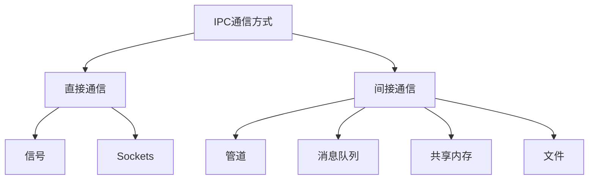

# 并发(Concurrency)与并行(Parallelism)

- 并发(Concurrency)
  - 本质是结构问题，关注如何组织多个任务
  - 是一种设计模型
  - 在有限CPU上制造“同时”的幻觉
  - 逻辑上“同时存在”，任意时刻仅处理一个任务
- 并行(Parallelism)
  - 本质是硬件问题，关注是否真的同时执行
  - 是一种硬件能力
  - 物理上“同时执行”，任意时刻任务数>=1

# 历史背景

## 单任务时代(1940s-1960s)

一台机器 = 一个程序

最早的计算机，没有操作系统，没有进程，没有并发

程序运行的方式：装纸带 -> 运行 -> 打印结果 -> 人工更换程序

问题

- CPU大量空闲（I/O时空转）
- 每次换程序要停机
- 没有“任务切换”概念

痛点：机器太贵，CPU太慢，人类时间浪费

## 批处理与多道程序(1960s-1970s)

并发的第一次觉醒

目标：让CPU不要空着

IBM, UNIX早期系统引入

- 多道程序(Multiprogramming)
- 中断
- 作业队列
- 内存分区

```text
P1 等待IO
-> CPU 切给 P2
-> P2 等待
-> 切给 P3
```

这就是早期的并发调度思想

关键突破

- 中断机制
- 上下文切换
- 进程状态机

从这里开始：程序 =/ 进程，进程 = 可被调度的“活体”

## 分时系统(1970s)

并发变成“交互式需求”

UNIX, MULTICS出现多用户使用一台主机，每个人“感觉自己独占CPU”

引入

- 时间片轮转(Round Robin)
- 就绪队列
- 抢占式调度

```text
P1 10ms -> P2 10ms -> P3 10ms -> ...
```

并发从“提高利用率”变成了“提升用户体验”

## 进程模型的确立(1970s-1980s)

并发 = 隔离 + 调度

UNIX给了进程三个核心属性

| 维度 | 含义 |
| - | - |
| 地址空间 | 隔离 |
| 资源表 | 文件、信号 |
| 执行上下文 | 可调度 |

进程成为：资源的容器 + 调度的单位

但问题开始显现

- 进程切换太慢
- 共享数据非常困难(IPC)
- 并发粒度太粗

## 线程诞生(1980s-1990s)

并发细化

服务器、GUI、数据库系统出现

- 一个程序内部需要并发
- 不想为每个任务创建进程

于是：把“执行流”从进程中拆出来

线程模型诞生

```text
Process
|-- Thread A
|-- Thread B
|__ Thread C
```

目标

- 更细粒度并发
- 更快切换
- 更容易共享数据

新问题

- 数据竞争
- 死锁
- 优先级反转
- 内存可见性

并发从OS问题，变成了程序员问题

## 多核时代(2005-)

并行成为现实

频率墙(3~4GHz)，单核提速结束，只能靠“核数”提升性能

并发不再是“时间片假象”，而是真实的物理同时执行

这使得

- 竟态真正发生
- cache一致性成为瓶颈
- 锁成为系统级灾难

## 高并发互联网(2010s)

线程崩溃

Web服务器、游戏、IM系统，10万连接，每个连接一个线程 -> 内存炸、切换炸

线程模型出现天花板

| 问题 | 原因 |
| - | - |
| 栈内存 | 每线程1-8MB |
| 切换 | 内核态切换 |
| 锁 | 共享地狱 |
| 阻塞 | 放大效应 |

## 协程与用户态调度(2010s-)

并发抽象的第三次革命

目标：像写顺序代码一样写并发

做法

- 把调度权从内核拿回
- 在用户态保存/恢复栈
- 非阻塞I/O
- 少量线程 + 海量协程

代表

| 系统 | 模型 |
| - | - |
| Go | goroutine + M:N |
| Python | asyncio |
| Lua | coroutine |
| C++20 | coroutine |
| 游戏引擎 | Fiber + Job |


# 进程

进程是计算机中正在执行的程序的实例。它是操作系统进行资源分配和调度的基本单位，也是程序在操作系统中的运行实体

## 定义

核心概念

- 动态实体：进程有创建、运行、暂停、终止的生命周期
- 资源容器：操作系统为进程分配内存、CPU时间、文件句柄等资源
- 执行上下文：包含程序代码、数据、堆栈、寄存器状态等

进程是程序在操作系统中一次执行的实例

- 程序是静态的代码（存储在磁盘上）
- 进程是动态的执行体（在内存中运行，拥有状态）

| 特性 | 程序 | 进程 |
| - | - | - |
| 本质 | 静态的指令集合（如.exe文件）| 动态的执行实例 |
| 状态 | 存储在磁盘上 | 在内存中运行 |
| 生命周期 | 永久存在 | 有创建到终止的过程 |
| 资源占用 | 不占用系统资源 | 占用CPU、内存等资源 |

- 程序 = 菜谱
- 进程 = 烹饪过程

每个进程都有自己的资源和执行上下文

| 属性 | 说明 |
| - | - |
| 程序代码（Text）| 可执行指令 |
| 数据区（Data）| 全局变量、静态变量 |
| 堆（Heap）| 动态分配内存（malloc/new）|
| 栈（Stack）| 局部变量、函数调用信息 |
| 程序计数器（PC）| 下一条要执行的指令地址 |
| 寄存器状态 | CPU寄存器当前内容 |
| 进程ID（PID） | 唯一标识 |

## 进程的生命周期

进程从创建到终止大体经历五个状态

1. 新建（New）：进程正在被创建
2. 就绪（Ready）：进程准备运行，等待CPU调度
3. 运行（Running）：CPU正在执行该进程
4. 阻塞/等待（Blocked/Waiting）：进程等待某些事件（I/O，信号等）
5. 终止（Terminated）：进程执行完成或被杀死

```text
New --> Ready --> Running --> Terminated
           |       ^
           v       |
         Waiting --^
```

- 就绪队列：所有等待CPU的进程
- 等待队列：所有等待I/O或事件的进程

## 进程的基本操作

### 进程创建与终止

- Unix/Linux: `fork()`，创建一个子进程，几乎是父进程的拷贝
- Windows: `CreateProcess()`，指定要执行的程序，并创建全新进程

子进程继承父进程的大部分资源，每个进程都有唯一PID

#### 创建方式

1. 系统初始化：操作系统启动时创建（init/systemd进程）
2. 用户请求：用户运行程序（shell中输入命令）
3. 进程派生：现有进程调用`fork()`创建子进程

Unix/Linux进程创建示例

```c
#include <stdio.h>
#include <unistd.h>

int main() {
    pid_t pid = fork(); // 创建子进程

    if (pid == 0) {
        // 子进程
        printf("Child Process PID: %d\n", getpid());
    } else if (pid > 0) {
        // 父进程
        printf("Parent Process PID: %d, Child PID: %d\n", getpid(), pid);
    } else {
        // fork失败
        perror("fork failed");
    }
    return 0;
}
```

#### 进程终止原因

1. 正常结束：执行`exit()`系统调用
2. 异常结束：
    - 除零错误、越界访问
    - 收到信号（如`SIGKILL`, `SIGSEGV`）
3. 外部终止：被其他进程终止

## 进程调度(Process Scheduling)

进程调度，调度方式，决定了系统快不快，卡不卡，公平不公平\

CPU是稀缺资源，而进程很多

- 多个进程同时就绪
- CPU一次只能运行一个（单核）
- OS必须决定：下一个运行谁？运行多久？什么时候切换？

这个决策过程就是进程调度

### 调度发生时机

| 场景 | 说明 |
| - | - |
| 进程创建 | 新进程进入就绪队列 |
| 时间片用完 | 时钟中断 |
| 进程阻塞 | 等待IO |
| 进程退出 | CPU空闲 |
| 更高优先级进程就绪 | 抢占 |

### 相关概念

1. 就绪队列(Ready Queue)
    所有可以运行、但没拿到CPU的进程
2. 时间片(Time Slice)
    一个进程一次最多运行的时间，防止“霸占CPU”
3. 抢占(Preemption)
    OS强制中断正在运行的进程，让更适合的进程上CPU
4. 饥饿(Starvation)
    进程因长期得不到所需资源而无法进展的状态

### 调度的目标

一个好的调度算法，要在多个目标之间权衡

| 目标 | 含义 |
| - | - |
| 吞吐量 | 单位时间完成多少进程 |
| 响应时间 | 用户多久能看到反应 |
| 等待时间 | 就绪队列中等多久 |
| 周转时间 | 提交到完成的总时间 |
| 公平性 | 不饿死任何进程 |

这些目标互相冲突

### 调度层次

```text
长期调度（作业调度）
    v （选择哪些进程进入内存）
中级调度（内存调度）  
    v （内外存交换，挂起/唤醒）
短期调度（CPU调度）   <- 主要讨论这个
    v （毫秒级，决定下个运行的进程）
```

### 调度与进程状态切换

```text
Running
  │  时间片到
  v
Ready
  ^
Blocked <- IO 等待
```

每次切换都伴随

- 上下文保存
- TLB/cache影响

#### 上下文切换的开销

典型上下文切换步骤

1. 保存当前进程的寄存器状态 -> 内存
2. 更新PCB（进程控制块）
3. 更新内存管理单元（MMU）寄存器
4. 恢复下一个进程的寄存器
5. 刷新TLB（转换检测缓冲区）
6. 更新缓存

开销：几百到几千始终周期\
现代CPU优化：快速上下文切换

### 经典调度算法

#### FCFS（先来先服务）

- 原理：按进入就绪队列的顺序执行
- 优点：实现简单，无饥饿
- 缺点：护航效应（长进程拖慢短进程），响应时间差

适合批处理系统

#### SJF/SJN（最短作业优先）

- 原理：优先执行运行时间最短的进程
- 优点：理论上平均等待时间最小
- 缺点：无碍准确预测运行时间，长作业可能饿死

理论最优，但现实难用

#### SRTF（最短剩余时间优先）

SJF的抢占版本，新短任务到来可抢占当前进程\
响应性更好，但实现更复杂

#### Round Robin, RR（时间片轮转）

原理

```text
P1 -> P2 -> P3 -> P1 -> ...
```

- 每个进程运行一个时间片
- 时间片用完就切换

优点：公平、响应快

缺点

- 时间片太小 -> 切换开销大
- 时间片太大 -> 退化成FCFS

交互式系统常用

#### Priority Scheduling（优先级调度）

- 原理：优先级高的先运行
- 风险：饥饿、优先级反转
- 解决：优先级老化(Aging)、优先级继承

### 多级调度队列算法（现代OS常用）

#### 多级队列(MLQ)

- 就绪队列分层
  - 前台交互
  - 后台计算
- 不同队列不同算法

队列之间通常不迁移 -> 不公平

#### 多级反馈队列(MLFQ)

核心思想：用“行为”推测进程类型

- 短CPU burst -> 交互型 -> 高优先级
- 长CPU burst -> 计算型 -> 地优先级

规则简化版

1. 新进程进入最高优先级
2. 用完整时间片 -> 降级
3. 主动让出CPU -> 升级

非常适合混合负载

### 现代Linux调度器（CFS）

设计思想：CFS仍有调度周期（sched period），但不再是固定时间片，而是根据权重动态分配运行时间

- 每个进程获得相同的虚拟运行时间
- 谁“欠CPU”，谁先跑

#### 核心概念

| 概念 | 含义 |
| - | - |
| vruntime | 虚拟运行时间 |
| 红黑树 | 按vruntime排序 |
| nice值 | 权重（优先级）|

调度策略：选择vruntime最小的进程

#### CFS优缺点

公平、适合通用系统\
实时性不强（另有RT调度器）

## 进程通信（IPC, Inter-Process Communication）

### 为什么需要IPC？

进程 = 独立的虚拟地址空间，一个进程不能直接访问另一个进程的内存\
这保证了安全性和稳定性\
代价就是：想协作，必须走操作系统提供的通道

IPC解决两类问题

- 通信（进程如何传数据）
- 同步（进程如何保证顺序与互斥）

现实中通信几乎一定伴随同步

### IPC历史演进

- 早期Unix (1970s)：信号、管道
- System V IPC (1980s)：消息队列、信号量、共享内存
- BSD Socket (1980s)：网络IPC
- POSIX IPC (1990s)：标准化接口
- 现代IPC：D-Bus, gRPC, ZeroMQ等

### IPC分类

#### 两大模型

- 消息传递（Message Passing）：不共享内存，只传消息
  - 管道
  - 消息队列
  - Socket

特点：内核中转、安全、简单、较慢

- 共享内存（Shared Memory）：多个进程映射同一块物理内存
  - `shm`
  - `mmap`

特点：极快，但必须自己做同步（锁/信号量）

#### 按通信关系分类



#### 按数据传输分类

| 类型 | 示例 | 特点 |
| - | - | - |
| 面向字节流 | 管道、TCP Socket | 无消息边界，像流水 |
| 面向消息 | 消息队列、UDP Socket | 有明确消息边界 |
| 面向共享 | 共享内存 | 直接读写内存 |

进程间需要通信来协作完成任务

### IPC 机制

#### 管道(Pipe)

```bash
ls | grep ".txt" # ls的输出作为grep的输入
```

原理：内核维护一块缓冲区，一端写，一端读，单向

```c
int fd[2];
pipe(fd);
```

特点

- 只能用于有亲缘关系的进程
- 自动同步（阻塞读写）
- 单向通信（半双工）
- 缓冲区有限（通常4KB-64KB）

#### 命名管道（FIFO）

有名字的管道（文件系统中），无亲缘关系进程可通信

```bash
mkfifo mypipe
```

行为类似pipe

#### 消息队列（Message Queue）

原理：内核维护消息链表，每条消息有：类型、长度、优先级

特点：

- 支持不同进程间的结构化数据交换
- 消息边界清晰
- 顺序由内核保证
- 消息有类型，可以按类型接收
- 独立于进程存在（进程结束队列仍保留）
- 需要显式删除(`msgctl(..., IPC_RMID, ...)`)
- 可通过`ipcs -q`查看，`ipcrm -q`删除
- 拷贝开销
- 容量限制

#### 共享内存

原理

```text
Process A
   ↓
  [ shared physical memory ]
   ↑
Process B
```

映射同一块物理内存

优点：零拷贝，极快

缺点：必须同步，极易出bug（竟态/死锁）

常见组合

```text
共享内存 + 信号量 / 互斥锁
```

#### 信号（Signal）

特点：不传数据，只传事件，异步中断

```c
kill(pid, SIGTERM);
```

用途：通知，控制进程行为，回收子进程（SIGCHLD）

#### Socket

特点：可本地/可网络，面向字节流或数据报

| 类型 | 用途 |
| - | - |
| Unix Domain Socket | 本机高效IPC |
| TCP Socket | 网络通信 |
| UDP Socket | 快速但不可靠 |

### 现代IPC

| 维度     | D-Bus           | ZeroMQ | gRPC         |
| ------ | --------------- | ------ | ------------ |
| 定位     | 桌面 / 系统总线       | 高性能消息库 | 远程 RPC 框架    |
| 通信模型   | 消息 + 总线         | 消息模式   | 请求 / 响应      |
| 是否依赖内核 | 是（Unix Socket）  | 否（用户态） | 否（TCP/HTTP2） |
| 是否跨机器  | 基本不             | 可以     | 天生支持         |
| 是否跨语言  | 有限              | 是      | 是            |
| 是否有中心  | 有（bus daemon）   | 无      | 无            |
| 复杂度    | 中               | 中      | 高            |
| 典型场景   | Linux 桌面 / 系统服务 | 分布式组件  | 微服务          |

#### D-Bus（桌面总线）

##### 解决的问题

在Linux桌面/系统中

- 蓝牙服务
- NetworkManager
- 电源管理
- 音量、亮度
- systemd 服务

这些进程必须互相通知、调用、监听事件

而且要求

- 安全（权限控制）
- 稳定（不能乱发）
- 结构化（不是字节流）

这就是D-Bus要解决的问题

##### 核心设计思想：总线模型

```text
┌─────────┐
│ Process │
└────┬────┘
     │
┌────▼────┐
│  D-Bus  │  ← bus daemon（中心）
└────┬────┘
     │
┌────▼────┐
│ Process │
└─────────┘
```

- 所有通信都经过bus
- bus负责：路由、权限校验、广播

##### 通信模式

D-Bus不只是“发消息”，而是三种

1. Method Call（像RPC）
2. Signal（广播事件）
3. Property（可观察属性）

##### 特点

- 安全模型清晰
- 非常适合系统服务
- 事件驱动
- 依赖中心节点（bus）
- 性能一般
- 不适合高吞吐

它不是给业务系统用的，是给系统组件用的

#### gRPC(Google RPC)

##### 解决问题

当系统变成：多语言、多团队、多机器、要长期维护\
你需要：强类型接口、明确契约、自动生成代码、版本管理

gRPC的做法是：RPC + IDL + 工具链

##### 核心架构

```text
Client
  v
Stub（自动生成）
  v
HTTP/2
  v
Server
```

- 基于HTTP/2
- 使用Protobuf
- 双向流支持

##### gRPC优势

- 强约束
  - 接口先行
  - 编译期检查
- 工程化
  - 监控
  - 负载均衡
  - 超时/重试
- 跨语言

##### gRPC代价

- 重
  - 学习成本高
  - 不适合小工具
  - 不适合本地IPC

它是为“组织规模”服务的

#### ZeroMQ

##### 解决的问题

传统IPC/Socket的痛点

- sned/recv太底层
- 协议自己写
- 错误多
- 状态复杂

ZeroMQ的目标：像用容器一样用通信

##### 核心哲学：模式，而不是API

ZeroMQ不说“发”/“收”，而是

- PUB/SUB
- REQ/REP
- PUSH/PULL
- DEALER/ROUTER

```text
Publisher >>> Subscribers
```

你需要关心的是：想要什么通信关系，而不是socket + select + buffer + retry

##### 特点

###### 快

- 完全用户态，自己管理buffer, queue, IO线程，绕开内核调度瓶颈

本质上是“通信虚拟机”

###### ZeroMQ的代价

ZeroMQ不是协议，它不保证：消息一定送达、不丢、顺序；你必须自己设计语义

自由但危险

### 进程间同步(IPC Synchronization)

进程间同步就是当多个进程访问共享资源（文件、共享内存、设备等）时，确保访问顺序正确、数据不冲突的技术

- 线程共享同一个进程的内存空间，同步主要是内存访问
- 进程内存空间独立，同步通常需要操作系统提供的机制

典型场景

- 多个进程写同一个日志文件
- 父子进程写作完成任务
- 多个进程操作共享内存缓冲区

#### 为什么需要进程间同步

问题根源是共享资源的访问冲突

共享文件：file.txt\
进程A写：100\
进程B写：200\
如果没有同步 -> 文件内容可能混乱或丢失

同步可以保证

- 互斥（Mutual Exclusion）：一次只有一个进程访问共享资源
- 顺序（Order）：按一定顺序执行操作，避免竟态条件

#### 进程间同步方法

##### 信号量(Semaphore)

- 定义：一个整数值，用于控制多个进程对共享资源的访问
- 操作
  - `P()`/`wait()`/`down()` -> 占用资源
  - `V()`/`signal()`/`up()` -> 释放资源

示例(POSIX信号量)

```c
#include <semaphore.h>

sem_t sem;
sem_init(&sem, 1, 1); // 1 表示共享线程，初始值1

sem_wait(&sem); // 占用
// 访问共享资源
sem_post(&sem); // 释放
```

- 用途：控制资源数量、互斥访问
- 特点：可用于多个进程同步，甚至跨机器（特殊实现）

##### 互斥锁(Mutex)

- 作用类似信号量，但专门用于互斥访问
- POSIX提供进程共享互斥锁

```c
pthread_mutex_t mutex;
pthread_mutexattr_t attr;

pthread_mutexattr_init(&attr);
pthread_mutexattr_setpshared(&attr, PTHREAD_PROCESS_SHARED);
pthread_mutex_init(&mutex, &attr);
```

- 只能由一个进程在同一时间持有
- 常与共享内存一起使用

##### 条件变量(Condition Variable)

- 当进程需要等待某个条件才执行时使用
- 通常配合互斥锁使用
- 示例

```c
pthread_cond_t cond;
pthread_mutex_t mutex;

pthread_mutex_lock(&mutex);
while(!condition) {
    pthread_cond_wait(&cond, &mutex); // 等待条件满足
}
// 条件满足，继续执行
pthread_mutex_unlock(&mutex);
```

##### 消息队列(Message Queue)

- 进程通信 + 同步
- 进程发送/接收消息时，操作系统保证顺序与完整性
- POSIX示例

```c
#include <mqueue.h>
mqd_t mq = mq_open("/myqueue", O_CREAT | O_RDWR, 0666, NULL);
mq_send(mq, "hello", 5, 0);
char buf[10];
mq_receive(mq, buf, 10, NULL);
```

- 优点：可以传递数据，同时实现同步
- 缺点：相对慢，依赖内核

##### 共享内存 + 锁

- 共享内存：速度最快，但需要手动同步
- 方案：
  - 创建共享内存区域
  - 进程访问共享内存前先加锁（信号量/互斥锁）
  - 访问完成后释放锁

进程间同步主要依赖操作系统提供机制，因为进程不共享内存，不能像线程那样直接用普通变量做锁

#### 进程同步的注意事项

1. 死锁
    - 两个或多个进程互相等待资源 -> 程序挂起
    - 解决：避免循环等待，设置超时
2. 优先级反转
    - 高优先级进程等待低优先级进程释放资源
    - 解决：优先级继承机制
3. 开销
    - 进程同步比线程同步慢
    - 因为需要操作系统内核介入

## 进程上下文（Context）

每次CPU切换进程时，会保存/恢复进程的上下文\

- 上下文切换（Context Switch）
  - 保存当前进程的PC和寄存器
  - 切换到下一个进程的PC和寄存器
  - CPU从新的进程继续执行

开销：

- 上下文切换不是免费的，会有CPU和内存开销
- 因此操作系统会尽量减少频繁切换

## 进程表（Process Table）

操作系统用来“统一管理所有PCB的数据结构”\
操作系统需要

1. 跟踪每个进程的状态
2. 快速找到要调度的进程
3. 管理进程资源
4. 实现进程间通信
5. 提供调试和监控信息

进程表就是这些信息的集中存储

进程表不描述单个进程，描述的是系统中所有进程

```text
进程表
 ├── PCB (PID 1)
 ├── PCB (PID 2)
 ├── PCB (PID 3)
 └── PCB (PID N)
```

早期OS（教学模型），进程表就是一张表/数组

```c
PCB process_table[MAX_PROCESS];
```

现代OS（如Linux），不存在一张统一的“进程表”，而是链表、红黑树、哈希表多个子结构组合\
进程表是一个概念，不是一个具体结构体

### Linux中的进程表

现代Linux没有“统一数组”，而是多个子数据结构组合

#### 1. task_struct
- 每个进程对应一个`struct task_struct`
- 相当于PCB
- 存储了进程的所有信息（状态、调度、内存、文件、信号等）
#### 2. 链表/红黑树/哈希表

Linux维护多种索引

| 数据结构 | 用途 |
| - | - |
| 双向链表`tasks` | 遍历系统所有进程 |
| 红黑树`pid_tree` | PID查找 |
| 其他链表 | 就绪队列、等待队列、僵尸队列 |

#### 3. 调度器视角

- 就绪队列/多级反馈队列不是PCB的一部分，而是指向task_struct的指针集合
- CPU调度通过这些队列找到task_struct，并切换上下文

#### `task_struct`字段

```c
// Linux内核中的进程表实际上是task_struct的链表/树
// 位于：include/linux/sched.h

struct task_struct {
    // ========== 标识信息 ==========
    pid_t pid;                    // 进程ID
    pid_t tgid;                   // 线程组ID（主线程的PID）
    pid_t ppid;                   // 父进程ID
    
    // ========== 状态信息 ==========
    volatile long state;          // 进程状态
    /*
        TASK_RUNNING     (0) 正在运行或可运行
        TASK_INTERRUPTIBLE (1) 可中断睡眠
        TASK_UNINTERRUPTIBLE (2) 不可中断睡眠
        TASK_STOPPED     (4) 停止状态
        TASK_TRACED      (8) 被调试器跟踪
        EXIT_ZOMBIE     (16) 僵尸状态
        EXIT_DEAD       (32) 死亡状态
    */
    int exit_code;                // 退出代码
    int exit_signal;              // 导致退出的信号
    
    // ========== 调度信息 ==========
    int prio;                     // 动态优先级
    int static_prio;              // 静态优先级
    int normal_prio;              // 归一化优先级
    const struct sched_class *sched_class;  // 调度类
    struct sched_entity se;       // 调度实体
    struct sched_rt_entity rt;    // 实时调度实体
    unsigned int policy;          // 调度策略
    
    // ========== 内存管理 ==========
    struct mm_struct *mm;         // 内存描述符
    struct mm_struct *active_mm;  // 活动内存描述符
    
    // ========== 文件系统 ==========
    struct fs_struct *fs;         // 文件系统信息
    struct files_struct *files;   // 打开文件表
    
    // ========== 信号处理 ==========
    struct signal_struct *signal; // 信号处理
    struct sighand_struct *sighand; // 信号处理器
    sigset_t blocked;            // 阻塞的信号
    sigset_t real_blocked;       // 实际阻塞的信号
    
    // ========== 时间统计 ==========
    u64 utime;                   // 用户态CPU时间
    u64 stime;                   // 内核态CPU时间
    unsigned long nvcsw;         // 自愿上下文切换次数
    unsigned long nivcsw;        // 非自愿上下文切换次数
    
    // ========== 关系链 ==========
    struct task_struct *real_parent;  // 真实父进程
    struct task_struct *parent;       // 父进程（可能被ptrace替换）
    struct list_head children;        // 子进程链表
    struct list_head sibling;         // 兄弟进程链表
    
    // ========== 其他 ==========
    char comm[TASK_COMM_LEN];    // 可执行文件名
    unsigned int flags;          // 进程标志
    cpu_mask_t cpus_allowed;     // 允许运行的CPU掩码
    
    // ========== 链接结构 ==========
    struct list_head tasks;      // 所有进程链表节点
    struct hlist_node pid_chain; // PID哈希链表节点
};
```

### Windows的EPROCESS

```cpp
// Windows内核的进程表结构（部分）
typedef struct _EPROCESS {
    // ========== 对象头 ==========
    KPROCESS Pcb;                // 进程控制块
    EX_PUSH_LOCK ProcessLock;    // 进程锁
    
    // ========== 标识信息 ==========
    LIST_ENTRY ActiveProcessLinks; // 活动进程链表
    HANDLE UniqueProcessId;      // 进程ID
    HANDLE InheritedFromUniqueProcessId; // 父进程ID
    
    // ========== 内存管理 ==========
    PVOID SectionBaseAddress;    // 映像基地址
    PVOID VadRoot;               // 虚拟地址描述符树根
    SIZE_T VirtualSize;          // 虚拟大小
    
    // ========== 句柄表 ==========
    PHANDLE_TABLE ObjectTable;   // 对象句柄表
    
    // ========== 时间统计 ==========
    LARGE_INTEGER CreateTime;    // 创建时间
    LARGE_INTEGER ExitTime;      // 退出时间
    LARGE_INTEGER KernelTime;    // 内核时间
    LARGE_INTEGER UserTime;      // 用户时间
    
    // ========== 线程信息 ==========
    LIST_ENTRY ThreadListHead;   // 线程链表头
    ULONG ActiveThreads;         // 活动线程数
    
    // ========== 安全信息 ==========
    PACCESS_TOKEN Token;         // 访问令牌
    QUAD Vm;                     // 虚拟内存计数器
    
    // ========== 其他 ==========
    ULONG SessionId;             // 会话ID
    CHAR ImageFileName[16];      // 映像文件名
    ULONG PriorityClass;         // 优先级类
} EPROCESS, *PEPROCESS;
```

## 进程控制块（PCB）

PCB是操作系统管理进程的核心数据结构，每个进程对应一个PCB，操作系统通过PCB来管理和控制进程

| 字段 | 作用 |
| - | - |
| PID | 唯一标识 |
| 状态 | New/Ready/Running/Waiting/Terminated |
| 程序计数器 | 下一条指令地址 |
| 寄存器内容 | CPU状态 |
| 内存管理信息 | 页表、段表 |
| 打开文件表 | 进程打开的文件 |
| 信号量/IPC信息 | 等待的事件或通信信息 |

```c
struct ProcessControlBlock {
    // 1. 进程标识信息
    int pid; // 进程ID
    int ppid // 父进程ID

    // 2. 进程状态信息
    enum state { // 进程状态
        NEW, READY, RUNNING,
        WAITING, TERMINATED
    };

    // 3. CPU状态信息
    int program_counter; // 程序计数器
    int registers[16]; // 寄存器组
    // ... 其他CPU状态
};
```

## 进程的重要特性

1. 并发性
    - 多个进程可以交替进行，给人同时运行的错觉
    - 单核CPU通过时间片轮转实现并发
2. 独立性
    - 每个进程有独立的地址空间
    - 一个进程崩溃不会直接影响其他进程
    - 通过进程间通信（IPC）进行数据交换
3. 异步性
    - 进程以不可预知的速度推进
    - 需要同步机制协调顺序

## Unix-like 进程

这个概念在Windows中并不显著，Unix是类文件系统层次结构，所有东西都是进程，Windows则是独立对象模型

### 父子进程（Parent/Child Process）

在Unix/Linux中，进程只能同另一个进程创建

- 创建者 -> 父进程
- 被创建者 -> 子进程
- 主要方式：`fork()`

```c
pid_t pid = fork();
```

| fork 返回值 | 进程 |
| - | - |
| > 0 | 父进程（返回子进程PID）|
| = 0 | 子进程 |
| < 0 | 创建失败 |

父子进程几乎是完整拷贝

- 虚拟内存(COW)
- 文件描述符
- 环境变量

但它们是两个独立的进程

#### 父子进程的关系

- 子进程继承父进程
  - 打开的文件
  - 工作目录
  - 信号处理方式
= 不共享地址空间（除非共享内存）

这也是为什么进程间通信需要IPC

| 特性 | 父进程 | 子进程 |
| - | - | - |
| PID | 保持不变 | 获得新的唯一PID |
| PPID | 自己的父进程 | 父进程的PID |
| 文件描述符 | 共享，但独立维护 | 复制父进程的文件表 |
| 未处理的信号 | 不继承 | 继承，但某些信号重置 |
| 资源统计 | 独立计数 | 从0开始计数（CPU时间等）|
| 进程组 | 通常相同 | 通常相同（除非调用setpgid）|

### 孤儿进程(Orphan Process)

父进程先退出，子进程还在继续，子进程就成了孤儿进程

孤儿进程不会出问题\
内核会自动把孤儿进程的父进程设为PID 1\
传统是`init`，现代是`systemd`，会负责回收它

孤儿进程不危险，是正常现象，很多后台程序就是主动“变孤儿”的

### 守护进程(Daemon Process)

守护进程是在后台运行、脱离终端、长期存在的进程

典型例子

- `sshd`
- `cron`
- `systemd`
- 日志服务、监控服务

守护进程的核心特征

| 特征 | 说明 |
| - | - |
| 无控制终端 | 不会因终端关闭而退出 |
| 长时间运行 | 生命周期长 |
| 后台运行 | 不与用户交互 |
| 通常是孤儿 | 被init/systemd接管 |

#### 守护进程的标准创建流程

标准守护化步骤

1. fork,父进程退出
2. 子进程 setsid()，脱离终端
3. 再fork,防止重新获得终端
4. 该工作目录/
5. 重设文件权限掩码
6. 关闭标准输入输出

### 僵尸进程(Zombie Process)

僵尸进程 = 已经死了，但还没被父进程“收尸”的进程

- 子进程已经退出(`exit()`)
- 资源已释放（内存、文件）
- 但PCB还留在内核中

状态标记`Z`

#### 为什么会有僵尸进程

这是Unix的设计选择，不是bug\
父进程需要知道：子进程是否正常退出，退出码是多少

所以内核会保留子进程的PID + 退出状态，等待父进程调用

#### 僵尸进程的问题

僵尸进程不占CPU,但占PID/PCB\
大量僵尸进程 -> 进程表耗尽 -> 新进程创建失败

#### 如何避免僵尸进程

父进程正确回收

```c
wait(NULL);
```

捕获SIGCHLD

```c
signal(SIGCHLD, SIG_IGN);
```

双fork（守护进程常用）

```text
父
└─子
  └─孙（真正工作）
```

### 进程相关系统调用

```text
进程相关系统调用
├─ 创建 / 装载
│   ├─ fork / vfork / clone
│   └─ exec*
│
├─ 终止 / 回收
│   ├─ exit / _exit
│   └─ wait / waitpid / waitid
│
├─ 身份 / 关系
│   ├─ getpid / getppid
│   ├─ setpgid / getsid
│   └─ setsid
│
├─ 调度 / 优先级
│   ├─ nice / setpriority
│   ├─ sched_yield
│   └─ sched_* 系列
│
├─ 信号
│   ├─ kill / tgkill
│   ├─ sigaction
│   └─ pause
│
├─ 资源限制 / 统计
│   ├─ getrlimit / setrlimit
│   ├─ times / getrusage
│   └─ prlimit
│
├─ 控制 / 管理
│   ├─ ptrace
│   ├─ prctl
│   └─ seccomp
│
└─ 命名空间 / 隔离（现代）
    ├─ unshare
    ├─ setns
    └─ clone (flags)
```

#### fork -> exec -> exit -> wait

##### `fork()`

###### 功能

- 创建一个几乎完整拷贝的子进程
- 父子进程几乎一样
  - 代码段（共享，只读）
  - 数据段（写时复制COW）
  - 文件描述符
  - 信号处理

不同点

- 子进程获得新的PID
- 子进程的父进程PID = 父进程的PID
- 返回值区分父子

```c
pid_t pid = fork();

if (pid < 0) {
    perror("fork failed");
} else if (pid == 0) {
    // 子进程
} else {
    //  父进程，pid = 子进程PID
}
```

###### fork的特性

- Copy-on-write(COW)
    数据段不会立即复制，只有子进程或父进程写入时才分配新页
- 文件描述符共享，但偏移独立
- 环境变量继承
- 资源独立（堆、栈、信号量计数等）

##### `exec()`

###### 功能

- 不创建新进程
- 将当前进程的内存空间（代码 + 数据 + 堆栈）替换成新程序
- PID保持不变

常用函数族

```c
execl("/bin/ls", "ls", "-l", NULL);
execv("/bin/ls", argv);
execvp("ls", argv); // PATH 搜索
```

###### 使用场景

- 通常fork + exec 配合使用

```text
父进程 fork()
    v
子进程 exec() 执行新程序
```

这样可以

1. 父进程继续执行
2. 子进程执行其他程序（shell命令、后台服务）

##### `exit()`

###### 功能

- 终止当前进程
- 释放资源（内存、打开文件）
- 保存退出状态，父进程可以通过`wait()`获取

```c
exit(0); // 正常退出
exit(1); // 立即退出，绕过缓冲区
```

###### 注意点

- 子进程exit后，如果父进程没有wait,会变成僵尸进程
- exit的状态码：0表示正常，非0表示异常

##### `wait()`/`waitpid()`

###### 功能

- 父进程等待子进程退出
- 回收子进程PCB（避免僵尸）
- 获取子进程退出码

```c
int status;
pid_t child_pid = wait(&status);
if (WIFEXITED(status)) {
    printf("Child exited with %d\n", WEXITSTATUS(status));
}
```

- `wait()` 阻塞父进程直到有子进程退出
- `waitpid(pid, &status, options)`可选择特定子进程或非阻塞

###### 常见问题

- 父进程不调用`wait()` -> 僵尸进程
- 父进程提前`exit()` -> 孤儿进程
  - 内核把孤儿交给`init/systemd`处理

##### 四者组合示意

```text
Parent Process
┌─────────────┐
│ fork()      │  ----> Child Process
│             │        │ exec("/bin/ls")
│ wait()      │ <---- exit()
└─────────────┘
```

- `fork()` -> 创建子进程
- `exec()` -> 子进程换程序
- `exit()` -> 子进程退出
- `wait()` -> 父进程回收子进程

##### 细节和工程实践

1. fork多次 -> 可以生成进程树
2. 双fork -> 守护进程模式（防止控制终端干扰）
3. COW优化 -> 进程创建成本低
4. wait/SIGCHLD -> 非阻塞回收子进程

# 线程

线程是操作系统能够进行运算调度的最小单位，是进程中的一个执行流程。一个进程可以包含多个线程，所有线程共享进程的资源（如内存空间、文件句柄），但每个线程拥有自己独立的执行栈和程序计数器

## 线程 vs 进程

| 特性 | 进程 | 线程 |
| - | - | - |
| 资源拥有 | 独立的内存和资源 | 共享进程的资源 |
| 通信方式 | IPC（管道、消息队列等）| 共享内存、更简单的通信 |
| 创建开销 | 较大（需分配独立内存）| 较小（共享进程资源）|
| 切换开销 | 较大（需切换地址空间）| 较小（不切换地址空间）|
| 独立性 | 完全独立 | 依赖于进程存在 |

线程是进程中的执行单元，是CPU调度的基本单位（现代OS）\
进程负责而“资源隔离”（容器），线程负责“并发执行”（工作单位）

从CPU的角度看，CPU不关心进程，CPU实际调度的是执行上下文，在现代OS中，这个执行上下文就是线程。所以线程才是真正跑在CPU上的东西

```text
Process
├── Thread 1  ← CPU 实际调度
├── Thread 2
├── Thread 3
└── 共享资源
    ├── 地址空间
    ├── 堆
    ├── 全局变量
    ├── 文件描述符
```

在Linux中

| 维度 | 进程 | 线程 |
| - | - | - |
| 内核对象 | task_struct | task_struct |
| 调度实体 | 是 | 是 |
| 地址空间 | 独立 mm_struct | 共享 mm_struct |
| PID | 唯一 | 共享 TGID |
| 切换成本 | 高 | 低 |

在Linux中，线程和进程没有本质区别，都是task_struct；区别只是clone()时共享了什么

### 线程存在意义

如果只有进程，进程切换会造成

- 页表切换
- TLB flush
- cache污染

IPC成本高，创建成本高

线程的存在，使得

- 创建成本降低
- 切换成本降低
- 数据共享高效（直接访问）
- 并发粒度细

线程是在不牺牲隔离模型的前提下，把并发粒度做细

## 线程本质结构

线程 =/ 轻量进程，线程轻在资源上，不在调度上

一个线程拥有以下内容

- 程序计数器（PC）：下一条指令
- 寄存器：CPU状态
- 栈（Stack）：局部变量、调用链
- TLS：线程局部存储

## 线程生命周期

```text
新建(New) → 就绪(Runnable) → 运行(Running) → 阻塞(Blocked) → 终止(Terminated)
          ^                    v
          |__ 等待(Waiting) ___|
```

- 新建(New)：线程对象已创建，但尚未启动
- 就绪(Runnable)：线程准备好运行，等待CPU分配时间片
- 运行(Running)：线程正在执行
- 阻塞(Blocked)：线程等待某个条件（如I/O操作、锁等）
- 等待(Waiting)：线程无限期等待其他线程通知
- 超时等待(Timed Waiting)：线程等待特定时间
- 终止(Terminated)：线程执行完毕或异常退出

## 线程创建与使用

### 创建

线程一定是内核创建的，但通常不是直接找内核要

```text
代码
v
语言/运行时
v
系统调用
v
内核线程
```

#### 操作系统层

这里是线程真正诞生的地方

##### Linux `clone()`

在Linux里，没有线程这个独立概念，本质上都是`task_struct`

创建线程时，内核进行以下流程

1. 分配一个新的`task_struct`
2. 分配线程栈
3. 复制寄存器上下文
4. 共享 or 不共享资源（关键！）

```c
clone (
fn,
stack,
CLONE_VM | CLONE_FS | CLONE_FILES | CLONE_SIGHAND | CLONE_THREAD,
arg
);
```

- `CLONE_VM`：共享地址空间
- `CLONE_FILES`：共享fd表
- `CLONE_THREAD`：同一线程组

这些flag决定是“新进程”还是“同进程线程”\
线程只是“共享更多资源的进程”

##### 用户态线程（绿色线程）

- 用户态线程：切换快，单不能利用多核
- 内核线程：可调度，可多核

现代Linux/Windows是1:1线程模型（用户线程 = 内核线程）


##### Windows：`CreateThread`

Windows中，线程是一等公民，有独立的`ETHREAD`\
创建时：分配TEB（线程环境块），分配用户栈，挂到进程里

#### 语言层

对系统调用的封装

##### POSIX `pthread_create`

```c
pthread_t tid;
pthread_create(&tid, nullptr, worker, arg);
```

背后

```text
pthread_create
↓
clone()
↓
task_struct
```

你能控制的东西

- 栈大小
- 调度策略（有限）
- 亲和性（affinity）

##### C++ `std::thread`

```cpp
std::thread t([] {
    do_work();
});
t.join();
```

本质：RAII包装，底层还是pthread/Win32

##### C# 

早期：真Thread

```cs
new Thread(Work).Start();
```

问题：

- 太重
- 不可控

现代：线程池 + 任务

```cs
Task.Run(() => Work());
```

这已经不是创建线程了

### 使用

创建线程的场景很少，使用线程的场景很多

正确的方式是：少量线程 + 大量任务

#### 线程使用的四种经典模型

##### 一线程一任务（过时）

简单，不可扩展

##### 线程池（主流）

```text
任务队列
v
N 个 worker创建
```

##### 线程 + 事件循环

```text
1~2 个线程
v
epoll / IOCP
v
回调
```

##### 线程 + 协程（现代）

```text
少量线程
v
成千上万个协程
```

#### 注意事项

线程使用时，必须注意以下问题

1. 生命周期
2. 栈是私有的
    - 每个线程一条栈
    - 默认1-8MB
    - 栈溢出 = 直接崩
3. 数据共享是危险的
4. 同步原语
5. 可见性 & 顺序
    - CPU重排序
    - 编译器重排序
    - memory order
6. 线程不是越多越好
    - CPU 密集型：线程数量约等于核心数
    - IO 密集型：线程数量是核心数的2～4倍

线程是昂贵的执行资源，应该被“管理”，而不是被“随意创建”

## 线程通信与同步

- 通信：怎么交换数据
- 同步：怎么保证顺序与一致性

通信但不同步 -> 数据错\
同步但不通信 -> 无意义

### 通信

线程通信，共享内存是默认通道，同一进程内的线程，天然共享地址空间，这即是优势也是灾难源头

#### 共享变量

```cpp
struct Data {
    int a;
    int b;
};

Data g_data;
```

- 快
- 简单
- 必须同步

#### 共享队列

```text
Producer Thread
v
Queue
v
Consumer Thread
```

- 解耦
- 好同步
- 容易扩展成线程池/Job System

#### 线程本地存储（TLS）

```cpp
thread_local int counter;
```

- 通信的反面
- 每个线程一份
- 用来避免通信

### 同步

同步解决三个问题：

1. 互斥(Mutual Exclusion)
2. 顺序(Ordering)
3. 可见性(Visibility)

#### 互斥：一次只能一个进入

##### Mutex

```cpp
std::mutex m;
m.lock();
x++
m.unlock();
```

- 保护临界区
- 阻塞线程
- 代价：上下文切换

##### Spinlock（自旋锁）

- 不睡眠
- 忙等

适合

- 临界区极短
- CPU核心多

#### 顺序：谁先谁后

##### Condition Variable

经典模型：生产者 - 消费者

```cpp
std::condition_variable cv;
std::mutex m;
bool ready = false;
```

- 等待某个条件
- 避免忙等

##### 信号量(Semaphore)

- 计数资源
- 常用于限流

#### 可见性：修改是否可见

问题来源：

- CPU缓存
- 编译器优化
- 指令重排

```cpp
bool done = false;

Thread A: done = true;
Thread B: while (!done) {}
```

可能死循环

解决方案

- mutex（隐含内存屏障）
- atomic
- 正确的memory_order

#### 原子操作：不加锁同步`atomic`

```cpp
std::atomic<int> x;
x.fetch_add(1);
```

- 单条原子指令
- 不会被打断

使用场景

- 计数器
- 状态标志
- 无锁队列

`atomic`只能保证单变量安全，不保证多变量一致性，跨多个变量仍然需要锁

### 通信 + 同步的经典组合模式

#### 生产者-消费者

```text
Queue + Mutex + ConditionVariable
```

#### 读多写少

```text
shared_mutex
```

#### 工作窃取（Work Stealing）

```text
每线程本地队列 + 偶尔偷
```

线程通信，本质是共享内存的设计问题\
线程同步，本质是时间顺序与可见性的约束问题\
最好的并发设计，是减少共享，而不是堆锁

并发问题70%是数据结构问题，30%才是锁的问题

## 线程安全与并发

## TLS

## 伪共享（False Sharing）

## 多线程

## 同步

# 轻量线程

## Coroutine（协程）

## goroutine

## Fiber（纤程）


