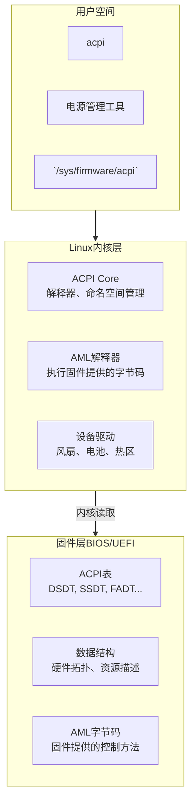

## 起因

我像往常一样在我的笔记本上启动Ubuntu 24.04，在tty1中login并startx启动GUI后，突发奇想，想去tty2中试一下tmux能不能用\
于是我按下ctrl + alt + f2 切换到tty2，出现以下信息并刷屏

```text
ACPI: divide by zero (20250404/utmath-478)
Aborting method \_SB.ATAD.WMNB due to previous error (AE_AML_DIVIDE_BY_ZERO)(20250404/pspurse-529)
```

上网查了一下，说是ACPI表中某个具体方法触发了除零，导致内核直接放弃执行这个ACPI方法，具体分析如下：

- `ACPI: divide by zero (20250404/utmath-478)`
  - 内核ACPI核心检测到除零错误
  - `(utmath-478)`是内核源码里的ACPI数学工具函数，478行触发
- `Aborting method \_SB.ATAD.WMNB due to previous error(AE_AML_DIVIDE_BY_ZERO)(20250404/pspurse-529)`
  - ACPI表里的方法`_SB.ATAD.WMNB`因前面的除零错误被放弃执行
  - `_SB`是"System Bus"
  - `ATAD`通常是某个设备或方法的命名，可能与ATA磁盘控制器或某厂商自定义设备相关
  - `WMNB`是一个WMI(Windows Management Instrumentation)方法，`WMN`开头通常是ACPI-WMI桥接方法，`B`表示这是一个数据块(Block)操作，`WMNB`一般是ACPI中暴露给WMI的可写数据块方法，笔记本厂商（如Lenovo, HP, ASUS等）用它来：控制风扇转速、性能模式；调节屏幕亮度或键盘背光；实现厂商专属的电源管理方法
  - `AE_AML_DIVIDE_BY_ZERO`表示AML(ACPI Machine Language)方法执行异常

总的来说

- ACPI的WMI方法`WMNB`内部有一个除法操作，分母为0
- 通常由切换VT（虚拟终端）触发，因为切换时系统会重新查询某些ACPI/WMI状态
- 这是固件Bug,不是Linux内核Bug,但Linux的ACPI报错比Windows更严格

## 解决方案

这个问题不影响系统的正常使用，可以忽略\
当tty使用直接framebuffer/控制台输出时，内核会把所有的ACPI错误打印到当前console\
tty1被Xorg/Wayland占用或使用了VGA text mode，错误信息不会频繁刷屏

### 方法零：切换回tty1再切换到tty2

亲测有效

Linux在启动时，ACPI表会被加载，但其中的部分AML方法不会立即执行，某些AML方法只在特定事件发生时才会被调用，比如

- 图形/显示状态切换
- 电源管理事件
- 热键或嵌入式控制器(EC)交互

当我从tty1切换到tty2时，内核或显示子系统可能会

- 触发ACPI中与显卡、背光、或电源策略相关的方法
- 其中`\_SB.ATAD.WMNB`被调用
- 该方法内部执行了除法，但除数为0，触发内核报错

为什么不报错了

1. 错误被内核屏蔽：某些ACPI错误在短时间内重复发生时，内核会限流(rate-limit)输出
2. 状态已变更：某些硬件状态被初始化后，除数为0的条件不再被满足
3. 系统进入稳定运行：不再触发该ACPI方法

`\_SB.ATAD.WMNB`方法有除零，往往是因为

- AML代码中某个除法的除数来自硬件寄存器读取，读到了0
- 固件假设某个硬件属性一定非零，但在特定时机（比如tty切换）尚未准备好

这个问题不严重，但它反映了ACPI表存在缺陷

### 方法一：屏蔽报错输出

在`/etc/default/grub`中添加内核参数，抑制ACPI错误刷屏

```bash
GRUB_CMDLINE_LINUX_DEFAULT="quiet splash loglevel=3"
```

或更精准地屏蔽ACPI调试输出

```bash
GRUB_CMDLINE_LINUX_DEFAULT="quiet splash acpi.debug_layer=0 acpi.debug_level=0"
```

然后更新

```bash
sudo update-grub
```

### 方法二：禁用触发该方法的WMI模块

查看是否加载了相关WMI模块

```bash
lsmod | grep wmi
```

如果有厂商专属模块，比如`asus_wmi`，可以将其加入黑名单

```bash
echo "blacklist <模块名>" | sudo tee /etc/modprobe.d/blacklist-wmi.conf
sudo update-initramfs -u
```

### 方法三：升级BIOS/UEFI

Linux内核更新可能导致对ACPI的报错更加严格，及时更新BIOS，这类ACPI除零Bug有时会在BISO中修复

### 方法四：用`acpi_override`打补丁

如果BIOS不更新，可以反编译DSDT，手动修复`WMNB`方法中的除零问题，再用自定义SSDT覆盖

---

## ACPI

ACPI表(Advanced Configuration and Power Interface Tables，高级配置与电源接口表)是计算机固件(BIOS/UEFI)提供给操作系统的一组数据结构

简单来说，它是硬件与操作系统之间的说明书，当操作系统启动时，固件会将这些表交给内核，告诉内核：主板上有什么硬件、它们是如何连接的、支持哪些电源管理功能、哪些设备可以唤醒电脑等信息

### 核心作用

- 电源管理：控制CPU进入休眠状态、风扇转速、电池管理、笔记本合盖动作等
- 硬件枚举：在x86架构中，ACPI表承担了类似设备树(Device Tree)的角色，让操作系统无需硬编码就能发现PCI中断路由、嵌入式控制器、CPU核心数量等
- 热插拔与事件：处理设备插拔（如USB-C扩展坞）、温度过热保护等

### 常见ACPI表

- RSDP(Root System Description Pointer)：ACPI表的入口，操作系统首先找到它
- DSDT(Differentlated System Description Table)：这是最重要的一张表，包含大部分硬件信息和AML(ACPI Machine Language)字节码，操作系统通过解析它来理解硬件布局
- SSDT(Secondary System Description Table)：补充表，常用于描述CPU电源状态（如SpeedStep、睿频）、独立显卡、USB控制器等
- FADT(Fixed ACPI Description Table)：定义电源按钮、寄存器地址等固定硬件接口
- MADT/APIC(Multiple ACPI Description Table)：多处理器表，描述CPU核心、中断控制器的分布，对多核CPU启动至关重要
- RSDT/XSDT(Root System Description Table/Extended RSDT)：列出系统中所有ACPI表的地址

1. 操作系统启动时读取RSDP，找到ACPI表
2. 解析DSDT/SSDT,知道硬件有哪些设备、如何操作它们
3. 根据FADT和其他表配置电源管理、休眠策略、风扇控制等
4. 调用AML方法与硬件交互（比如开关CPU C-state或S-state）

### ACPI的分层架构


